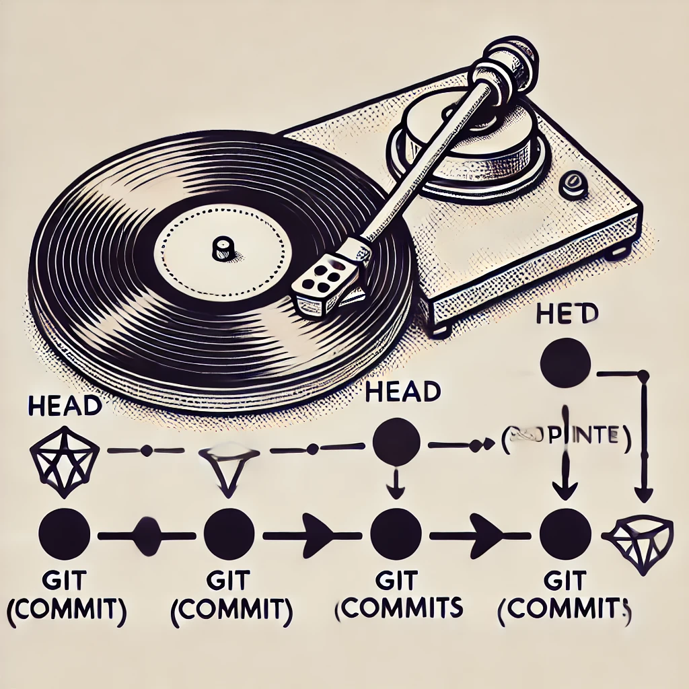

## مفهوم HEAD در گیت

در سیستم کنترل نسخه گیت (Git)، HEAD یکی از مهم‌ترین مفاهیم است که به نقطه فعلی در تاریخچه پروژه اشاره می‌کند. به زبان ساده، HEAD یک اشاره‌گر به شاخه یا کامیت فعلی است که شما در آن کار می‌کنید. هر زمان که در پروژه‌ای تغییرات اعمال می‌کنید، این تغییرات نسبت به کامیتی است که HEAD به آن اشاره دارد.

#### HEAD چیست؟

HEAD در گیت یک اشاره‌گر متحرک است که به شاخه‌ای که در حال حاضر روی آن کار می‌کنید، یا به کامیت خاصی اشاره می‌کند. به طور پیش‌فرض، HEAD معمولاً به آخرین کامیت در شاخه‌ی فعال (current branch) اشاره دارد.

#### مثال:

فرض کنید که در شاخه‌ی `main` هستید. در این صورت، HEAD به آخرین کامیت این شاخه اشاره می‌کند. هر زمان که یک کامیت جدید ایجاد می‌کنید، HEAD به این کامیت جدید اشاره می‌کند، زیرا آخرین تغییرات شما را شامل می‌شود.

```plaintext
HEAD -> main
```

#### موقعیت HEAD در گیت:

HEAD همیشه به موقعیت جاری شما در مخزن اشاره می‌کند. این به معنای این است که هر عملیاتی که انجام می‌دهید (مانند افزودن تغییرات، ساخت شاخه جدید، یا رفتن به شاخه‌های دیگر) همه بر اساس مکانی است که HEAD به آن اشاره دارد.

### فلسفه HEAD

فلسفه‌ی اصلی پشت HEAD این است که گیت با استفاده از این اشاره‌گر، می‌تواند به شما کمک کند تا به صورت دقیق روی یک شاخه یا کامیت خاص تمرکز کنید و تغییرات خود را نسبت به آن انجام دهید. هر زمان که شاخه‌ها را تغییر می‌دهید یا به یک کامیت قبلی بازمی‌گردید (checkout)، HEAD نیز تغییر می‌کند تا به آن موقعیت جدید اشاره کند.

می‌توان **HEAD** در گیت را به **سوزن گرامافون** تشبیه کرد، زیرا هر دو وظیفه‌ای مشابه دارند: هر دو به موقعیتی خاص اشاره می‌کنند و به شما اجازه می‌دهند از آن نقطه کار یا تغییرات را ادامه دهید.

#### تشبیه HEAD به سوزن گرامافون:

- **HEAD در گیت:** مانند سوزن گرامافون که روی یک شیار خاص از صفحه گرامافون قرار می‌گیرد و موسیقی را از همان شیار پخش می‌کند، HEAD در گیت نیز به کامیت یا شاخه خاصی در تاریخچه پروژه اشاره می‌کند و از آن نقطه تغییرات اعمال می‌شود.
- **حرکت HEAD:** همان‌طور که سوزن گرامافون می‌تواند به جلو یا عقب حرکت کند و از شیارهای مختلف صفحه گرامافون عبور کند، HEAD نیز می‌تواند به کامیت‌های قبلی یا جدیدتر تغییر مکان دهد. با اجرای دستورات مانند `git checkout`، شما می‌توانید HEAD را به یک شاخه یا کامیت خاص ببرید، مانند جابجایی سوزن به شیارهای مختلف صفحه.

- **Detached HEAD:** حالت "Detached HEAD" مانند زمانی است که سوزن گرامافون از صفحه اصلی جدا می‌شود و روی یک نقطه خاص به طور موقت قرار می‌گیرد؛ شما تغییراتی انجام می‌دهید، اما اگر بخواهید دوباره به صفحه اصلی بازگردید، ممکن است تغییرات موقت شما از بین بروند. این دقیقاً مشابه حالتی است که HEAD به یک کامیت خاص (بدون شاخه) اشاره می‌کند و اگر تغییرات جدیدی اعمال شود، این تغییرات به شاخه متصل نخواهند بود مگر اینکه دوباره به شاخه‌ای بازگردید.

_۱۱.۱. تصویر تشبیه HEAD به سوزن گرامافون:_

<div align="center">
    
</div>

> تصویری که در آن سوزن گرامافون به مفهوم HEAD در گیت تشبیه شده است، رسم شد. این تصویر به طور نمادین حرکت سوزن روی صفحه گرامافون را به هدایت HEAD در گیت و جابه‌جایی بین کامیت‌ها مرتبط می‌کند و هر نقطه بر روی صفحه به عنوان یک کامیت نمایش داده شده است.

بنابراین، این تشبیه مناسب است، زیرا هر دو مفهوم به عنوان یک ابزار هدایت برای کار با مجموعه‌ای از داده‌ها عمل می‌کنند. در گرامافون، سوزن مسیر موسیقی را تعیین می‌کند و در گیت، HEAD مسیر و شاخه‌ای که در آن کار می‌کنید را مشخص می‌کند.

#### HEAD در مقابل شاخه‌ها:

در واقع، هر شاخه در گیت یک اشاره‌گر به آخرین کامیت خود است. وقتی روی یک شاخه کار می‌کنید، HEAD به آن شاخه اشاره می‌کند. زمانی که شما از یک شاخه به شاخه دیگری می‌روید (با استفاده از `git checkout`)، HEAD به شاخه جدید تغییر می‌کند.

#### HEAD متحرک:

گاهی اوقات HEAD به جای یک شاخه، به یک کامیت خاص اشاره می‌کند. این حالت را "Detached HEAD" می‌نامند. این زمانی اتفاق می‌افتد که شما به طور مستقیم به یک کامیت خاص بروید، نه به شاخه‌ای که به آن متصل است.

مثال زمانی که HEAD متحرک است:

```bash
git checkout <commit-hash>
```

در این حالت، HEAD به جای اینکه به یک شاخه اشاره کند، مستقیماً به شناسه‌ی کامیت مشخصی اشاره می‌کند. در این وضعیت، اگر کامیتی انجام دهید، این تغییرات به هیچ شاخه‌ای متصل نخواهد بود و ممکن است با تغییر شاخه‌ها از بین بروند.

### چه اتفاقی در پس‌زمینه HEAD می‌افتد؟

وقتی از HEAD صحبت می‌کنیم، منظور یک فایل متنی ساده به نام `HEAD` در دایرکتوری `.git/` است. این فایل اشاره می‌کند که HEAD در حال حاضر به کدام شاخه یا کامیت اشاره دارد.

#### ساختار فایل HEAD:

1. **زمانی که HEAD به یک شاخه اشاره می‌کند:**

   اگر در شاخه‌ی `main` باشید، محتوای فایل `HEAD` به صورت زیر خواهد بود:

   ```plaintext
   ref: refs/heads/main
   ```

   این خط به گیت می‌گوید که HEAD به شاخه‌ی `main` اشاره دارد و هر تغییری که انجام دهید به این شاخه اعمال می‌شود.

2. **زمانی که HEAD متحرک است:**

   اگر به یک کامیت خاص مراجعه کنید و HEAD متحرک شود، فایل `HEAD` حاوی هش (hash) کامیت خواهد بود:

   ```plaintext
   a3f5b9c4d1e6b7a5d4f9d3c9b9e6f7d8e7c6a5b3
   ```

   این به گیت می‌گوید که شما در حالت Detached HEAD هستید و به یک کامیت خاص اشاره دارید.

#### تغییرات HEAD:

- **زمان استفاده از `git checkout`:** وقتی از `git checkout` برای تغییر شاخه یا رفتن به یک کامیت خاص استفاده می‌کنید، محتوای فایل `HEAD` تغییر می‌کند. اگر به شاخه‌ای جدید بروید، `HEAD` به آن شاخه جدید اشاره می‌کند. اگر به یک کامیت خاص بروید، `HEAD` حاوی شناسه‌ی آن کامیت می‌شود.
- **هنگام کامیت کردن:** وقتی یک کامیت جدید انجام می‌دهید، شاخه‌ای که HEAD به آن اشاره می‌کند به روز می‌شود و به آخرین کامیت جدید اشاره می‌کند.

#### بازگرداندن HEAD:

یکی از قابلیت‌های بسیار مفید گیت این است که می‌توانید HEAD را به هر کامیت قبلی بازگردانید. برای این کار از دستور `git reset` استفاده می‌شود. با استفاده از این دستور، می‌توانید HEAD را به هر کامیت قبلی که می‌خواهید برگردانید:

```bash
git reset --hard <commit-hash>
```

در این حالت، HEAD به کامیت مشخص‌شده تغییر پیدا می‌کند و تمامی تغییرات بعد از آن حذف می‌شود (در صورت استفاده از `--hard`).

### جمع‌بندی

HEAD یکی از مفاهیم کلیدی در گیت است که به نقطه فعلی شما در تاریخچه پروژه اشاره می‌کند. این اشاره‌گر تعیین می‌کند که شما در حال حاضر روی کدام شاخه یا کامیت کار می‌کنید و تغییرات به کجا اعمال می‌شوند. با درک مفهوم HEAD و نحوه کار با آن، می‌توانید پروژه‌های خود را به شکل دقیق‌تر و کنترل‌شده‌تری مدیریت کنید. همچنین، قابلیت‌های پیشرفته مانند بازگرداندن HEAD یا کار در حالت Detached HEAD، ابزارهای قدرتمندی هستند که گیت برای مدیریت تغییرات به شما ارائه می‌دهد.
