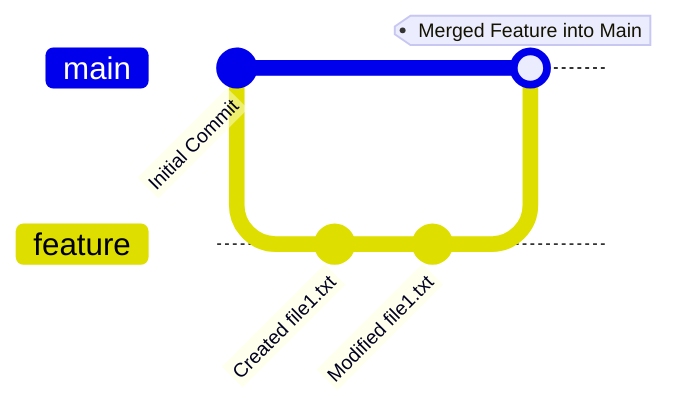

## استیج‌ها در گیت

گیت (Git) به عنوان یک سیستم کنترل نسخه توزیع‌شده، سه استیج اصلی دارد که به توسعه‌دهندگان امکان مدیریت مؤثر تغییرات در فایل‌ها و پروژه‌هایشان را می‌دهد. این استیج‌ها کمک می‌کنند تا توسعه‌دهندگان بتوانند تغییرات را مرحله‌بندی و سپس کامیت کنند. سه استیج اصلی گیت به شرح زیر است:

### 1. دایرکتوری کاری (Working Directory)

این استیج، جایی است که فایل‌های پروژه شما قرار دارند و تغییرات در آن‌ها اعمال می‌شود. دایرکتوری کاری همان پوشه‌ای است که فایل‌های کد منبع پروژه در آن قرار دارد و تغییرات ایجادشده در فایل‌ها، ابتدا در اینجا اعمال می‌شوند.

**مثال:**
شما یک فایل جدید به نام `file1.txt` ایجاد کرده یا آن را تغییر می‌دهید. این فایل در دایرکتوری کاری شما ذخیره می‌شود و هنوز توسط گیت پیگیری نمی‌شود.

```bash
# ساخت یا تغییر فایل
echo "Hello World" > file1.txt
```

### 2. ناحیه آماده‌سازی (Staging Area)

استیج یا ناحیه آماده‌سازی یک منطقه میانی است که فایل‌های تغییر یافته پس از اجرای دستور `git add` در آن قرار می‌گیرند. فایل‌هایی که به این ناحیه اضافه می‌شوند، آماده برای کامیت (commit) بعدی خواهند بود.

**مثال:**
برای افزودن فایل `file1.txt` به ناحیه آماده‌سازی از دستور زیر استفاده می‌شود:

```bash
git add file1.txt
```

### 3. مخزن محلی (Local Repository)

پس از اینکه فایل‌ها به ناحیه آماده‌سازی منتقل شدند و آماده برای کامیت شدند، با اجرای دستور `git commit` تغییرات به مخزن محلی (Local Repository) منتقل می‌شود. هر کامیت یک نقطه از تاریخچه پروژه را ثبت می‌کند و تغییرات انجام‌شده در فایل‌ها به طور دائمی ذخیره می‌شوند.

**مثال:**
برای کامیت کردن فایل‌های آماده‌سازی شده، از دستور زیر استفاده می‌شود:

```bash
git commit -m "Added file1.txt"
```

در اینجا تغییرات در فایل `file1.txt` به مخزن محلی شما منتقل شده و تاریخچه آن ثبت می‌شود.

_۳.۱. دیاگرام مفهومی استیج‌ها در گیت:_



### توضیحات دیاگرام:

- **Initial Commit:** نشان‌دهنده کامیت اولیه در پروژه است.
- **branch feature:** ایجاد یک شاخه جدید به نام `feature`.
- **checkout feature:** انتقال به شاخه‌ی `feature` برای کار روی ویژگی جدید.
- **commit Created file1.txt:** در این کامیت فایل `file1.txt` ایجاد شده است.
- **commit Modified file1.txt:** در این مرحله تغییراتی در فایل `file1.txt` اعمال شده و کامیت شده است.
- **checkout main:** بازگشت به شاخه‌ی اصلی (`main`).
- **merge feature:** ادغام تغییرات شاخه‌ی `feature` به شاخه‌ی اصلی (`main`).

> **نکته**
>
> اصلا نگران نباشید اگر چیزی از کامندها سر در نیاوردید! در ادامه به برسی تمام آن‌ها می‌پردازیم.

## جمع‌بندی

گیت دارای سه استیج اصلی است که هر کدام نقش مهمی در مدیریت تغییرات فایل‌ها ایفا می‌کنند:

1. **دایرکتوری کاری (Working Directory):** جایی که تغییرات روی فایل‌ها اعمال می‌شود.
2. **ناحیه آماده‌سازی (Staging Area):** محلی برای آماده‌سازی تغییرات قبل از کامیت.
3. **مخزن محلی (Local Repository):** جایی که تغییرات به طور دائمی ذخیره می‌شوند.

با استفاده از این استیج‌ها و دستورات گیت، می‌توانید به طور دقیق و مؤثر تغییرات خود را در پروژه‌های نرم‌افزاری مدیریت کنید.
