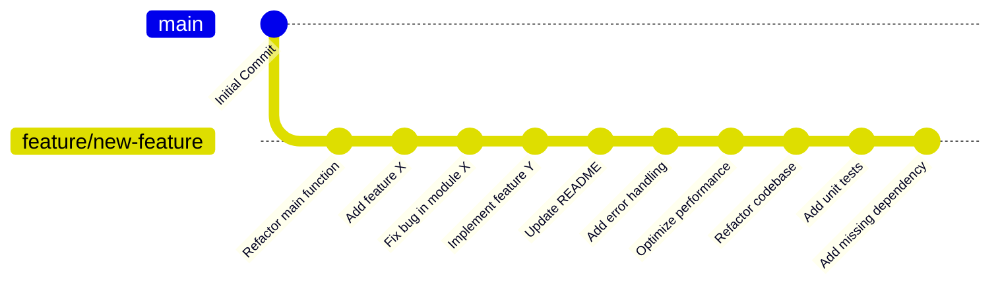
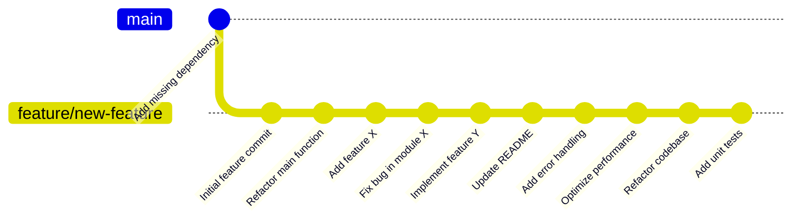

## راهنمای جامع دستور `git rebase` در گیت (Git)

**دستور `git rebase`** یکی از دستورات پرکاربرد و قدرتمند در گیت است که برای تغییر تاریخچه کامیت‌ها و مرتب‌سازی آن‌ها استفاده می‌شود. این دستور به توسعه‌دهندگان اجازه می‌دهد که شاخه خود را بر اساس شاخه اصلی به‌روز کنند و تغییرات خود را روی آخرین کامیت‌ها در شاخه اصلی دوباره اعمال کنند. استفاده از `rebase` باعث می‌شود که تاریخچه گیت شما تمیزتر و ساده‌تر شود، زیرا از ایجاد کامیت‌های ادغام (merge commits) جلوگیری می‌کند.

در این داکیومنت، به توضیح کامل دستور `git rebase`، نحوه کارکرد آن در پس‌زمینه، و موارد کاربرد آن می‌پردازیم. همچنین با استفاده از **Gitgraph** در **Mermaid**، گراف‌هایی برای نمایش فرآیند `rebase` ارائه می‌کنیم.

### دستور `git rebase` چیست؟

دستور `git rebase` به معنای **پایه‌گذاری مجدد** تغییرات شما بر روی یک شاخه دیگر است. به طور خلاصه، `rebase` تغییرات (کامیت‌های) موجود در یک شاخه را گرفته و آن‌ها را به بالای کامیت‌های یک شاخه دیگر منتقل می‌کند. این کار باعث می‌شود که تغییرات شما به عنوان جدیدترین تغییرات در شاخه هدف قرار بگیرند.

#### نحوه استفاده از `git rebase`:

```bash
git rebase <branch>
```

در این دستور:

- `<branch>` شاخه‌ای است که شما می‌خواهید تغییرات را بر اساس آن دوباره پایه‌گذاری کنید.

### چه اتفاقی در پس‌زمینه `git rebase` می‌افتد؟

1. **انتقال کامیت‌ها:**
   - گیت ابتدا تمام کامیت‌های شما را از شاخه فعلی برمی‌دارد و آن‌ها را در کنار می‌گذارد.
2. **بروزرسانی شاخه فعلی:**
   - سپس گیت شاخه فعلی شما را بر اساس شاخه مقصد (مثلاً `main`) به‌روز می‌کند.
3. **اعمال مجدد کامیت‌ها:**
   - در نهایت، گیت تمام کامیت‌های شما را به عنوان جدیدترین تغییرات، یکی یکی به بالای کامیت‌های جدید شاخه مقصد اضافه می‌کند.

#### تفاوت با `git merge`:

- **Merge:** کامیت‌های شما را با شاخه هدف ترکیب می‌کند و یک **کامیت ادغام (merge commit)** ایجاد می‌کند.
- **Rebase:** کامیت‌های شما را دوباره اعمال می‌کند و از ایجاد کامیت‌های ادغام جلوگیری می‌کند، به طوری که تغییرات شما مستقیماً بر روی شاخه هدف قرار می‌گیرند.

### گراف Gitgraph برای فرآیند `git rebase`:

#### قبل از `git rebase`:

```mermaid
gitGraph
   commit id: "Initial Commit"
   branch main
   commit id: "Feature A"
   branch feature-branch
   commit id: "Work on Feature 1"
   commit id: "Work on Feature 2"
```

#### بعد از `git rebase`:

```mermaid
gitGraph
   commit id: "Initial Commit"
   branch main
   commit id: "Feature A"
   checkout feature-branch
   commit id: "Work on Feature 1 (rebased)"
   commit id: "Work on Feature 2 (rebased)"
```

#### توضیحات:

- **گراف اول:** قبل از اجرای `git rebase`، شاخه `feature-branch` شامل دو کامیت جدید است که روی شاخه قدیمی `main` پایه‌گذاری شده است.
- **گراف دوم:** پس از اجرای `git rebase`, کامیت‌های `Work on Feature 1` و `Work on Feature 2` به عنوان جدیدترین کامیت‌ها روی شاخه `main` دوباره اعمال می‌شوند.

### مراحل استفاده از `git rebase`:

#### 1. جابه‌جایی به شاخه ویژگی (Feature Branch):

ابتدا به شاخه‌ای که می‌خواهید بر اساس شاخه اصلی دوباره پایه‌گذاری کنید بروید:

```bash
git checkout feature-branch
```

#### 2. اجرای دستور `rebase`:

دستور `git rebase` را برای پایه‌گذاری مجدد کامیت‌های شاخه ویژگی بر روی شاخه اصلی اجرا کنید:

```bash
git rebase main
```

#### 3. حل تعارض‌ها (در صورت وجود):

اگر بین تغییرات شما و تغییرات شاخه اصلی تعارضی وجود داشته باشد، گیت فرآیند rebase را متوقف می‌کند تا شما تعارض‌ها را حل کنید. بعد از حل تعارض‌ها، دستور زیر را اجرا کنید:

```bash
git add <file>
git rebase --continue
```

#### 4. پایان فرآیند:

وقتی rebase کامل شد، شما تغییرات خود را دوباره بر روی آخرین تغییرات شاخه اصلی اعمال کرده‌اید.

### کاربردهای `git rebase`:

1. **تمیز نگه‌داشتن تاریخچه گیت:**

   - یکی از اصلی‌ترین کاربردهای `git rebase` این است که تاریخچه پروژه شما را تمیز و خوانا نگه دارد. به جای ایجاد چندین کامیت ادغام، rebase کامیت‌های شما را مستقیماً به بالای شاخه اصلی منتقل می‌کند.

2. **حل تعارضات قبل از ادغام:**

   - قبل از ادغام یک شاخه با شاخه اصلی، می‌توانید از `git rebase` استفاده کنید تا تغییرات خود را با شاخه اصلی همگام کنید. این کار به شما اجازه می‌دهد تا تعارض‌ها را زودتر شناسایی و حل کنید.

3. **همگام‌سازی شاخه‌های قدیمی:**

   - اگر شاخه‌ای دارید که برای مدتی تغییر نکرده است، می‌توانید با `rebase` آن را به روز کنید و تغییرات جدید شاخه اصلی را به شاخه خود اضافه کنید بدون اینکه تاریخچه پیچیده‌ای ایجاد کنید.

4. **ادغام تغییرات بدون ایجاد کامیت‌های اضافی:**

   - برخلاف `git merge` که یک کامیت اضافی ایجاد می‌کند، `git rebase` کامیت‌های شما را به بالای شاخه اصلی منتقل می‌کند بدون نیاز به کامیت‌های اضافی.

5. **یکپارچه‌سازی بهتر با Code Review:**
   - در برخی تیم‌ها، استفاده از `rebase` قبل از ارسال Pull Request به عنوان یک راه برای اطمینان از همگام بودن تغییرات با شاخه اصلی پیشنهاد می‌شود. این کار به خوانایی بهتر و بررسی ساده‌تر تغییرات کمک می‌کند.

#### سناریو: اضافه کردن وابستگی (Dependency) پس از ۱۰ کامیت با استفاده از `git rebase`

فرض کنید شما در حال کار بر روی یک پروژه هستید و ۱۰ کامیت انجام داده‌اید، اما بعد از اتمام کار به یاد می‌آورید که یک وابستگی مهم (Dependency) را در فایل `requirements.txt` یا `package.json` اضافه نکرده‌اید. در این سناریو، شما می‌خواهید این وابستگی را به عنوان اولین کامیت به تمام تغییرات اعمال کنید بدون اینکه ساختار کامیت‌ها به هم بخورد یا تاریخچه پروژه شما پیچیده شود.

#### هدف:

استفاده از دستور **`git rebase -i`** برای ویرایش کامیت‌ها و اضافه کردن وابستگی به اولین کامیت، به طوری که به نظر برسد وابستگی همیشه از ابتدا در پروژه وجود داشته است.

#### مراحل انجام این کار:

##### 1. بررسی وضعیت فعلی پروژه

شما در شاخه‌ای به نام `feature/new-feature` کار می‌کنید و ۱۰ کامیت انجام داده‌اید:

```bash
git log --oneline
```

خروجی فرضی:

```plaintext
a1b2c3d (HEAD -> feature/new-feature) Add unit tests
b2c3d4e Refactor codebase
c3d4e5f Optimize performance
d4e5f6g Add error handling
e5f6g7h Update README
f6g7h8i Implement feature Y
g7h8i9j Fix bug in module X
h8i9j0k Add feature X
i9j0k1l Refactor main function
j0k1l2m Initial feature commit
```

همانطور که مشاهده می‌شود، شما ۱۰ کامیت زده‌اید و وابستگی‌ها فراموش شده‌اند.

##### 2. اضافه کردن وابستگی

ابتدا وابستگی جدید را به فایل مورد نظر اضافه کنید (برای مثال `requirements.txt` یا `package.json`):

```bash
echo "new-dependency==1.0.0" >> requirements.txt
```

##### 3. ساختن یک کامیت جدید برای اضافه کردن وابستگی

یک کامیت برای اضافه کردن این وابستگی جدید بسازید:

```bash
git add requirements.txt
git commit -m "Add missing dependency"
```

حالا اگر وضعیت گیت را بررسی کنید، می‌بینید که کامیت مربوط به اضافه کردن وابستگی به عنوان آخرین کامیت ثبت شده است:

```bash
git log --oneline
```

خروجی:

```plaintext
z1y2x3w (HEAD -> feature/new-feature) Add missing dependency
a1b2c3d Add unit tests
b2c3d4e Refactor codebase
...
j0k1l2m Initial feature commit
```

##### 4. استفاده از `git rebase -i` برای ادغام وابستگی در اولین کامیت

حالا می‌خواهیم کامیت مربوط به اضافه کردن وابستگی را به عنوان اولین کامیت در این شاخه اعمال کنیم.

برای این کار از دستور زیر استفاده می‌کنیم:

```bash
git rebase -i HEAD~11
```

این دستور تمام ۱۱ کامیت آخر (۱۰ کامیت قبلی و کامیت جدید مربوط به وابستگی) را برای ویرایش در حالت **interactive rebase** باز می‌کند.

پس از اجرای دستور، یک ویرایشگر متنی باز می‌شود که لیستی از کامیت‌ها را نمایش می‌دهد. این لیست به صورت زیر خواهد بود:

```plaintext
pick j0k1l2m Initial feature commit
pick i9j0k1l Refactor main function
pick h8i9j0k Add feature X
pick g7h8i9j Fix bug in module X
pick f6g7h8i Implement feature Y
pick e5f6g7h Update README
pick d4e5f6g Add error handling
pick c3d4e5f Optimize performance
pick b2c3d4e Refactor codebase
pick a1b2c3d Add unit tests
pick z1y2x3w Add missing dependency
```

در این لیست، کامیت مربوط به اضافه کردن وابستگی در انتها قرار دارد. برای اینکه این تغییرات در اولین کامیت قرار بگیرد، باید خط مربوط به کامیت **"Add missing dependency"** را به بالای لیست منتقل کنید.

ویرایش‌شده:

```plaintext
pick z1y2x3w Add missing dependency
pick j0k1l2m Initial feature commit
pick i9j0k1l Refactor main function
pick h8i9j0k Add feature X
pick g7h8i9j Fix bug in module X
pick f6g7h8i Implement feature Y
pick e5f6g7h Update README
pick d4e5f6g Add error handling
pick c3d4e5f Optimize performance
pick b2c3d4e Refactor codebase
pick a1b2c3d Add unit tests
```

سپس فایل را ذخیره کرده و از ویرایشگر خارج شوید.

##### 5. حل تعارضات (در صورت وجود)

ممکن است در طی فرآیند `rebase` با **تعارض‌ها (conflicts)** مواجه شوید. در این صورت، گیت به شما پیغام می‌دهد تا تعارضات را حل کنید. پس از حل تعارضات، از دستورات زیر استفاده کنید:

```bash
git add <file>
git rebase --continue
```

##### 6. اتمام فرآیند

بعد از پایان فرآیند `rebase`، تاریخچه شما به گونه‌ای خواهد بود که گویی وابستگی‌ها از ابتدا اضافه شده‌اند. حالا اگر لاگ گیت را بررسی کنید:

```bash
git log --oneline
```

خروجی به شکل زیر خواهد بود:

```plaintext
z1y2x3w (HEAD -> feature/new-feature) Add missing dependency
j0k1l2m Initial feature commit
i9j0k1l Refactor main function
h8i9j0k Add feature X
g7h8i9j Fix bug in module X
f6g7h8i Implement feature Y
e5f6g7h Update README
d4e5f6g Add error handling
c3d4e5f Optimize performance
b2c3d4e Refactor codebase
a1b2c3d Add unit tests
```

#### گراف Gitgraph برای این سناریو:

##### قبل از `git rebase`:



##### بعد از `git rebase`:



### مزایا و معایب `git rebase`:

#### مزایا:

- **تاریخچه تمیزتر:** با استفاده از `rebase`، از ایجاد کامیت‌های ادغام اضافه جلوگیری می‌شود و تاریخچه پروژه تمیزتر و ساده‌تر می‌ماند.
- **حل تعارضات قبل از ادغام:** توسعه‌دهندگان می‌توانند تعارضات را قبل از ادغام اصلی حل کنند.
- **به‌روزرسانی آسان شاخه‌ها:** تغییرات جدید شاخه اصلی به راحتی به شاخه‌های قدیمی اعمال می‌شوند.

#### معایب:

- **تغییر در تاریخچه:** `rebase` تاریخچه کامیت‌ها را تغییر می‌دهد، بنابراین باید با احتیاط استفاده شود. اگر شاخه‌ای را که با دیگران به اشتراک گذاشته‌اید، دوباره پایه‌گذاری کنید، ممکن است مشکلاتی در همگام‌سازی برای آن‌ها ایجاد شود.
- **پیچیدگی بیشتر نسبت به `merge`:** در برخی موارد، `rebase` می‌تواند پیچیده‌تر از `merge` باشد، به‌ویژه زمانی که با تعارضات زیادی مواجه شوید.

### نتیجه‌گیری:

**دستور `git rebase`** ابزاری قدرتمند است که به شما کمک می‌کند تا تاریخچه گیت خود را تمیز و ساده نگه دارید. با استفاده از این دستور، می‌توانید تغییرات خود را دوباره بر روی آخرین نسخه شاخه اصلی اعمال کنید و از ایجاد کامیت‌های ادغام غیرضروری جلوگیری کنید. با این حال، باید با دقت از آن استفاده شود، به‌خصوص در پروژه‌هایی که توسعه‌دهندگان زیادی روی یک شاخه کار می‌کنند.

با استفاده از **Gitgraph** در **Mermaid**، فرآیند `git rebase` به صورت بصری و روشن نمایش داده شد تا بهتر بتوانید درک کنید که چگونه کامیت‌های شما به شاخه اصلی منتقل می‌شوند.
