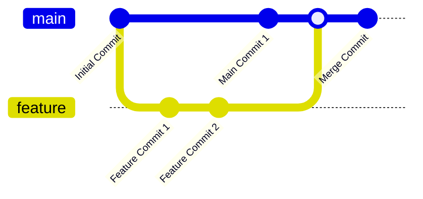
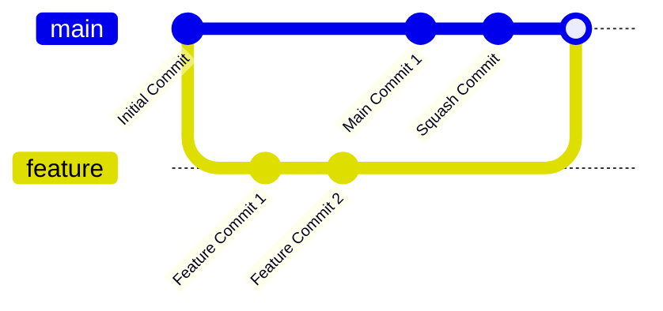
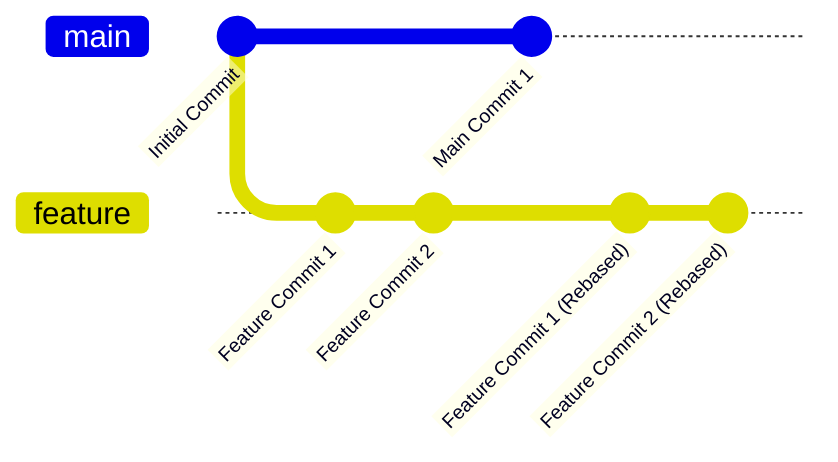

## توضیح Merge Commit، Squash and Merge و Rebase and Merge در گیت

در گیت، وقتی می‌خواهید یک شاخه (branch) را با شاخه دیگری ادغام کنید، چندین روش وجود دارد که هر کدام پیامدها و نتایج مختلفی در تاریخچه مخزن (repository) دارند. این روش‌ها عبارتند از **Merge Commit**، **Squash and Merge** و **Rebase and Merge**. هر کدام از این روش‌ها در شرایط مختلف استفاده می‌شوند و برای هر یک از آن‌ها مزایا و معایب خاصی وجود دارد. در این مستند، به بررسی این سه روش و تفاوت‌های آن‌ها با استفاده از **Gitgraph Diagrams** خواهیم پرداخت.

### 1. Merge Commit (ادغام با کامیت ادغام)

**Merge Commit** یک روش معمول برای ادغام تغییرات از یک شاخه به شاخه دیگر است. در این روش، یک کامیت اضافی به نام کامیت ادغام (**merge commit**) ایجاد می‌شود که نشان‌دهنده ترکیب تغییرات هر دو شاخه است. تاریخچه پروژه به صورت یک درخت غیرخطی باقی می‌ماند که در آن هر شاخه به صورت جداگانه توسعه یافته و در نهایت با شاخه اصلی ادغام می‌شود.

#### ویژگی‌ها:

- تغییرات هر شاخه به طور مستقل حفظ می‌شوند.
- تاریخچه غیرخطی است و شامل کامیت‌های ادغام است.
- برای پروژه‌هایی که می‌خواهند تاریخچه کامل تغییرات حفظ شود، مناسب است.

#### مثال:

#### مزایا:

- تاریخچه کاملاً شفاف و تغییرات هر شاخه به‌وضوح مشخص است.
- برای پروژه‌های بزرگ و تیم‌های چندنفره که نیاز به پیگیری دقیق تغییرات دارند، مفید است.

#### معایب:

- تاریخچه ممکن است پیچیده و شلوغ شود.
- کامیت‌های اضافی مربوط به ادغام ایجاد می‌شود.

---

### 2. Squash and Merge (ادغام و فشرده‌سازی کامیت‌ها)

در روش **Squash and Merge**، تمام کامیت‌های موجود در یک شاخه به یک کامیت واحد تبدیل می‌شوند و سپس به شاخه اصلی ادغام می‌شوند. این روش باعث می‌شود که تغییرات شاخه مورد نظر به صورت یک کامیت واحد در تاریخچه شاخه اصلی ثبت شوند.

#### ویژگی‌ها:

- تمام کامیت‌های یک شاخه به یک کامیت فشرده تبدیل می‌شوند.
- تاریخچه خطی است و تنها یک کامیت نشان‌دهنده تمام تغییرات است.
- برای تمیز و خطی نگه داشتن تاریخچه پروژه مفید است.

#### مثال:

#### مزایا:

- تاریخچه پروژه تمیز و ساده باقی می‌ماند.
- مناسب برای پروژه‌هایی است که تغییرات کوچک و زیاد دارند و نیازی به پیگیری دقیق هر کامیت نیست.

#### معایب:

- تاریخچه هر شاخه ناپدید می‌شود و کامیت‌های جداگانه شاخه ادغام‌شده از بین می‌روند.
- برای تیم‌هایی که نیاز به پیگیری دقیق تغییرات هر کامیت دارند، مناسب نیست.

---

### 3. Rebase and Merge (ادغام با بازپایه‌گذاری)

در روش **Rebase and Merge**، شاخه مورد نظر بازپایه‌گذاری (**rebase**) می‌شود، به این معنا که تغییرات شاخه ادغام‌شونده به بالای شاخه مقصد (مثلاً `main`) منتقل می‌شود و تاریخچه آن به گونه‌ای نمایش داده می‌شود که گویی تمام تغییرات به صورت خطی اعمال شده‌اند. پس از بازپایه‌گذاری، شاخه ادغام‌شده به شاخه اصلی اضافه می‌شود.

#### ویژگی‌ها:

- تاریخچه پروژه کاملاً خطی است و هیچ کامیت ادغامی وجود ندارد.
- تمام کامیت‌های شاخه ادغام‌شده حفظ می‌شوند، اما به گونه‌ای بازنویسی می‌شوند که انگار بعد از کامیت‌های شاخه اصلی انجام شده‌اند.

#### مثال:

#### مزایا:

- تاریخچه خطی و مرتب باقی می‌ماند.
- تمام کامیت‌های هر شاخه حفظ می‌شوند.
- برای پروژه‌هایی که می‌خواهند هم تاریخچه کامل حفظ شود و هم ساختار خطی داشته باشند، بسیار مفید است.

#### معایب:

- اگر تغییرات زیادی در شاخه‌ها باشد، ممکن است بازپایه‌گذاری پیچیده و همراه با تعارضات ادغام باشد.
- ممکن است برای اعضای تیم پیچیده‌تر باشد، به‌خصوص اگر با بازپایه‌گذاری آشنا نباشند.

---

### مقایسه کلی

| ویژگی                  | Merge Commit | Squash and Merge    | Rebase and Merge                 |
| ---------------------- | ------------ | ------------------- | -------------------------------- |
| **ساختار تاریخچه**     | غیرخطی       | خطی (یک کامیت واحد) | خطی (کامیت‌های اصلی حفظ می‌شوند) |
| **حفظ کامیت‌های شاخه** | بله          | خیر                 | بله                              |
| **ساده‌سازی تاریخچه**  | خیر          | بله                 | بله                              |
| **احتمال تعارضات**     | معمولی       | پایین               | بالا (به‌ویژه در بازپایه‌گذاری)  |

---

### جمع‌بندی

- **Merge Commit:** برای تیم‌ها و پروژه‌هایی که می‌خواهند تمام جزئیات تغییرات هر شاخه حفظ شود، اما تاریخچه پروژه پیچیده می‌شود.
- **Squash and Merge:** مناسب برای تیم‌هایی که می‌خواهند تاریخچه خطی و تمیز باشد و نیازی به پیگیری تغییرات جزئی هر کامیت ندارند.
- **Rebase and Merge:** تاریخچه خطی حفظ می‌شود و کامیت‌های هر شاخه حفظ می‌شوند، اما ممکن است برای پروژه‌های بزرگ پیچیده باشد و احتمال تعارضات ادغام بالاست.

هر کدام از این روش‌ها مزایا و معایب خود را دارند و بسته به نیاز پروژه و تیم می‌توان از آن‌ها استفاده کرد.
