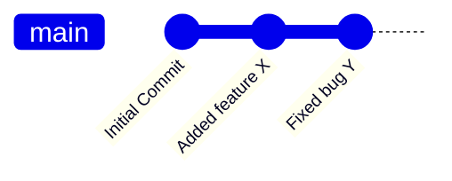
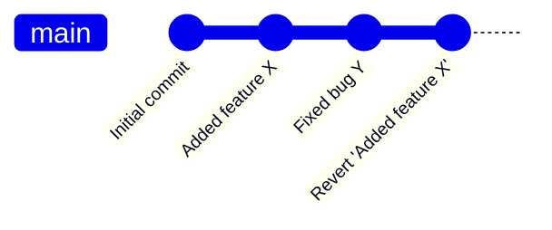

## دستور `git revert`

دستور `git revert` یکی از دستورات قدرتمند و پرکاربرد در گیت (Git) است که برای بازگردانی یک یا چند کامیت (commit) خاص استفاده می‌شود. این دستور تغییرات یک کامیت را معکوس می‌کند، بدون اینکه تاریخچه تغییرات قبلی را از بین ببرد. به عبارت دیگر، یک کامیت جدید ایجاد می‌کند که اثرات کامیت انتخابی شما را معکوس کرده و به نوعی "لغو" می‌کند، اما خود کامیت اصلی در تاریخچه باقی می‌ماند.

### دستور `git revert` چه کاری انجام می‌دهد؟

بر خلاف دستور `git reset` که تاریخچه را تغییر می‌دهد، `git revert` کامیت‌های قبلی را حفظ می‌کند و تنها یک کامیت جدید ایجاد می‌کند که تغییرات کامیت خاصی را معکوس می‌کند. این روش یک راه امن برای بازگشت به نسخه قبلی است، چرا که در صورت استفاده از `git revert` هیچ اطلاعاتی از تاریخچه گم نمی‌شود.

#### سینتکس کلی:

```bash
git revert <commit>
```

- **`<commit>`**: شناسه (hash) کامیت‌ای که می‌خواهید معکوس کنید.

#### نمونه استفاده:

1. **معکوس کردن آخرین کامیت:**

```bash
git revert HEAD
```

این دستور آخرین کامیت (`HEAD`) را معکوس می‌کند و تغییرات آن را به حالت قبل برمی‌گرداند.

2. **معکوس کردن یک کامیت خاص:**

```bash
git revert a1b2c3d
```

این دستور کامیت‌ای با شناسه `a1b2c3d` را معکوس می‌کند و تغییرات آن را برمی‌گرداند.

#### خروجی:

هنگام اجرای دستور `git revert`، گیت یک کامیت جدید ایجاد می‌کند که اثرات کامیت مشخص‌شده را معکوس می‌کند. سپس از شما می‌خواهد که برای این کامیت جدید یک پیام (commit message) وارد کنید که معمولاً به صورت پیش‌فرض پیام "Revert" است.

```plaintext
Revert "Add user authentication system"

This reverts commit a1b2c3d.
```

### چه اتفاقی در پس‌زمینه دستور `git revert` می‌افتد؟

هنگامی که شما دستور `git revert` را اجرا می‌کنید، گیت به صورت زیر عمل می‌کند:

1. **ایجاد یک کامیت جدید معکوس:**

   - گیت تغییرات کامیت مشخص‌شده را معکوس می‌کند (برای مثال، اگر فایلی اضافه شده باشد، فایل حذف می‌شود یا اگر خطی از کد اضافه شده باشد، آن خط حذف می‌شود) و یک کامیت جدید ایجاد می‌کند که این تغییرات معکوس را اعمال می‌کند.

2. **تغییر ندادن تاریخچه اصلی:**

   - برخلاف دستور `git reset`، تاریخچه پروژه تغییری نمی‌کند و کامیت اصلی همچنان در تاریخچه باقی می‌ماند. در واقع، تنها تغییراتی که کامیت اصلی اعمال کرده بود، معکوس می‌شود.

3. **همکاری ایمن با دیگران:**
   - دستور `git revert` یکی از بهترین روش‌ها برای همکاری در تیم‌های بزرگ است، چرا که کامیت‌های دیگران تحت تأثیر قرار نمی‌گیرند و تاریخچه پروژه کاملاً حفظ می‌شود.

### مزایا و معایب `git revert`

#### مزایا:

- **حفظ تاریخچه:** تاریخچه پروژه به هیچ وجه تغییر نمی‌کند و تمامی کامیت‌ها به ترتیب باقی می‌مانند.
- **ایمن برای همکاری تیمی:** به راحتی می‌توانید تغییرات را معکوس کنید، بدون اینکه کامیت‌های دیگران یا تاریخچه مخزن تحت تأثیر قرار بگیرد.
- **قابل ردگیری:** هر معکوس کردن به عنوان یک کامیت جداگانه ثبت می‌شود که می‌توانید آن را در آینده پیگیری کنید.

#### معایب:

- **ایجاد کامیت‌های اضافی:** برای هر معکوس کردن، یک کامیت جدید ایجاد می‌شود که ممکن است تاریخچه را شلوغ کند.
- **بازگردانی کامل نیست:** اگر تغییرات پیچیده‌ای در کامیت‌های قبلی انجام داده باشید، ممکن است بازگردانی به صورت کامل نتواند تغییرات را معکوس کند و نیاز به ادغام دستی داشته باشید.

### مقایسه `git revert` با `git reset`

- **`git revert`:** تغییرات یک کامیت خاص را معکوس می‌کند و یک کامیت جدید در تاریخچه ایجاد می‌کند. تاریخچه پروژه دست نخورده باقی می‌ماند و برای همکاری تیمی امن است.
- **`git reset`:** تاریخچه پروژه را به حالت قبل برمی‌گرداند و تغییرات کامیت‌های مشخص‌شده را به صورت کامل حذف می‌کند. این دستور تاریخچه پروژه را تغییر می‌دهد و ممکن است باعث ایجاد ناسازگاری در مخزن‌های دیگر شود.

### نحوه نمایش `git revert` با Gitgraph در Mermaid

#### 1. گراف بدون `git revert`:



در این گراف، سه کامیت انجام شده است: `Initial Commit`، `Added feature X` و `Fixed bug Y`.

#### 2. گراف پس از اجرای `git revert` برای معکوس کردن کامیت "Added feature X":


در این گراف، پس از اجرای `git revert` روی کامیت "Added feature X"، یک کامیت جدید به نام `Revert 'Added feature X'` ایجاد شده است که تغییرات کامیت `Added feature X` را معکوس می‌کند.

### نکات و ترفندها

#### 1. معکوس کردن چندین کامیت

اگر بخواهید چندین کامیت را به صورت همزمان معکوس کنید، می‌توانید از چندین شناسه کامیت استفاده کنید:

```bash
git revert <commit1> <commit2> <commit3>
```

#### 2. بازگرداندن تغییرات بدون کامیت فوری

اگر می‌خواهید تغییرات را معکوس کنید اما هنوز قصد ندارید آن‌ها را کامیت کنید، می‌توانید از گزینه `--no-commit` استفاده کنید:

```bash
git revert --no-commit <commit>
```

#### 3. حل تعارضات هنگام بازگردانی

در برخی موارد، ممکن است هنگام اجرای `git revert` با تعارضات ادغام (merge conflicts) مواجه شوید. در این حالت، باید تغییرات را به صورت دستی حل کنید و سپس تغییرات را کامیت کنید.

### مثال جامع از استفاده از `git revert` در گیت

در این مثال کامل و جامع، تمام مراحل لازم برای بازگردانی (revert) یک کامیت خاص را به همراه سایر عملیات‌هایی که ممکن است لازم باشد، از جمله `checkout`، بررسی لاگ (`log`) و حل تعارضات را نشان خواهیم داد. این مثال به شما کمک می‌کند تا تمامی جوانب و مراحل کار با دستور `git revert` را به خوبی درک کنید.

#### سناریو:

فرض کنید شما در حال کار روی پروژه‌ای هستید که دارای چندین کامیت در شاخه اصلی (`main`) است. در یکی از کامیت‌ها (به عنوان مثال "Added feature X") تغییراتی ناخواسته ایجاد شده و شما می‌خواهید این تغییرات را معکوس کنید. در اینجا مراحل مختلفی از جمله `checkout`، بررسی لاگ، اجرای `git revert` و کامیت کردن تغییرات را خواهیم دید.

##### 1. بررسی وضعیت و مشاهده شاخه فعلی

ابتدا باید مطمئن شوید که در شاخه‌ای قرار دارید که می‌خواهید تغییرات آن را معکوس کنید. برای این کار، از دستور `git status` استفاده می‌کنیم:

```bash
git status
```

این دستور به شما نشان می‌دهد که در کدام شاخه هستید و آیا تغییرات غیرکامیت شده‌ای دارید یا نه.

##### 2. بررسی تاریخچه کامیت‌ها

برای معکوس کردن یک کامیت، ابتدا باید شناسه (hash) آن کامیت را پیدا کنید. می‌توانید از دستور `git log` برای مشاهده تاریخچه کامیت‌ها استفاده کنید:

```bash
git log --oneline
```

خروجی دستور `git log` به صورت زیر خواهد بود:

```plaintext
d4e8f72 (HEAD -> main) Fixed bug Y
a1b2c3d Added feature X
e4f5g6h Initial commit
```

در اینجا، کامیت "Added feature X" دارای شناسه `a1b2c3d` است. ما می‌خواهیم این کامیت را معکوس کنیم.

##### 3. استفاده از `git checkout` برای اطمینان از حضور در شاخه اصلی

اگر در شاخه دیگری هستید و می‌خواهید تغییرات را در شاخه اصلی (`main`) معکوس کنید، ابتدا باید به شاخه `main` بروید:

```bash
git checkout main
```

این دستور شما را به شاخه اصلی منتقل می‌کند.

##### 4. اجرای دستور `git revert`

اکنون می‌خواهیم کامیت `a1b2c3d` (که مربوط به "Added feature X" است) را معکوس کنیم. برای این کار از دستور زیر استفاده می‌کنیم:

```bash
git revert a1b2c3d
```

این دستور تغییرات مربوط به کامیت `a1b2c3d` را معکوس می‌کند و یک کامیت جدید ایجاد می‌کند که این تغییرات را به حالت قبل برمی‌گرداند.

##### 5. مشاهده پیام کامیت revert

پس از اجرای `git revert`، گیت ویرایشگر پیش‌فرض سیستم شما (مانند Vim یا Nano) را باز می‌کند و یک پیام پیش‌فرض برای کامیت معکوس آماده می‌کند:

```plaintext
Revert "Added feature X"

This reverts commit a1b2c3d.
```

شما می‌توانید این پیام را تغییر دهید یا به همان شکل نگه دارید. سپس پیام را ذخیره و ویرایشگر را ببندید تا کامیت جدید ایجاد شود.

##### 6. بررسی لاگ بعد از revert

برای اطمینان از اینکه کامیت معکوس به درستی انجام شده است، می‌توانید مجدداً از دستور `git log` استفاده کنید:

```bash
git log --oneline
```

خروجی جدید به صورت زیر خواهد بود:

```plaintext
f8g9h0i (HEAD -> main) Revert "Added feature X"
d4e8f72 Fixed bug Y
a1b2c3d Added feature X
e4f5g6h Initial commit
```

می‌بینید که یک کامیت جدید با عنوان `Revert "Added feature X"` اضافه شده است که تغییرات آن کامیت را معکوس کرده است.

##### 7. حل تعارضات احتمالی (در صورت وجود)

گاهی اوقات، هنگامی که تغییرات زیادی در شاخه فعلی وجود داشته باشد، ممکن است اجرای `git revert` به تعارض (conflict) برخورد کند. در این حالت، شما باید تعارضات را به صورت دستی حل کنید. گیت به شما اطلاع خواهد داد که کدام فایل‌ها تعارض دارند.

برای حل تعارضات:

1. فایل‌هایی که تعارض دارند را ویرایش کنید و تعارضات را برطرف کنید.
2. تغییرات را با دستور زیر به استیج اضافه کنید:

```bash
git add <filename>
```

3. سپس کامیت نهایی را ایجاد کنید:

```bash
git commit
```

##### 8. ارسال تغییرات به مخزن راه دور

پس از اجرای `git revert` و معکوس کردن تغییرات، می‌توانید تغییرات را به مخزن راه دور ارسال کنید:

```bash
git push origin main
```

این دستور کامیت جدید (revert) را به مخزن راه دور (`origin`) در شاخه `main` ارسال می‌کند.

#### نمایش گراف با Gitgraph در Mermaid

##### گراف قبل از `git revert`:


##### گراف پس از اجرای `git revert`:



در این گراف، کامیت `Revert 'Added feature X'` اضافه شده است که تغییرات مربوط به کامیت `Added feature X` را معکوس کرده است.

### جمع‌بندی

دستور `git revert` یکی از بهترین روش‌ها برای بازگردانی تغییرات در گیت است، به خصوص در پروژه‌های تیمی. با استفاده از این دستور، شما می‌توانید تغییرات ناخواسته را به راحتی معکوس کنید و در عین حال تاریخچه پروژه را دست نخورده نگه دارید. این روش ایمن‌تر از `git reset` است و برای همکاری‌های تیمی مناسب‌تر است. با استفاده از گزینه‌های پیشرفته مانند `--no-commit` یا معکوس کردن چندین کامیت، می‌توانید کنترل بیشتری بر فرآیند بازگردانی داشته باشید.
