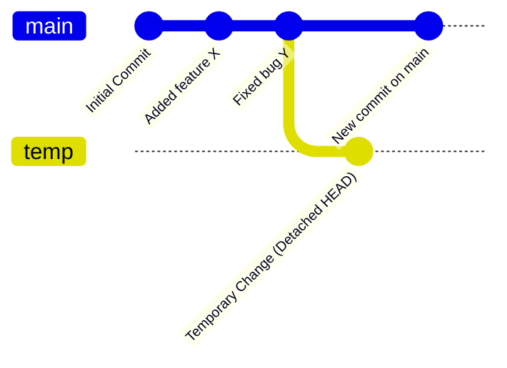

## بررسی Anonymous Checkout یا On-the-Fly Checkout در گیت

**Anonymous Checkout** یا **On-the-Fly Checkout** به فرآیندی در گیت (Git) اشاره دارد که در آن شما به‌طور موقت بدون تغییر شاخه فعلی، به یک کامیت خاص یا شاخه‌ای دیگر "چک‌اوت" (checkout) می‌کنید. این نوع چک‌اوت به شما اجازه می‌دهد که فایل‌های یک کامیت خاص یا نسخه‌ای از کد را برای مشاهده، آزمایش یا تغییر موقت بررسی کنید، بدون اینکه گیت وضعیت شاخه‌ی فعلی شما را تغییر دهد یا نیاز به ایجاد یک شاخه جدید داشته باشد.

### هدف از Anonymous Checkout یا On-the-Fly Checkout

Anonymous Checkout به شما این امکان را می‌دهد که به صورت موقت به یک نسخه خاص از پروژه دسترسی پیدا کنید، بدون اینکه نیاز باشد تغییری در شاخه فعلی ایجاد کنید یا کامیت جدیدی بسازید. این روش برای مواقعی مفید است که می‌خواهید یک نسخه خاص را بررسی کنید یا دیباگ انجام دهید و نیازی به ذخیره تغییرات یا تغییر شاخه فعلی ندارید.

### فرآیند Anonymous Checkout در گیت

هنگامی که از Anonymous Checkout استفاده می‌کنید، شما در واقع به "حالت جداگانه" یا **detached HEAD** می‌روید. در این حالت، HEAD گیت به جای اشاره به یک شاخه، به یک کامیت خاص اشاره می‌کند. در این وضعیت می‌توانید تغییراتی را اعمال کنید، اما اگر این تغییرات را ذخیره نکنید یا به یک شاخه دیگر بازنگردید، ممکن است تغییرات شما از بین بروند.

#### مثال:

فرض کنید شما می‌خواهید به یک کامیت خاص در گذشته چک‌اوت کنید:

```bash
git checkout a1b2c3d
```

در اینجا، `a1b2c3d` شناسه (hash) کامیت مورد نظر است. با اجرای این دستور، HEAD به کامیت مشخص‌شده اشاره می‌کند و شما می‌توانید به صورت موقت فایل‌ها و تغییرات آن کامیت را مشاهده و بررسی کنید. این عملیات به شما امکان می‌دهد تغییرات موقت انجام دهید، اما این تغییرات به شاخه فعلی شما اعمال نمی‌شود مگر اینکه به‌صورت دستی آن‌ها را ذخیره کنید.

#### پیام Detached HEAD:

هنگام چک‌اوت به یک کامیت خاص، گیت پیامی مانند زیر نمایش می‌دهد:

```plaintext
You are in 'detached HEAD' state. You can look around, make experimental
changes and commit them, and you can discard any commits you make in this
state without impacting any branches by performing another checkout.
```

این پیام به شما هشدار می‌دهد که در حالت detached HEAD هستید و هر تغییری که انجام دهید، به شاخه‌ای مرتبط نخواهد بود مگر اینکه آن را به شاخه‌ای اختصاص دهید.

### ویژگی‌های Anonymous Checkout یا On-the-Fly Checkout

1. **حالت موقت:** تغییراتی که در این حالت انجام می‌شوند، موقتی هستند و به شاخه فعلی شما اعمال نمی‌شوند، مگر اینکه آن‌ها را به یک شاخه جدید یا موجود متصل کنید.
2. **آزمایش و بررسی:** این روش برای بررسی یا دیباگ نسخه‌های قدیمی کد بدون ایجاد تغییر در شاخه فعلی بسیار مفید است.
3. **ایمن برای شاخه‌ها:** شما می‌توانید به یک کامیت یا تگ خاص چک‌اوت کنید، بدون اینکه روی شاخه اصلی خود تغییری ایجاد کنید.

### بازگشت از حالت Detached HEAD

برای بازگشت به حالت عادی و بازگشت به شاخه قبلی، کافی است به شاخه مورد نظر خود چک‌اوت کنید:

```bash
git checkout main
```

این دستور شما را از حالت Anonymous Checkout خارج کرده و به شاخه اصلی (main) بازمی‌گرداند.

### ذخیره تغییرات در حالت Anonymous Checkout

اگر در حالت Detached HEAD تغییراتی ایجاد کردید و می‌خواهید این تغییرات را حفظ کنید، می‌توانید آن‌ها را به یک شاخه جدید منتقل کنید:

1. ابتدا یک شاخه جدید بسازید:

   ```bash
   git checkout -b new-branch
   ```

2. سپس تغییرات را در شاخه جدید کامیت کنید:

   ```bash
   git commit -m "Save changes from detached HEAD"
   ```

در این صورت، تغییرات شما حفظ می‌شود و به شاخه جدید اختصاص می‌یابد.

### گراف Gitgraph برای نمایش Anonymous Checkout

در این گراف، مراحل استفاده از `git checkout` برای چک‌اوت به یک کامیت خاص و سپس بازگشت به شاخه اصلی نمایش داده می‌شود:



#### **توضیحات:**

- **Detached HEAD at 'Added feature X':** شما به کامیت `Added feature X` با استفاده از `git checkout` چک‌اوت می‌کنید و وارد حالت `Detached HEAD` می‌شوید.
- **Temporary Change (Detached HEAD):** تغییرات موقتی در حالت Detached HEAD ایجاد می‌کنید که در تاریخچه ثبت نشده است.
- **Back to main:** شما دوباره به شاخه `main` بازمی‌گردید و از حالت `Detached HEAD` خارج می‌شوید.
- **New commit on main:** پس از بازگشت به شاخه `main`، یک کامیت جدید در این شاخه انجام می‌شود.

### تفاوت بین Anonymous Checkout و Checkout معمولی

- **Anonymous Checkout (Detached HEAD):** در این حالت، شما به یک کامیت یا تگ خاص چک‌اوت می‌کنید و تغییرات موقتی هستند. تغییرات مستقیماً به شاخه‌ای متصل نیستند و تنها در کامیت جاری اعمال می‌شوند.
- **Checkout معمولی:** در این حالت، شما به یک شاخه مشخص چک‌اوت می‌کنید و تغییرات به شاخه متصل شده و در تاریخچه آن شاخه ثبت می‌شوند.

### مزایا و معایب

#### مزایا:

- **دیباگ و آزمایش آسان:** شما می‌توانید به‌صورت موقت هر نسخه‌ای از پروژه را بررسی کنید.
- **بدون تغییر در تاریخچه:** هیچ تغییری در شاخه‌ها یا تاریخچه اصلی پروژه ایجاد نمی‌شود.
- **ایمنی در برابر تغییرات ناخواسته:** به راحتی می‌توانید تغییرات را بدون اثرگذاری بر شاخه‌های اصلی انجام دهید.

#### معایب:

- **تغییرات ناپایدار:** اگر تغییرات را به یک شاخه جدید منتقل نکنید، ممکن است تغییرات از بین بروند.
- **سردرگمی برای مبتدیان:** حالت `detached HEAD` ممکن است برای کسانی که به تازگی کار با گیت را آغاز کرده‌اند، گیج‌کننده باشد.

### نتیجه‌گیری

Anonymous Checkout یا On-the-Fly Checkout یک روش بسیار مفید در گیت است که به شما اجازه می‌دهد به‌طور موقت به یک کامیت خاص چک‌اوت کنید و تغییرات موقتی انجام دهید. این روش برای آزمایش و بررسی نسخه‌های قدیمی کد و دیباگ بسیار کاربردی است. با این حال، باید توجه داشته باشید که تغییرات در این حالت موقتی هستند و باید آن‌ها را به شاخه‌ای جدید یا موجود منتقل کنید تا از بین نروند.
