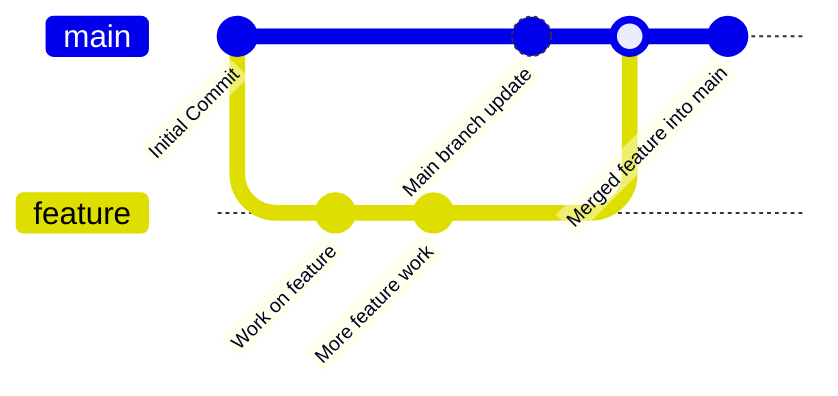

## شاخه (Branch) در گیت چیست؟

در گیت، **شاخه (Branch)** یکی از مفاهیم کلیدی است که به شما اجازه می‌دهد روی نسخه‌های مختلف کد به‌صورت همزمان کار کنید. به زبان ساده، شاخه‌ها نسخه‌های موازی از تاریخچه پروژه شما هستند که می‌توانید تغییرات را در آن‌ها انجام دهید بدون اینکه روی شاخه اصلی تأثیر بگذارید. شاخه‌ها به شما این امکان را می‌دهند که ویژگی‌های جدید را توسعه دهید، باگ‌ها را برطرف کنید یا آزمایش‌های خود را انجام دهید و در نهایت، پس از اطمینان از صحت تغییرات، آن‌ها را با شاخه اصلی ادغام (merge) کنید.

### ساختار شاخه‌ها

- **شاخه‌ی اصلی (Main/Master)**: این شاخه اغلب به عنوان شاخه‌ی پیش‌فرض پروژه در نظر گرفته می‌شود که شامل کد پایدار و تایید شده است.
- **شاخه‌های ویژگی (Feature branches)**: توسعه‌دهندگان برای کار بر روی ویژگی‌های جدید، معمولاً از شاخه‌ی اصلی یک شاخه جدید می‌سازند و تغییرات خود را در آن اعمال می‌کنند. پس از تکمیل کار، شاخه‌های ویژگی با شاخه اصلی ادغام می‌شوند.

### فرآیند کار با شاخه‌ها:

1. **ایجاد یک شاخه جدید**: برای توسعه یک ویژگی یا حل یک مشکل، شما از شاخه اصلی جدا می‌شوید و یک شاخه جدید ایجاد می‌کنید. این کار باعث می‌شود تغییرات شما روی شاخه اصلی تأثیر نگذارد.
2. **اعمال تغییرات**: در شاخه جدید، شما تغییرات خود را انجام داده و کامیت‌ها را ثبت می‌کنید.
3. **ادغام (Merge)**: پس از اتمام کار، تغییرات شاخه جدید را با شاخه اصلی ادغام می‌کنید.

### مزایای استفاده از شاخه‌ها:

- **همزمانی کارها**: چندین نفر می‌توانند به صورت همزمان روی بخش‌های مختلف پروژه کار کنند.
- **عدم تداخل**: شاخه‌ها از هم جدا هستند، بنابراین تغییرات یکی روی دیگری تأثیر نمی‌گذارد.
- **ساده‌سازی مدیریت پروژه**: شاخه‌ها به شما اجازه می‌دهند که کدهای جدید را جدا از کدهای اصلی تست کنید و در صورت درست بودن، آن‌ها را به شاخه اصلی اضافه کنید.

## نمایش شاخه‌ها با Gitgraph در Mermaid

در ادامه، یک گراف برای نمایش نحوه کار با شاخه‌ها در گیت ارائه شده است:

### توضیحات:

1. **Initial Commit**: اولین کامیت در شاخه اصلی (`main`).
2. **branch feature**: ایجاد یک شاخه جدید به نام `feature` از شاخه اصلی برای توسعه یک ویژگی جدید.
3. **Work on feature**: تغییرات و کامیت‌ها در شاخه `feature` بدون تأثیرگذاری روی شاخه اصلی انجام می‌شوند.
4. **checkout main**: بازگشت به شاخه اصلی.
5. **Main branch update**: یک کامیت جدید در شاخه اصلی انجام می‌شود.
6. **merge feature**: شاخه `feature` با شاخه `main` ادغام می‌شود.
7. **Merged feature into main**: تغییرات شاخه `feature` در شاخه اصلی اعمال شده و پروژه به‌روزرسانی می‌شود.

## استفاده از شاخه‌ها برای مدیریت پروژه

استفاده از شاخه‌ها در گیت به شما این امکان را می‌دهد که پروژه خود را به بخش‌های مختلف تقسیم کنید و بدون ایجاد اختلال در شاخه اصلی، تغییرات خود را اعمال کنید. پس از اتمام کار و تست کردن تغییرات، می‌توانید آن‌ها را با شاخه اصلی ادغام کرده و به این ترتیب مدیریت کدها را ساده‌تر و موثرتر کنید.

در ادامه به عملی کردن بحث شاخه‌ها در گیت می‌پردازیم.
