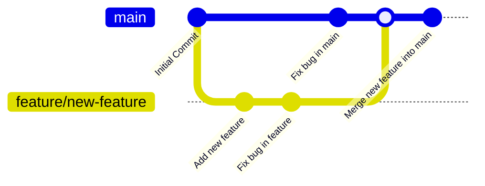

## دستور `git branch`

دستور `git branch` یکی از دستورات کلیدی گیت (Git) است که برای ایجاد، حذف و مشاهده شاخه‌ها در مخزن استفاده می‌شود. شاخه‌ها در گیت به شما این امکان را می‌دهند که مسیرهای توسعه جداگانه‌ای برای ویژگی‌ها، رفع باگ‌ها، یا هر تغییر دیگری ایجاد کنید. در این داکیومنت، به طور کامل به نحوه استفاده از دستور `git branch`، عملیات مربوط به شاخه‌ها و همچنین به بررسی آنچه در پس‌زمینه هنگام استفاده از این دستور اتفاق می‌افتد، خواهیم پرداخت.

### شاخه (Branch) در گیت چیست؟

یک شاخه در گیت در واقع یک اشاره‌گر به آخرین کامیت در یک سری از کامیت‌ها است. زمانی که شما یک شاخه جدید ایجاد می‌کنید، گیت یک اشاره‌گر جدید به کامیت فعلی اضافه می‌کند. این کار به شما اجازه می‌دهد که به طور مستقل تغییرات جدیدی را روی یک مسیر جداگانه از توسعه انجام دهید. شاخه اصلی یک پروژه معمولاً `main` یا `master` نام دارد، اما شما می‌توانید شاخه‌های جداگانه‌ای برای توسعه ویژگی‌های جدید یا رفع باگ‌ها ایجاد کنید.

### دستور `git branch` چه کاری انجام می‌دهد؟

دستور `git branch` به شما امکان مدیریت شاخه‌ها را می‌دهد. این دستور می‌تواند برای ایجاد شاخه جدید، مشاهده شاخه‌های موجود، حذف شاخه‌ها یا تغییر نام آن‌ها استفاده شود.

#### 1. مشاهده شاخه‌های موجود

با استفاده از این دستور، می‌توانید لیست شاخه‌های موجود را مشاهده کنید. شاخه‌ای که در حال حاضر در آن قرار دارید با ستاره (\*) مشخص می‌شود.

```bash
git branch
```

#### خروجی:

```plaintext
  feature/new-feature
* main
```

در این مثال، دو شاخه وجود دارد و شما در حال حاضر در شاخه `main` هستید.

#### 2. ایجاد یک شاخه جدید

برای ایجاد یک شاخه جدید از شاخه فعلی، از دستور زیر استفاده کنید:

```bash
git branch <branch_name>
```

**مثال:**

```bash
git branch feature/new-feature
```

این دستور یک شاخه جدید به نام `feature/new-feature` ایجاد می‌کند، اما شما همچنان در شاخه فعلی (`main`) باقی خواهید ماند.

#### 3. جابه‌جایی به یک شاخه (Checkout)

برای جابه‌جایی بین شاخه‌ها، از دستور `git checkout` استفاده می‌شود:

```bash
git checkout <branch_name>
```

**مثال:**

```bash
git checkout feature/new-feature
```

این دستور شما را به شاخه `feature/new-feature` منتقل می‌کند و می‌توانید تغییرات خود را در آن شاخه انجام دهید.

#### 4. ایجاد و جابه‌جایی همزمان به یک شاخه جدید

برای اینکه هم یک شاخه جدید ایجاد کنید و هم بلافاصله به آن شاخه منتقل شوید، از دستور `git checkout -b` استفاده کنید:

```bash
git checkout -b <branch_name>
```

**مثال:**

```bash
git checkout -b feature/experimental
```

این دستور شاخه `feature/experimental` را ایجاد کرده و شما را به آن منتقل می‌کند.

#### 5. حذف شاخه

برای حذف یک شاخه محلی که دیگر نیازی به آن ندارید، از دستور زیر استفاده کنید:

```bash
git branch -d <branch_name>
```

**مثال:**

```bash
git branch -d feature/new-feature
```

این دستور شاخه `feature/new-feature` را حذف می‌کند. اگر شاخه هنوز کامیت نشده باشد، گیت هشدار می‌دهد که شاخه شامل تغییرات منتشرنشده است. برای حذف اجباری می‌توانید از `-D` استفاده کنید:

```bash
git branch -D <branch_name>
```

#### 6. تغییر نام شاخه

اگر می‌خواهید نام یک شاخه را تغییر دهید، می‌توانید از دستور زیر استفاده کنید:

```bash
git branch -m <old_name> <new_name>
```

**مثال:**

```bash
git branch -m feature/old-feature feature/new-feature
```

این دستور نام شاخه `feature/old-feature` را به `feature/new-feature` تغییر می‌دهد.

### چه اتفاقی در پس‌زمینه دستور `git branch` می‌افتد؟

وقتی شما یک شاخه جدید با استفاده از دستور `git branch` ایجاد می‌کنید، گیت یک اشاره‌گر جدید به آخرین کامیت فعلی ایجاد می‌کند. در گیت، شاخه‌ها فقط یک اشاره‌گر (یا "reference") به کامیت‌ها هستند، بنابراین ایجاد شاخه جدید بسیار سبک و سریع است. این بدان معنی است که ایجاد شاخه‌ها باعث کپی کردن کل تاریخچه یا فایل‌ها نمی‌شود، بلکه تنها یک نشانگر جدید به آخرین کامیت اضافه می‌شود.

#### ایجاد شاخه:

1. **ایجاد اشاره‌گر جدید:** گیت یک اشاره‌گر جدید به کامیت فعلی اضافه می‌کند.
2. **بدون تغییر در تاریخچه:** هیچ‌گونه کپی یا تغییر در تاریخچه پروژه انجام نمی‌شود.
3. **شروع مستقل:** شما می‌توانید تغییرات جدید را در این شاخه به صورت مستقل انجام دهید، بدون اینکه بر سایر شاخه‌ها تأثیر بگذارید.

### نمایش گراف با Gitgraph در Mermaid

در این بخش، با استفاده از Gitgraph در Mermaid، نمایش بصری از عملیات شاخه‌ها (branching) را خواهیم داشت.

#### گراف نمایش ایجاد و ادغام شاخه‌ها:



#### توضیحات گراف:

1. **Initial Commit:** اولین کامیت در شاخه اصلی (`main`).
2. **branch feature/new-feature:** ایجاد شاخه جدید `feature/new-feature`.
3. **checkout feature/new-feature:** جابه‌جایی به شاخه `feature/new-feature`.
4. **Add new feature:** اضافه کردن یک ویژگی جدید و ایجاد کامیت در شاخه `feature/new-feature`.
5. **Fix bug in feature:** رفع باگ در شاخه `feature/new-feature` و ایجاد یک کامیت دیگر.
6. **checkout main:** بازگشت به شاخه `main`.
7. **Fix bug in main:** رفع باگ در شاخه `main`.
8. **merge feature/new-feature:** ادغام شاخه `feature/new-feature` با شاخه `main`.
9. **Merge new feature into main:** ایجاد کامیت نهایی ادغام در شاخه `main`.

### نکات مهم درباره شاخه‌ها

1. **کار همزمان روی چندین ویژگی:** شاخه‌ها به شما این امکان را می‌دهند که به طور همزمان روی چندین ویژگی یا باگ‌فیکس کار کنید، بدون اینکه تغییرات هر ویژگی روی ویژگی‌های دیگر تأثیر بگذارد.
2. **شاخه‌های محلی و راه دور:** شاخه‌هایی که به صورت محلی ایجاد می‌کنید تنها در مخزن محلی شما موجود هستند. برای اشتراک‌گذاری آن‌ها با دیگران باید از دستور `git push` برای ارسال آن‌ها به مخزن راه دور استفاده کنید.
3. **ادغام (Merge):** شاخه‌ها در نهایت باید ادغام شوند تا تغییرات آن‌ها در شاخه‌های دیگر نیز اعمال شوند. این ادغام می‌تواند به صورت خودکار (در صورت عدم وجود تعارض) یا دستی (در صورت وجود تعارض) انجام شود.

### جمع‌بندی

دستور `git branch` یکی از مهم‌ترین و پرکاربردترین دستورات در گیت است که به شما امکان مدیریت و استفاده از شاخه‌ها را می‌دهد. شاخه‌ها در گیت به شما این امکان را می‌دهند که به صورت مستقل روی ویژگی‌ها، باگ‌ها یا هر نوع تغییر دیگری کار کنید، بدون اینکه روی شاخه اصلی یا سایر شاخه‌ها تأثیر بگذارید. با استفاده از شاخه‌ها، توسعه پروژه‌ها به صورت ساختاریافته‌تر و منظم‌تر انجام می‌شود. همچنین استفاده از دستورات مختلف برای مدیریت شاخه‌ها مانند ایجاد، تغییر، حذف و ادغام شاخه‌ها به شما کمک می‌کند پروژه‌های خود را به بهترین شکل ممکن مدیریت کنید.
