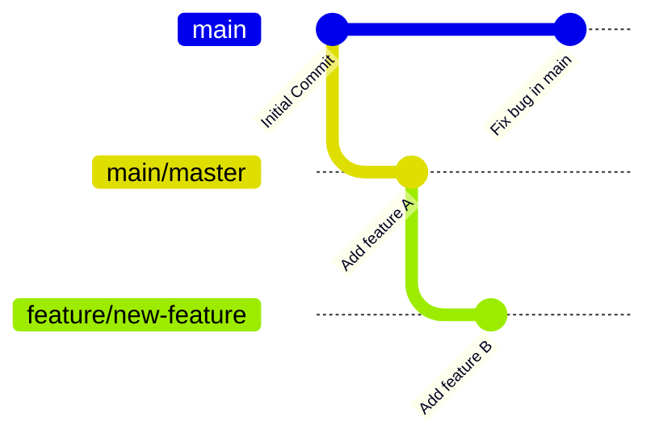
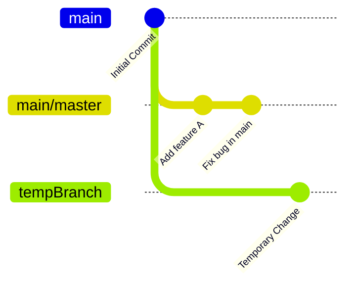

## دستور `git checkout`

دستور `git checkout` یکی از پرکاربردترین و مهم‌ترین دستورات در گیت (Git) است که برای جابه‌جایی بین شاخه‌ها (branches)، چک‌اوت به کامیت خاص و یا بازیابی فایل‌های خاص در پروژه استفاده می‌شود. این دستور به شما امکان می‌دهد که به شاخه دیگری بروید، فایل‌ها را از یک نسخه خاص بازیابی کنید، یا تغییرات موقت انجام دهید.

در این داکیومنت، به طور کامل به دستور `git checkout` و کاربردهای مختلف آن پرداخته و بررسی خواهیم کرد که در پس‌زمینه این دستور چه اتفاقی می‌افتد. همچنین با استفاده از **Gitgraph در Mermaid** گراف‌های مربوطه برای نمایش بهتر مفاهیم ارائه می‌شود.

### دستور `git checkout` چیست؟

دستور `git checkout` به شما اجازه می‌دهد که:

1. **بین شاخه‌ها جابه‌جا شوید:** برای کار بر روی شاخه‌های مختلف، شما باید بین شاخه‌های موجود در مخزن خود جابه‌جا شوید.
2. **چک‌اوت به یک کامیت خاص:** برای مشاهده یک نسخه قدیمی از پروژه یا برای ایجاد تغییرات موقت.
3. **بازیابی فایل‌ها از تاریخچه:** شما می‌توانید فایل‌های خاصی را از یک نسخه قدیمی یا شاخه دیگر بازیابی کنید.

### دستورات پایه‌ای `git checkout`

#### 1. جابه‌جایی بین شاخه‌ها

برای جابه‌جایی بین شاخه‌های مختلف، دستور `git checkout` به شما اجازه می‌دهد به شاخه‌ای که می‌خواهید در آن کار کنید منتقل شوید:

```bash
git checkout <branch_name>
```

**مثال:**

```bash
git checkout feature/new-feature
```

این دستور شما را به شاخه `feature/new-feature` منتقل می‌کند.

#### 2. ایجاد شاخه جدید و جابه‌جایی به آن

برای اینکه همزمان یک شاخه جدید ایجاد کنید و بلافاصله به آن منتقل شوید، از `-b` استفاده می‌شود:

```bash
git checkout -b <branch_name>
```

**مثال:**

```bash
git checkout -b feature/experimental
```

این دستور یک شاخه جدید به نام `feature/experimental` ایجاد کرده و شما را به آن منتقل می‌کند.

#### 3. چک‌اوت به یک کامیت خاص

شما می‌توانید به یک کامیت خاص چک‌اوت کنید تا آن نسخه از پروژه را مشاهده کنید یا تغییرات موقت انجام دهید. این کار معمولاً با استفاده از شناسه (hash) کامیت انجام می‌شود.

```bash
git checkout <commit_hash>
```

**مثال:**

```bash
git checkout a1b2c3d
```

این دستور شما را به کامیت با شناسه `a1b2c3d` می‌برد. پس از اجرای این دستور، شما وارد حالت **Detached HEAD** می‌شوید، به این معنی که تغییراتی که انجام می‌دهید به هیچ شاخه خاصی متصل نیستند.

#### 4. بازیابی فایل‌های خاص از تاریخچه

اگر بخواهید یک یا چند فایل خاص را از یک شاخه دیگر یا یک کامیت قدیمی بازیابی کنید، می‌توانید از `git checkout` برای این منظور استفاده کنید:

```bash
git checkout <branch_name> -- <file_path>
```

**مثال:**

```bash
git checkout main -- README.md
```

این دستور فایل `README.md` را از شاخه `main` بازیابی می‌کند و جایگزین نسخه فعلی آن در شاخه‌ای که شما در آن قرار دارید می‌شود.

### چه اتفاقی در پس‌زمینه دستور `git checkout` می‌افتد؟

هنگامی که شما دستور `git checkout` را اجرا می‌کنید، گیت عملیات زیر را انجام می‌دهد:

#### 1. **جابه‌جایی بین شاخه‌ها:**

- گیت اشاره‌گر **HEAD** را از شاخه فعلی به شاخه جدید تغییر می‌دهد. شاخه فعلی شما اکنون به شاخه جدیدی که به آن چک‌اوت کرده‌اید، تغییر می‌کند.
- گیت فایل‌های کاری شما را به وضعیت جدید شاخه مقصد تغییر می‌دهد، بنابراین فایل‌ها و تغییراتی که در شاخه جدید اعمال شده بودند به حالت فعلی برمی‌گردند.

#### 2. **چک‌اوت به یک کامیت خاص:**

- گیت شما را وارد حالت **Detached HEAD** می‌کند. در این حالت، HEAD به جای اینکه به یک شاخه خاص اشاره کند، به یک کامیت خاص اشاره می‌کند. این بدان معناست که شما به صورت مستقیم در تاریخچه یک نسخه خاص از پروژه کار می‌کنید، اما تغییرات شما در این حالت به هیچ شاخه‌ای متصل نخواهند شد.

#### 3. **بازیابی فایل‌ها:**

- گیت نسخه مشخصی از فایل را از تاریخچه پروژه بازیابی می‌کند و آن را جایگزین نسخه فعلی آن فایل در دایرکتوری کاری می‌کند. این کار بدون تغییر در وضعیت سایر فایل‌ها یا شاخه‌ها انجام می‌شود.

### نمایش گراف با Gitgraph در Mermaid

#### گراف برای جابه‌جایی بین شاخه‌ها و ایجاد شاخه جدید:



#### توضیحات گراف:

1. **Initial Commit:** اولین کامیت در شاخه `main`.
2. **Add feature A:** یک ویژگی جدید در شاخه `main` اضافه می‌شود.
3. **branch feature/new-feature:** یک شاخه جدید به نام `feature/new-feature` ایجاد می‌شود.
4. **checkout feature/new-feature:** جابه‌جایی به شاخه `feature/new-feature`.
5. **Add feature B:** ویژگی جدیدی به شاخه `feature/new-feature` اضافه می‌شود.
6. **checkout main:** بازگشت به شاخه `main`.
7. **Fix bug in main:** یک باگ در شاخه `main` رفع می‌شود.

#### گراف برای چک‌اوت به کامیت خاص و بازگشت:



#### توضیحات گراف:

1. **Initial Commit:** اولین کامیت در شاخه `main`.
2. **Add feature A:** یک ویژگی جدید به شاخه `main` اضافه می‌شود.
3. **Fix bug in main:** رفع باگ در شاخه `main`.
4. **checkout a1b2c3d:** چک‌اوت به یک کامیت خاص با شناسه `a1b2c3d`.
5. **Temporary Change (Detached HEAD):** ایجاد تغییرات موقتی در حالت Detached HEAD.
6. **checkout main:** بازگشت به شاخه `main`.

### نکات مهم درباره دستور `git checkout`

1. **Detached HEAD:** وقتی به یک کامیت خاص چک‌اوت می‌کنید، وارد حالت Detached HEAD می‌شوید که در آن تغییرات موقت و بدون اتصال به شاخه انجام می‌شود.
2. **حفظ تغییرات:** اگر در حالت Detached HEAD تغییراتی ایجاد کرده‌اید و نمی‌خواهید آن‌ها را از دست بدهید، باید این تغییرات را به یک شاخه جدید منتقل کنید.
3. **بازیابی فایل‌ها:** `git checkout` به شما امکان می‌دهد فایل‌های خاص را از یک نسخه قدیمی یا یک شاخه دیگر بازیابی کنید، بدون اینکه شاخه‌ای که در آن هستید تغییر کند.

### جمع‌بندی

دستور `git checkout` یکی از مهم‌ترین دستورات در گیت است که به شما امکان می‌دهد بین شاخه‌ها جابه‌جا شوید، به نسخه‌های خاص چک‌اوت کنید یا فایل‌های خاصی را بازیابی کنید. این دستور در پس‌زمینه با تغییر اشاره‌گر HEAD و جایگزینی فایل‌ها کار می‌کند و به شما کمک می‌کند تا به راحتی نسخه‌های مختلف پروژه خود را مدیریت کنید. همچنین با استفاده از گراف‌های **Gitgraph** در Mermaid، می‌توانید به صورت بصری عملکرد این دستور و نتایج آن را مشاهده کنید.
