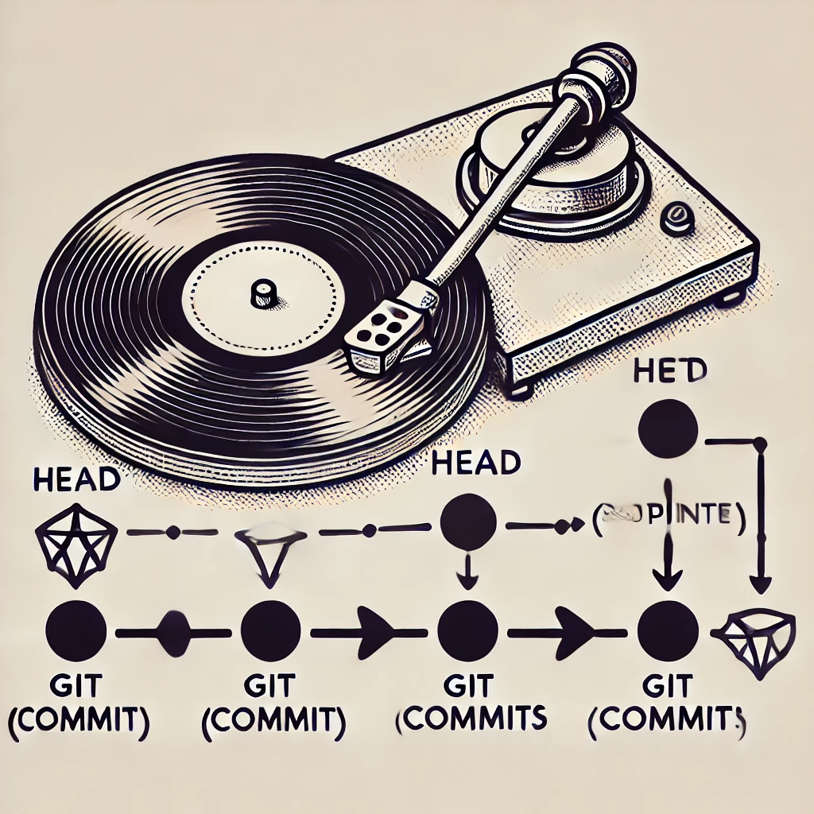

# فصل اول: مقدمه‌ای بر Git

## سیستم‌های کنترل نسخه نرم‌افزار

سیستم‌های کنترل نسخه نرم‌افزار (**Version Control Systems - VCS**) ابزاری برای مدیریت و پیگیری تغییرات در کد و فایل‌های پروژه هستند. این سیستم‌ها به توسعه‌دهندگان اجازه می‌دهند تا به‌صورت همزمان روی یک پروژه کار کنند، تاریخچه تغییرات (**history of changes**) را ذخیره کنند و به نسخه‌های قبلی بازگردند (**rollback**).

## تاریخچه سیستم‌های کنترل نسخه نرم‌افزار

سیستم‌های کنترل نسخه نرم‌افزار از دهه ۱۹۷۰ با سیستم‌های ابتدایی مانند **SCCS** (1972) و **RCS** (1982) شروع شدند که فایل‌های تغییرات را به صورت محلی ذخیره می‌کردند. در دهه ۱۹۹۰، **CVS** (Concurrent Versions System) معرفی شد که امکان همکاری تیمی و کار همزمان روی پروژه‌ها را فراهم کرد. سپس **Subversion (SVN)** در سال 2000 معرفی شد و بهبودهایی مانند ذخیره‌سازی متمرکز و تاریخچه بهتر را ارائه کرد.

با گسترش پروژه‌های منبع‌باز و نیاز به همکاری بیشتر، سیستم‌های کنترل نسخه توزیع‌شده مانند **Git** (2005) به وجود آمدند. **Git** که توسط لینوس توروالدز برای توسعه هسته لینوکس ساخته شد، به دلیل سرعت بالا، ذخیره‌سازی توزیع‌شده و مدیریت شاخه‌ها، به یکی از محبوب‌ترین سیستم‌های کنترل نسخه تبدیل شد.

## گیت چیست؟

**گیت** (**Git**) یک سیستم کنترل ورژن توزیع‌شده است که برای پیگیری تغییرات در منبع کد (source code) در طول توسعه نرم‌افزار طراحی شده است. این ابزار به توسعه‌دهندگان اجازه می‌دهد تا به‌طور همزمان بر روی یک پروژه کار کنند، نسخه‌های مختلف سورس کد را مدیریت کنند و بدون نوشتن بر روی کار یکدیگر همکاری کنند. ماهیت توزیع‌شده گیت به این معناست که هر توسعه‌دهنده یک نسخه کامل از تاریخچه پروژه را در اختیار دارد، که این موضوع باعث می‌شود گیت بسیار کارآمد و مطمئن برای مدیریت پروژه‌های بزرگ با تعداد زیادی از همکاران باشد. گیت که توسط **لینوس توروالدز** (**Linus Torvalds**) در سال **۲۰۰۵** ایجاد شد، به طور گسترده‌ای برای پروژه‌های منبع‌باز و سازمانی مورد استفاده قرار می‌گیرد و ویژگی‌هایی همچون شاخه‌سازی (branching)، ادغام (merging) و ذخیره‌سازی کارآمد فایل‌ها را ارائه می‌دهد.

## تاریخچه گیت

**گیت (Git)** در سال 2005 توسط **لینوس توروالدز**، خالق هسته لینوکس، ایجاد شد. در آن زمان، توسعه هسته لینوکس از یک سیستم کنترل نسخه تجاری به نام **BitKeeper** استفاده می‌کرد. پس از بروز اختلافاتی بین جامعه لینوکس و شرکت ارائه‌دهنده BitKeeper، تیم توسعه لینوکس به دنبال یک جایگزین متن‌باز بودند.

لینوس توروالدز تصمیم گرفت تا سیستم کنترل نسخه‌ای جدید، قدرتمند، سریع و توزیع‌شده ایجاد کند که نیازهای پیچیده پروژه‌های بزرگی مثل لینوکس را برآورده سازد. او **Git** را طراحی کرد که بر اساس اصول سرعت بالا، کارایی و توزیع‌شده بودن شکل گرفت. یکی از ویژگی‌های کلیدی گیت، توانایی آن در مدیریت پروژه‌های بزرگ با تعداد زیادی از توسعه‌دهندگان بود، به گونه‌ای که هر توسعه‌دهنده یک نسخه کامل از تاریخچه پروژه را در اختیار دارد.

گیت به سرعت به یکی از محبوب‌ترین سیستم‌های کنترل نسخه در دنیا تبدیل شد و امروزه در پروژه‌های منبع‌باز و تجاری به طور گسترده استفاده می‌شود. پلتفرم‌هایی مانند **GitHub** و **GitLab** نیز با استفاده از گیت، همکاری در پروژه‌های نرم‌افزاری را به سطح جدیدی ارتقا داده‌اند.

## استیج‌ها در گیت

گیت (Git) به عنوان یک سیستم کنترل نسخه توزیع‌شده، سه استیج اصلی دارد که به توسعه‌دهندگان امکان مدیریت مؤثر تغییرات در فایل‌ها و پروژه‌هایشان را می‌دهد. این استیج‌ها کمک می‌کنند تا توسعه‌دهندگان بتوانند تغییرات را مرحله‌بندی و سپس کامیت کنند. سه استیج اصلی گیت به شرح زیر است:

### 1. دایرکتوری کاری (Working Directory)

این استیج، جایی است که فایل‌های پروژه شما قرار دارند و تغییرات در آن‌ها اعمال می‌شود. دایرکتوری کاری همان پوشه‌ای است که فایل‌های کد منبع پروژه در آن قرار دارد و تغییرات ایجادشده در فایل‌ها، ابتدا در اینجا اعمال می‌شوند.

**مثال:**
شما یک فایل جدید به نام `file1.txt` ایجاد کرده یا آن را تغییر می‌دهید. این فایل در دایرکتوری کاری شما ذخیره می‌شود و هنوز توسط گیت پیگیری نمی‌شود.

```bash
# ساخت یا تغییر فایل
echo "Hello World" > file1.txt
```

### 2. ناحیه آماده‌سازی (Staging Area)

استیج یا ناحیه آماده‌سازی یک منطقه میانی است که فایل‌های تغییر یافته پس از اجرای دستور `git add` در آن قرار می‌گیرند. فایل‌هایی که به این ناحیه اضافه می‌شوند، آماده برای کامیت (commit) بعدی خواهند بود.

**مثال:**
برای افزودن فایل `file1.txt` به ناحیه آماده‌سازی از دستور زیر استفاده می‌شود:

```bash
git add file1.txt
```

### 3. مخزن محلی (Local Repository)

پس از اینکه فایل‌ها به ناحیه آماده‌سازی منتقل شدند و آماده برای کامیت شدند، با اجرای دستور `git commit` تغییرات به مخزن محلی (Local Repository) منتقل می‌شود. هر کامیت یک نقطه از تاریخچه پروژه را ثبت می‌کند و تغییرات انجام‌شده در فایل‌ها به طور دائمی ذخیره می‌شوند.

**مثال:**
برای کامیت کردن فایل‌های آماده‌سازی شده، از دستور زیر استفاده می‌شود:

```bash
git commit -m "Added file1.txt"
```

در اینجا تغییرات در فایل `file1.txt` به مخزن محلی شما منتقل شده و تاریخچه آن ثبت می‌شود.

_۳.۱. دیاگرام مفهومی استیج‌ها در گیت:_


### توضیحات دیاگرام:

- **Initial Commit:** نشان‌دهنده کامیت اولیه در پروژه است.
- **branch feature:** ایجاد یک شاخه جدید به نام `feature`.
- **checkout feature:** انتقال به شاخه‌ی `feature` برای کار روی ویژگی جدید.
- **commit Created file1.txt:** در این کامیت فایل `file1.txt` ایجاد شده است.
- **commit Modified file1.txt:** در این مرحله تغییراتی در فایل `file1.txt` اعمال شده و کامیت شده است.
- **checkout main:** بازگشت به شاخه‌ی اصلی (`main`).
- **merge feature:** ادغام تغییرات شاخه‌ی `feature` به شاخه‌ی اصلی (`main`).

> **نکته**
>
> اصلا نگران نباشید اگر چیزی از کامندها سر در نیاوردید! در ادامه به برسی تمام آن‌ها می‌پردازیم.

### جمع‌بندی

گیت دارای سه استیج اصلی است که هر کدام نقش مهمی در مدیریت تغییرات فایل‌ها ایفا می‌کنند:

1. **دایرکتوری کاری (Working Directory):** جایی که تغییرات روی فایل‌ها اعمال می‌شود.
2. **ناحیه آماده‌سازی (Staging Area):** محلی برای آماده‌سازی تغییرات قبل از کامیت.
3. **مخزن محلی (Local Repository):** جایی که تغییرات به طور دائمی ذخیره می‌شوند.

با استفاده از این استیج‌ها و دستورات گیت، می‌توانید به طور دقیق و مؤثر تغییرات خود را در پروژه‌های نرم‌افزاری مدیریت کنید.

## دستور `git init`

دستور `git init` برای ایجاد یک مخزن گیت (Git repository) جدید در یک دایرکتوری استفاده می‌شود. این دستور یک مخزن گیت محلی (local repository) را راه‌اندازی می‌کند که به توسعه‌دهنده اجازه می‌دهد تا تغییرات در منبع کد خود را مدیریت کند.

هنگامی که دستور `git init` اجرا می‌شود، گیت یک پوشه مخفی به نام `.git/` در همان دایرکتوری ایجاد می‌کند که تمام اطلاع ات مورد نیاز برای پیگیری تغییرات و مدیریت ورژن‌ها را در خود ذخیره می‌کند.

### دستور `git init` چه کار می‌کند؟

- یک مخزن خالی گیت ایجاد می‌کند.
- فایل‌ها و ساختارهای داخلی گیت مانند `.git/` را ایجاد می‌کند.
- آماده‌سازی دایرکتوری برای شروع پیگیری تغییرات در فایل‌ها و پوشه‌ها.

### چه اتفاقی در پس زمینه می‌افتد؟

1. **ایجاد پوشه `.git/`:** با اجرای دستور `git init`، پوشه‌ای مخفی به نام `.git/` در دایرکتوری پروژه شما ایجاد می‌شود. این پوشه شامل تمام اطلاعاتی است که گیت برای مدیریت مخزن و پیگیری تغییرات به آن نیاز دارد.

2. **ایجاد ساختار داخلی گیت:** درون پوشه `.git/`، چندین زیرپوشه و فایل کلیدی ساخته می‌شود:

   - **`objects/`:** این پوشه محل ذخیره‌سازی شیء‌های گیت است که شامل همه نسخه‌های فایل‌ها و تغییرات می‌شود.
   - **`refs/`:** این پوشه محل ذخیره شاخه‌ها (branches) و برچسب‌ها (tags) است.
   - **`HEAD`:** این فایل نشان می‌دهد که کدام شاخه (branch) فعال است.
   - **`config`:** تنظیمات مخزن محلی را ذخیره می‌کند.
   - **`index`:** فایل‌هایی که در مرحله آماده‌سازی (staging area) برای کامیت بعدی قرار دارند را مدیریت می‌کند.

3. **گیت آماده شروع پیگیری تغییرات می‌شود:** پس از اجرای `git init`، گیت آماده است تا فایل‌ها و تغییرات را پیگیری کند. هر تغییری که در فایل‌ها ایجاد شود، می‌تواند با استفاده از دستورات دیگر گیت (مانند `git add` و `git commit`) ثبت و پیگیری شود.

### موارد استفاده از `git init`

- ایجاد یک مخزن جدید از ابتدا برای شروع مدیریت سورس کد.
- تبدیل یک دایرکتوری موجود به یک مخزن گیت برای شروع پیگیری تغییرات.
- راه‌اندازی یک مخزن خالی برای پروژه‌های منبع‌باز یا سازمانی.

# فصل دوم: دستور‌های پایه در گیت

## دستور `git config`

دستور `git config` برای تنظیم و مدیریت تنظیمات گیت (Git) استفاده می‌شود. این دستور به کاربران اجازه می‌دهد تا اطلاعات مربوط به تنظیمات سطح کاربر، سطح مخزن (repository)، و سطح سیستم را مدیریت کنند. برخی از تنظیمات معمول که توسط این دستور مدیریت می‌شوند، شامل نام کاربری، ایمیل، و ویرایشگر پیش‌فرض است.

### استفاده‌های معمول از دستور `git config`:

1. **تنظیم نام کاربر:**

   ```bash
   git config --global user.name "Your Name"
   ```

2. **تنظیم ایمیل کاربر:**

   ```bash
   git config --global user.email "your.email@example.com"
   ```

3. **تغییر ویرایشگر پیش‌فرض:**

   ```bash
   git config --global core.editor "vim"
   ```

### انواع سطوح تنظیمات

- **سطح محلی (Local):** تنظیماتی که فقط به مخزن جاری اعمال می‌شود. این تنظیمات در فایل `.git/config` مخزن ذخیره می‌شوند. این دستور با آپشن `--local` در زمانی که در دایرکتوری که گیت را در آن init کرده‌اید تنظیم می‌شود.
- **سطح جهانی (Global):** تنظیماتی که به تمام مخازن کاربر در سیستم اعمال می‌شود. این تنظیمات در فایل `~/.gitconfig` ذخیره می‌شوند. آپشن آن `--global` می‌باشد.
- **سطح سیستم (System):** تنظیماتی که به تمام کاربران و مخازن سیستم اعمال می‌شود. این تنظیمات در فایل `/etc/gitconfig` ذخیره می‌شوند. آپشن این سطح سیستم `--system` می‌باشد.

### دستور `git config` چه کار می‌کند؟

- به کاربران اجازه می‌دهد تنظیمات مرتبط با هویت خود (مانند نام و ایمیل) را برای گیت ثبت کنند.
- تنظیمات پیش‌فرض مربوط به رفتار گیت (مانند ویرایشگر پیش‌فرض، نحوه نمایش خروجی‌ها، و مدیریت شاخه‌ها) را سفارشی یا کاستومایز می‌کند.
- گیت از این تنظیمات برای تعیین رفتارهای خاص استفاده می‌کند، مانند شناسایی نویسنده کامیت‌ها.

### چه اتفاقی در پس‌زمینه می‌افتد؟

1. **ایجاد و/یا بروزرسانی فایل‌های پیکربندی:** وقتی از دستور `git config` استفاده می‌کنید، گیت اطلاعات مربوط به تنظیمات شما را در یکی از سه فایل پیکربندی ذخیره می‌کند:

   - **`~/.gitconfig`** یا **`~/.config/git/config`**: برای تنظیمات سطح جهانی.
   - **`/etc/gitconfig`**: برای تنظیمات سطح سیستم.
   - **`./.git/config`**: برای تنظیمات سطح محلی.

2. **ساختار کلید-مقدار (Key-Value):** فایل‌های تنظیمات گیت به صورت یک ساختار کلید-مقدار ذخیره می‌شوند. به عنوان مثال:

   ```ini
   [user]
       name = Your Name
       email = your.email@example.com
   [core]
       editor = vim
   ```

3. **بارگذاری تنظیمات در هنگام استفاده از گیت:** هنگامی که از گیت استفاده می‌کنید (مانند اجرای دستور `git commit` یا `git push`)، گیت این فایل‌های تنظیمات را می‌خواند و رفتار خود را براساس آن‌ها تنظیم می‌کند. اولویت بارگذاری تنظیمات به ترتیب زیر است:

   - ابتدا تنظیمات سطح محلی.
   - سپس تنظیمات سطح جهانی.
   - در نهایت تنظیمات سطح سیستم.

4. **ذخیره هویت برای هر کامیت:** زمانی که نام و ایمیل خود را با `git config` تنظیم می‌کنید، گیت از این اطلاعات برای مشخص کردن نویسنده کامیت‌ها استفاده می‌کند. هر بار که یک کامیت انجام می‌دهید، این اطلاعات به همراه پیام کامیت در تاریخچه ذخیره می‌شود.

### تنظیمات حرفه‌ای در `git config`

#### 1. **تنظیم Alias برای دستورات گیت**

Aliasها (نام‌های مستعار) به شما کمک می‌کنند تا دستورات گیت را به شکل کوتاه‌تر و سریع‌تر استفاده کنید. برای مثال، برای تعریف یک Alias برای `git status`:

```bash
git config --global alias.st status
```

پس از تنظیم، می‌توانید به جای `git status` از `git st` استفاده کنید.

مثال‌های دیگر:

```bash
git config --global alias.co checkout
git config --global alias.br branch
git config --global alias.cm commit
```

#### 2. **تنظیمات Merge و Diff**

گیت به صورت پیش‌فرض از ابزارهای ساده برای ادغام (Merge) و مقایسه (Diff) استفاده می‌کند، اما می‌توانید آن‌ها را به ابزارهای حرفه‌ای تغییر دهید.

مثال: استفاده از `meld` به عنوان ابزار Diff:

```bash
git config --global diff.tool meld
git config --global difftool.prompt false
```

و برای ابزار Merge:

```bash
git config --global merge.tool meld
git config --global mergetool.prompt false
```

#### 3. **استفاده از `core.autocrlf` برای سازگاری پایان خط‌ها**

اگر تیم شما روی سیستم‌های مختلف (مانند ویندوز و لینوکس) کار می‌کند، بهتر است تنظیم `core.autocrlf` را برای مدیریت سازگاری پایان خط‌ها به کار ببرید.

- برای ویندوز:

  ```bash
  git config --global core.autocrlf true
  ```

- برای مک و لینوکس:
  ```bash
  git config --global core.autocrlf input
  ```

#### 4. **فعال کردن رنگ‌بندی در گیت**

فعال کردن رنگ‌بندی می‌تواند خوانایی خروجی دستورات گیت را افزایش دهد. با تنظیم `color.ui` می‌توانید خروجی‌های رنگی را فعال کنید:

```bash
git config --global color.ui auto
```

#### 5. **تنظیم `pull.rebase` برای استفاده از Rebase به جای Merge در `git pull`**

برای جلوگیری از ایجاد کامیت‌های ادغام غیرضروری هنگام کشیدن تغییرات از مخزن راه دور، می‌توانید از Rebase به جای Merge استفاده کنید:

```bash
git config --global pull.rebase true
```

### مشاهده و مدیریت تنظیمات

#### 1. **مشاهده تنظیمات فعلی**

برای مشاهده تنظیمات سطح خاصی از `git config` می‌توانید از این دستورات استفاده کنید:

- **تنظیمات محلی**:

  ```bash
  git config --local --list
  ```

- **تنظیمات کاربر**:

  ```bash
  git config --global --list
  ```

- **تنظیمات سیستم**:
  ```bash
  git config --system --list
  ```

#### 2. **حذف یک تنظیم**

برای حذف یک تنظیم، از گزینه `--unset` استفاده کنید. این کار می‌تواند برای تنظیمات محلی، کاربر یا سیستم استفاده شود.

```bash
git config --global --unset alias.st
```

### موارد استفاده از `git config`

- تنظیم هویت کاربر برای هر کامیت.
- تنظیمات رفتار گیت در مخازن محلی یا در تمام سیستم.
- مدیریت پارامترهایی مانند ادغام (merging) و شاخه‌بندی (branching) در مخازن پروژه.

در ادامه به برسی ویژگی‌های `git config` در جزئیات می‌پردازیم.

## دستور `git add`

دستور `git add` برای اضافه کردن تغییرات فایل‌ها به مرحله آماده‌سازی (staging area) در گیت استفاده می‌شود. این دستور به گیت می‌گوید که کدام تغییرات در فایل‌ها برای کامیت بعدی آماده شوند. تنها فایل‌ها یا تغییراتی که با `git add` به مرحله آماده‌سازی اضافه شده‌اند، در کامیت ثبت می‌شوند.

### استفاده‌های معمول از دستور `git add`:

1. **اضافه کردن یک فایل خاص به مرحله آماده‌سازی:**

   ```bash
   git add <filename>
   ```

2. **اضافه کردن تمام تغییرات به مرحله آماده‌سازی:**

   ```bash
   git add .
   ```

3. **اضافه کردن چند فایل یا دایرکتوری به مرحله آماده‌سازی:**

   ```bash
   git add <file1> <file2> <directory/>
   ```

4. **اضافه کردن تغییرات در بخشی از فایل:**
   ```bash
   git add -p
   ```

### دستور `git add` چه کار می‌کند؟

- فایل‌های مشخص شده را به مرحله آماده‌سازی (staging area) اضافه می‌کند.
- به گیت می‌گوید که این فایل‌ها و تغییرات آن‌ها باید در کامیت بعدی ثبت شوند.
- فایل‌های اصلاح‌شده، جدید و یا حذف‌شده را به همراه متادیتا (metadata) مرتبط به گیت معرفی می‌کند.

### چه اتفاقی در پس‌زمینه می‌افتد؟

1. **ایندکس کردن تغییرات:** وقتی دستور `git add` اجرا می‌شود، گیت تغییرات را از فایل‌های کاری شما برمی‌دارد و آن‌ها را در مرحله آماده‌سازی قرار می‌دهد. این مرحله در واقع یک ایندکس از تغییرات است که گیت آن را در حافظه محلی خود ذخیره می‌کند.

2. **ایجاد یک ایندکس جدید (Staging Area):**
   - مرحله آماده‌سازی (staging area) یک ناحیه موقت است که گیت از آن برای جمع‌آوری تغییراتی که قرار است در کامیت بعدی ثبت شوند، استفاده می‌کند.
   - وقتی شما از `git add` استفاده می‌کنید، گیت یک کپی از تغییرات را در این ناحیه ذخیره می‌کند. این تغییرات در واقع یک اسنپ‌شات از فایل‌ها و تغییرات آن‌ها است.
3. **به‌روزرسانی فایل‌های ایندکس در پوشه `.git/`:** در پوشه `.git/`، گیت اطلاعات ایندکس را در فایل‌های مختلف ذخیره می‌کند. به عنوان مثال:
   - **`index`**: این فایل شامل اطلاعات فایل‌هایی است که در مرحله آماده‌سازی قرار دارند.
   - **`objects/`**: این پوشه شامل شیء‌هایی است که نمایانگر اسنپ‌شات‌های مختلف از فایل‌های شما هستند.
4. **فایل‌های اصلاح‌شده یا جدید به ایندکس اضافه می‌شوند:** تغییرات فایل‌های جدید یا اصلاح‌شده در این مرحله ذخیره می‌شوند و آماده می‌شوند تا در کامیت بعدی به مخزن گیت اضافه شوند.

5. **مدیریت فایل‌های حذف‌شده:** اگر فایلی حذف شده باشد و شما از `git add` استفاده کنید، گیت این تغییر را نیز در ایندکس ثبت می‌کند و آماده است تا آن را در کامیت بعدی حذف کند.

### موارد استفاده از `git add`

- اضافه کردن تغییرات جدید یا اصلاح‌شده به مرحله آماده‌سازی.
- جمع‌آوری تغییرات مختلف برای یک کامیت تمیز و منظم.
- مدیریت فایل‌های جدید، تغییرات در فایل‌های موجود و حذف فایل‌ها قبل از ثبت در مخزن.

## ترفندها و نکات کاربردی دستور `git add`

### 1. اضافه کردن فایل‌های خاص با wildcard

می‌توانید از کاراکترهای wildcard برای اضافه کردن مجموعه‌ای از فایل‌ها با الگوی مشابه استفاده کنید. به عنوان مثال، اگر فقط بخواهید فایل‌های با پسوند `.js` را به مرحله آماده‌سازی اضافه کنید، می‌توانید از دستور زیر استفاده کنید:

```bash
git add *.js
```

این دستور تمام فایل‌های جاوااسکریپت موجود در دایرکتوری جاری را اضافه می‌کند.

### 2. اضافه کردن تغییرات بخشی از فایل‌ها (`git add -p`)

اگر فقط بخشی از تغییرات یک فایل را می‌خواهید به مرحله آماده‌سازی اضافه کنید، می‌توانید از گزینه `-p` استفاده کنید. این گزینه به شما اجازه می‌دهد تا تغییرات را به صورت تکه‌های (hunks) کوچک مشاهده کرده و انتخاب کنید که کدام یک به مرحله آماده‌سازی اضافه شوند:

```bash
git add -p
```

این قابلیت برای زمانی مفید است که نمی‌خواهید تمام تغییرات یک فایل در یک کامیت ثبت شوند.

### 3. اضافه کردن تمام فایل‌های تغییر یافته به مرحله آماده‌سازی

برای اضافه کردن تمام فایل‌های جدید، اصلاح‌شده و حذف‌شده به مرحله آماده‌سازی، می‌توانید از دستور زیر استفاده کنید:

```bash
git add .
```

این دستور تمام تغییرات در دایرکتوری جاری و زیرشاخه‌ها را به مرحله آماده‌سازی اضافه می‌کند.

### 4. اضافه کردن فایل‌ها از یک دایرکتوری خاص

اگر بخواهید فقط تغییرات در یک دایرکتوری خاص را به مرحله آماده‌سازی اضافه کنید، می‌توانید به‌طور مستقیم آن دایرکتوری را مشخص کنید:

```bash
git add <directory>/
```

به عنوان مثال، برای اضافه کردن تمام تغییرات در دایرکتوری `src`:

```bash
git add src/
```

### 5. افزودن فایل‌های حذف‌شده به کامیت بعدی

وقتی فایلی را حذف می‌کنید، برای اینکه این حذف در کامیت بعدی ثبت شود، باید از دستور `git add` استفاده کنید. گیت باید بداند که حذف فایل‌ها را نیز پیگیری کند:

```bash
git add -u
```

این دستور تمام فایل‌هایی که حذف شده‌اند و قبلاً تحت پیگیری گیت بودند را به مرحله آماده‌سازی اضافه می‌کند.

### 6. اضافه کردن فایل‌های جدید، بدون لمس فایل‌های حذف‌شده یا اصلاح‌شده

گاهی اوقات فقط می‌خواهید فایل‌های جدید را به مرحله آماده‌سازی اضافه کنید و تغییرات در فایل‌های موجود را نادیده بگیرید. برای این کار از گزینه `-N` استفاده کنید:

```bash
git add -N <filename>
```

این دستور فایل جدید را به مرحله آماده‌سازی اضافه می‌کند، بدون اینکه آن را در کامیت بعدی قرار دهد. این کار به گیت می‌گوید که فایل جدید را در نظر بگیرد اما هنوز به کامیت اضافه نکند.

### 7. بررسی سریع وضعیت پس از `git add`

برای اینکه ببینید چه فایل‌هایی به مرحله آماده‌سازی اضافه شده‌اند و آماده برای کامیت هستند، می‌توانید از دستور زیر استفاده کنید:

```bash
git status
```

این دستور فایل‌های آماده برای کامیت را نمایش می‌دهد و به شما اطمینان می‌دهد که کدام فایل‌ها در مرحله آماده‌سازی قرار دارند.

### 8. اضافه کردن تغییرات فایل‌های اصلاح‌شده بدون فایل‌های جدید

اگر فایل‌هایی اصلاح شده‌اند اما فایل جدیدی اضافه نکرده‌اید و فقط می‌خواهید تغییرات فایل‌های موجود را آماده کامیت کنید، می‌توانید از دستور `git add -u` استفاده کنید:

```bash
git add -u
```

این دستور فقط فایل‌هایی را که تغییر کرده‌اند (و قبلاً در مخزن بوده‌اند) به مرحله آماده‌سازی اضافه می‌کند و فایل‌های جدید را نادیده می‌گیرد.

### 9. استفاده از `git add -A` برای همگانی کردن تغییرات

اگر بخواهید هم فایل‌های جدید، هم فایل‌های اصلاح‌شده و هم فایل‌های حذف‌شده را به یک‌باره به مرحله آماده‌سازی اضافه کنید، از گزینه `-A` استفاده کنید:

```bash
git add -A
```

این دستور تمام تغییرات را در هر فایلی در دایرکتوری‌های شما به مرحله آماده‌سازی اضافه می‌کند.

### 10. استفاده از `git add .` و `git add -A` و تفاوت آن‌ها

- `git add .` فقط تغییرات در دایرکتوری جاری و زیرشاخه‌های آن را اضافه می‌کند، در حالی که تغییرات خارج از این دایرکتوری را نادیده می‌گیرد.
- `git add -A` تمام تغییرات در کل مخزن، از جمله فایل‌های خارج از دایرکتوری جاری را به مرحله آماده‌سازی اضافه می‌کند.

این تفاوت برای مدیریت بهتر پروژه‌های بزرگ و چندین دایرکتوری می‌تواند مفید باشد.

## سه فایل ضروری در اولین کامیت: `LICENSE`, `README.md` و `.gitignore`

قبل از اینکه وارد دستور `git commit` بشویم بیایید تا با سه فایل ضروری قبل از اولین کامیت آشنا شویم.

در هر پروژه‌ی نرم‌افزاری که با گیت (Git) مدیریت می‌شود، سه فایل مهم وجود دارند که اغلب در اولین کامیت (commit) به مخزن اضافه می‌شوند: `LICENSE`, `README.md` و `.gitignore`. هر کدام از این فایل‌ها نقشی کلیدی در سازماندهی و مدیریت پروژه دارند و می‌توانند به تیم توسعه‌دهنده و کاربران پروژه کمک کنند تا پروژه را بهتر درک و استفاده کنند.

### 1. فایل `LICENSE`

فایل `LICENSE` حاوی اطلاعات مربوط به مجوز استفاده از پروژه است. این فایل تعیین می‌کند که چه حقوق و محدودیت‌هایی برای استفاده، توزیع و اصلاح کد پروژه وجود دارد. انتخاب مجوز مناسب برای پروژه‌های منبع‌باز بسیار مهم است، زیرا به کاربران اجازه می‌دهد بدانند که چگونه می‌توانند از کد شما استفاده کنند.

#### اهمیت `LICENSE`:

- **حقوق قانونی:** به وضوح مشخص می‌کند که چه حقوقی به کاربران پروژه اعطا شده است.
- **محافظت از توسعه‌دهنده:** در برابر مسئولیت‌های قانونی محافظت می‌کند.
- **شفافیت:** کاربران پروژه به راحتی متوجه می‌شوند که چگونه می‌توانند از پروژه استفاده کنند و آیا اجازه‌ی تغییر و توزیع دارند یا خیر.

#### مثال:

یکی از مجوزهای محبوب، **MIT License** است که بسیار ساده و منعطف است:

```plaintext
MIT License

Copyright (c) [Year] [Your Name]

Permission is hereby granted, free of charge, to any person obtaining a copy of this software and associated documentation files (the "Software"), to deal in the Software without restriction, including without limitation the rights to use, copy, modify, merge, publish, distribute, sublicense, and/or sell copies of the Software, and to permit persons to whom the Software is furnished to do so, subject to the following conditions: ...
```

### 2. فایل `README.md`

فایل `README.md` حاوی اطلاعات کلیدی درباره‌ی پروژه است و اولین جایی است که کاربران پروژه یا همکاران تیم به آن نگاه می‌کنند. این فایل اغلب شامل توضیحات اولیه درباره‌ی پروژه، نحوه نصب، استفاده، وابستگی‌ها، و سایر اطلاعات ضروری است.

#### اهمیت `README.md`:

- **معرفی پروژه:** توضیح می‌دهد که پروژه چه کاری انجام می‌دهد.
- **راهنمای شروع:** نحوه نصب و اجرای پروژه را به کاربر یا توسعه‌دهنده‌ی جدید نشان می‌دهد.
- **مستندات اولیه:** می‌تواند اطلاعات کلیدی مانند وابستگی‌ها و ساختار کلی پروژه را در خود جای دهد.

#### ساختار معمول `README.md`:

# نام پروژه

توضیح کوتاهی درباره پروژه و هدف آن.

## نصب

دستورالعمل‌هایی برای نصب و راه‌اندازی پروژه:

```bash
git clone https://github.com/yourusername/projectname.git
cd projectname
npm install
```

## نحوه استفاده

توضیحی درباره چگونگی استفاده از پروژه:

```bash
npm start
```

## مشارکت

قوانینی برای مشارکت در پروژه (در صورت وجود).

### 3. فایل `.gitignore`

فایل `.gitignore` حاوی لیستی از فایل‌ها و دایرکتوری‌هایی است که نباید توسط گیت پیگیری و به مخزن اضافه شوند. این فایل برای جلوگیری از اضافه شدن فایل‌های غیرضروری، موقت، یا شخصی (مانند فایل‌های پیکربندی محلی، کش‌ها و فایل‌های کامپایل‌شده) به مخزن بسیار مفید است.

#### اهمیت `.gitignore`:

- **حذف فایل‌های غیرضروری:** مانع از اضافه شدن فایل‌های موقت، کامپایل‌شده، یا وابستگی‌های پروژه به مخزن می‌شود.
- **بهبود سرعت و کارایی:** با کاهش حجم مخزن و جلوگیری از پیگیری فایل‌هایی که به مخزن ارتباطی ندارند.
- **افزایش امنیت:** جلوگیری از اضافه شدن فایل‌های حساس مانند کلیدهای API یا فایل‌های پیکربندی محلی به مخزن.

#### مثال از `.gitignore`:

```plaintext
# Ignore node_modules for Node.js projects
node_modules/

# Ignore Python cache files
__pycache__/
*.py[cod]

# Ignore macOS system files
.DS_Store

# Ignore environment variables file
.env
```

### نتیجه‌گیری

وجود فایل‌های `LICENSE`, `README.md` و `.gitignore` در اولین کامیت، به نظم‌بخشی، وضوح و امنیت پروژه کمک می‌کند. این فایل‌ها نه تنها به همکاران و کاربران پروژه اطلاعات حیاتی ارائه می‌دهند، بلکه به تیم توسعه‌دهنده کمک می‌کنند تا از پیگیری فایل‌های غیرضروری جلوگیری کرده و از حقوق قانونی خود محافظت کنند.

در ادامه به برسی دقیق‌تر دو فایل `.gitignore` و `LICENSE` می‌پردازیم.

## راهنمای جامع `.gitignore`

فایل `.gitignore` یکی از فایل‌های کلیدی در هر پروژه‌ای است که با گیت (Git) مدیریت می‌شود. این فایل به شما امکان می‌دهد مشخص کنید کدام فایل‌ها و دایرکتوری‌ها نباید توسط گیت پیگیری شوند. این موضوع مخصوصاً زمانی اهمیت پیدا می‌کند که فایل‌هایی وجود دارند که نیازی به اشتراک‌گذاری یا ذخیره در مخزن ندارند (مثل فایل‌های خروجی، موقت یا فایل‌های حاوی اطلاعات شخصی).

در این راهنما، به ساختار فایل `.gitignore`، نحوه نوشتن آن، و نکات و ترفندهای مهم برای استفاده بهتر از این فایل می‌پردازیم.

### ساختار و اصول اولیه `.gitignore`

فایل `.gitignore` یک فایل متنی ساده است که هر خط آن یک الگو برای نادیده گرفتن فایل‌ها یا دایرکتوری‌ها تعریف می‌کند. این الگوها می‌توانند شامل نام فایل‌ها، دایرکتوری‌ها یا ترکیب‌های پیچیده‌تری باشند.

### قوانین کلی:

- **هر خط یک الگو:** هر خط از فایل `.gitignore` نشان‌دهنده‌ی یک الگوی نادیده گرفتن است.
- **خط‌های خالی و کامنت‌ها:** خطوط خالی و خطوطی که با `#` شروع می‌شوند به عنوان کامنت در نظر گرفته می‌شوند و گیت آن‌ها را نادیده می‌گیرد.
- **علامت `!`:** اگر یک خط با `!` شروع شود، به گیت گفته می‌شود که آن فایل یا پوشه را پیگیری کند حتی اگر قبلاً با یک الگوی دیگر نادیده گرفته شده باشد.
- **دایرکتوری‌ها با `/`:** اضافه کردن `/` در انتهای یک نام دایرکتوری باعث می‌شود گیت تمام فایل‌های داخل آن دایرکتوری را نادیده بگیرد.

### مثال‌های ساده:

```plaintext
# نادیده گرفتن فایل‌های خروجی
*.log

# نادیده گرفتن دایرکتوری node_modules/
node_modules/

# نادیده گرفتن فایل‌های کش پایتون
__pycache__/

# نادیده گرفتن فایل‌های کامپایل‌شده C
*.o
```

### کاراکترهای ویژه و الگوها در `.gitignore`

#### 1. **الگوهای عمومی با `*`:**

`*` به عنوان کاراکتر wildcard (جانشین) استفاده می‌شود و به معنای تطبیق با هر تعداد کاراکتر است.

- `*.log`: تمام فایل‌هایی با پسوند `.log` را نادیده می‌گیرد.
- `build/*`: تمام فایل‌های داخل دایرکتوری `build/` را نادیده می‌گیرد.

#### 2. **الگوهای سطحی با `/`:**

- `test/`: فقط دایرکتوری `test/` در سطح جاری را نادیده می‌گیرد.
- `/*.log`: فقط فایل‌های `.log` در ریشه‌ی پروژه را نادیده می‌گیرد و فایل‌های مشابه در دایرکتوری‌های فرعی را نادیده نمی‌گیرد.

#### 3. **نادیده گرفتن یک فایل مشخص:**

اگر بخواهید فقط یک فایل خاص را نادیده بگیرید:

- `config/settings.json`: فقط این فایل را در مسیر مشخص نادیده می‌گیرد.

#### 4. **علامت `!` برای پیگیری فایل خاص:**

گاهی اوقات ممکن است بخواهید یک فایل خاص را از بین فایل‌های نادیده گرفته‌شده استثناء کنید.

- `*.log`: همه فایل‌های `.log` را نادیده بگیر.
- `!important.log`: اما فایل `important.log` را پیگیری کن.

#### 5. **الگوهای recursive:**

- `**/temp`: همه‌ی دایرکتوری‌های `temp/` را در هر سطحی از پروژه نادیده می‌گیرد.
- `**/*.log`: همه فایل‌های `.log` را در تمام دایرکتوری‌ها و زیرشاخه‌ها نادیده می‌گیرد.

### نکات و ترفندها

#### 1. **تنظیم `.gitignore` به‌طور خاص برای سیستم‌عامل‌ها**

فایل‌های موقتی یا خروجی مربوط به سیستم‌عامل‌های مختلف را می‌توانید به `.gitignore` اضافه کنید تا این فایل‌ها در مخزن گیت ذخیره نشوند. مثال‌هایی برای سیستم‌عامل‌ها:

**macOS:**

```plaintext
# macOS specific ignores
.DS_Store
.AppleDouble
```

**Windows:**

```plaintext
# Windows specific ignores
Thumbs.db
ehthumbs.db
```

#### 2. **الگوهای خاص زبان‌های برنامه‌نویسی**

بسیاری از زبان‌ها فایل‌های موقتی و خروجی خاص خود را دارند. اضافه کردن این فایل‌ها به `.gitignore` از ذخیره شدن فایل‌های غیرضروری جلوگیری می‌کند.

**JavaScript (Node.js):**

```plaintext
# Node.js dependencies
node_modules/
npm-debug.log
yarn-error.log
```

**Python:**

```plaintext
# Byte-compiled / optimized / DLL files
__pycache__/
*.py[cod]

# Virtual environment
.venv/
```

**Java:**

```plaintext
# Compiled class file
*.class

# Log files
*.log
```

#### 3. **ایجاد یک فایل `.gitignore` جهانی**

اگر پروژه‌های مختلفی دارید و می‌خواهید برخی فایل‌ها را برای همه پروژه‌ها نادیده بگیرید، می‌توانید یک فایل `.gitignore` جهانی بسازید. این کار می‌تواند برای فایل‌های سیستم‌عامل، ویرایشگر متن یا ابزارهای توسعه بسیار مفید باشد.

**ایجاد فایل `.gitignore` جهانی:**

```bash
git config --global core.excludesfile ~/.gitignore_global
```

**نمونه‌ای از `.gitignore` جهانی:**

```plaintext
# macOS
.DS_Store

# Vim
*.swp

# Logs
*.log
```

#### 4. **پاک کردن فایل‌های نادیده گرفته شده از مخزن**

اگر فایلی قبلاً به مخزن اضافه شده و حالا می‌خواهید آن را از مخزن حذف کنید و به `.gitignore` اضافه کنید، ابتدا باید آن را از مخزن حذف کنید (بدون حذف آن از دیسک):

```bash
git rm --cached <filename>
```

سپس فایل را به `.gitignore` اضافه کنید تا از این پس پیگیری نشود.

#### 5. **استفاده از `.git/info/exclude` برای نادیده گرفتن فایل‌های محلی**

اگر بخواهید به‌طور موقت و فقط در سیستم خودتان فایل‌هایی را نادیده بگیرید، می‌توانید به‌جای استفاده از `.gitignore` از فایل `.git/info/exclude` استفاده کنید. این فایل برای نادیده گرفتن فایل‌ها به‌صورت محلی و بدون اشتراک‌گذاری با دیگران استفاده می‌شود.

#### 6. **بررسی وضعیت فایل‌های نادیده گرفته**

برای مشاهده اینکه کدام فایل‌ها توسط `.gitignore` نادیده گرفته شده‌اند، می‌توانید از دستور زیر استفاده کنید:

```bash
git status --ignored
```

این دستور لیستی از تمام فایل‌هایی که توسط `.gitignore` نادیده گرفته شده‌اند را نمایش می‌دهد.

#### 7. **نکته مهم: به روزرسانی .gitignore در میانه پروژه**

اگر پس از مدتی متوجه شوید که باید فایل‌هایی را به `.gitignore` اضافه کنید، مطمئن شوید که فایل‌هایی که از قبل به مخزن اضافه شده‌اند، با استفاده از `git rm --cached` از مخزن حذف شوند و سپس به `.gitignore` اضافه شوند. در غیر این صورت، گیت آن‌ها را همچنان پیگیری خواهد کرد.

### نتیجه‌گیری

فایل `.gitignore` یکی از ابزارهای قدرتمند گیت برای مدیریت بهینه فایل‌ها و جلوگیری از ورود فایل‌های غیرضروری به مخزن است. با استفاده از الگوهای مناسب و ترفندهای گفته‌شده، می‌توانید پروژه خود را تمیز و منظم نگه دارید و از بارگذاری فایل‌های نامرتبط جلوگیری کنید.

## لایسنس‌ها: چگونه لایسنس انتخاب کنیم؟

لایسنس‌ها (مجوزها) بخش بسیار مهمی از توسعه نرم‌افزار هستند. آن‌ها تعیین می‌کنند که چه کسانی و چگونه می‌توانند از کد شما استفاده، اصلاح، و توزیع کنند. انتخاب لایسنس مناسب برای پروژه‌تان، هم از حقوق شما به عنوان یک توسعه‌دهنده محافظت می‌کند و هم به کاربران اجازه می‌دهد بدانند چه محدودیت‌ها و حقوقی دارند.

### منابع برای آگاهی و دریافت لایسنس

#### 1. **Choose a License** (https://choosealicense.com)

این وب‌سایت توسط گیت‌هاب پشتیبانی می‌شود و یکی از بهترین منابع برای آشنایی با انواع لایسنس‌ها است. شما می‌توانید با چند کلیک ساده لایسنس مناسب برای پروژه‌تان را پیدا کنید. همچنین، توضیحات ساده‌ای در مورد هر لایسنس ارائه می‌دهد.

#### 2. **Open Source Initiative (OSI)** (https://opensource.org/licenses)

OSI سازمانی است که استانداردهای لایسنس‌های متن‌باز را تایید و مدیریت می‌کند. این وب‌سایت اطلاعات جامعی در مورد انواع لایسنس‌های متن‌باز ارائه می‌دهد و یک منبع معتبر برای توسعه‌دهندگان است.

#### 3. **GNU Project** (https://www.gnu.org/licenses)

پروژه‌ی گنو، توسعه‌دهنده لایسنس‌های GPL (General Public License)، منابع غنی‌ای برای آشنایی با انواع لایسنس‌ها و انتخاب مجوز مناسب در اختیار شما قرار می‌دهد. این وب‌سایت برای کسانی که به دنبال استفاده از لایسنس‌های با رویکرد حفاظت از آزادی نرم‌افزار هستند، بسیار مفید است.

#### 4. **Creative Commons** (https://creativecommons.org/licenses)

اگر به دنبال لایسنس‌هایی برای کارهای خلاقانه (مانند متن، تصاویر و موسیقی) هستید، لایسنس‌های Creative Commons به شما اجازه می‌دهد تا به‌طور منعطف حقوق مربوط به پروژه‌های خود را مدیریت کنید. هر لایسنس بر اساس نحوه استفاده، اشتراک‌گذاری و تغییر محتوا تنظیم می‌شود.

### اهمیت لایسنس‌ها

#### 1. **محافظت از حقوق توسعه‌دهنده**

لایسنس‌ها تضمین می‌کنند که حقوق شما به عنوان سازنده یا مالک پروژه حفظ می‌شود. به عنوان مثال، اگر بخواهید کد شما فقط در پروژه‌های متن‌باز استفاده شود یا اگر می‌خواهید کاربران نتوانند پروژه را به شکل تجاری تغییر دهند، لایسنس به شما کمک می‌کند این شرایط را تنظیم کنید.

#### 2. **تعیین حقوق کاربران**

کاربران پروژه شما نیاز به آگاهی از حقوق و محدودیت‌های خود دارند. لایسنس‌ها به آن‌ها اجازه می‌دهند بدانند که آیا می‌توانند کد شما را تغییر دهند، توزیع کنند، یا به شکل تجاری استفاده کنند.

#### 3. **جلوگیری از سوءاستفاده**

انتخاب لایسنس مناسب از سوءاستفاده‌های احتمالی جلوگیری می‌کند. برای مثال، یک لایسنس می‌تواند تضمین کند که کد شما نمی‌تواند بدون مشارکت شما در پروژه‌های تجاری مورد استفاده قرار گیرد.

#### 4. **شفافیت و اطمینان**

با وجود یک لایسنس واضح، هم کاربران و هم همکاران شما می‌توانند با اطمینان بیشتری از پروژه استفاده کنند و در آن مشارکت کنند.

### نکات مهم در انتخاب لایسنس

1. **هدف پروژه:** آیا می‌خواهید پروژه‌تان متن‌باز باشد؟ یا پروژه تجاری است؟ لایسنس‌هایی مانند MIT و GPL برای پروژه‌های متن‌باز مناسب هستند، در حالی که لایسنس‌هایی مانند Apache 2.0 برای پروژه‌های بزرگ تجاری قابل استفاده است.

2. **محدودیت‌های استفاده:** آیا می‌خواهید کاربران آزادانه کد شما را اصلاح و توزیع کنند؟ یا می‌خواهید محدودیت‌هایی در مورد استفاده تجاری یا تغییرات داشته باشید؟

3. **سازگاری با سایر لایسنس‌ها:** اگر پروژه شما از کتابخانه‌ها یا کدهای دیگران استفاده می‌کند، مطمئن شوید که لایسنس‌های شما با لایسنس‌های آن کتابخانه‌ها سازگار هستند.

4. **آینده پروژه:** فکر کنید که در آینده ممکن است بخواهید پروژه خود را به یک شرکت بفروشید یا آن را خصوصی کنید. برخی لایسنس‌ها انعطاف بیشتری برای این نوع تغییرات فراهم می‌کنند.

### چند لایسنس مهم

#### 1. **MIT License**

یکی از ساده‌ترین و پرکاربردترین لایسنس‌ها برای پروژه‌های متن‌باز است. به کاربران اجازه می‌دهد که نرم‌افزار را استفاده، تغییر، و توزیع کنند، حتی برای مقاصد تجاری، به شرط آنکه اطلاعیه کپی‌رایت حفظ شود.

**ویژگی‌ها:**

- بسیار آزاد و انعطاف‌پذیر.
- مناسب برای پروژه‌های متن‌باز و تجاری.
- نیاز به حفظ اطلاعیه کپی‌رایت دارد.

**متن لایسنس:**

```LICENSE
MIT License

Copyright (c) [Year] [Your Name]

Permission is hereby granted, free of charge, to any person obtaining a copy of this software and associated documentation files (the "Software"), to deal in the Software without restriction, including without limitation the rights to use, copy, modify, merge, publish, distribute, sublicense, and/or sell copies of the Software, and to permit persons to whom the Software is furnished to do so, subject to the following conditions: ...
```

#### 2. **GNU General Public License (GPL)**

GPL یکی از معروف‌ترین لایسنس‌ها است که به کاربران اجازه می‌دهد نرم‌افزار را استفاده، تغییر و توزیع کنند، به شرط آنکه تمام تغییرات و نرم‌افزارهای مشتق‌شده تحت همان لایسنس منتشر شوند. این لایسنس مخصوصاً برای پروژه‌هایی که خواستار حفظ آزادی نرم‌افزار هستند، مناسب است.

**ویژگی‌ها:**

- نیاز به انتشار کدهای تغییر یافته تحت همان لایسنس.
- مناسب برای پروژه‌های متن‌باز با رویکرد حفاظت از آزادی نرم‌افزار.

#### 3. **Apache License 2.0**

این لایسنس برای پروژه‌های تجاری و متن‌باز مناسب است. بر خلاف GPL، کاربران می‌توانند تغییرات را تحت هر لایسنس دیگری منتشر کنند. این لایسنس همچنین در مورد حفاظت از پتنت‌ها (حق اختراع) بسیار مفصل است.

**ویژگی‌ها:**

- مناسب برای پروژه‌های تجاری.
- دارای بندهای خاص مربوط به پتنت‌ها.

#### 4. **Creative Commons (CC)**

برای محتوای خلاقانه مانند متن، تصویر، موسیقی و ویدئو استفاده می‌شود. لایسنس‌های CC به شما اجازه می‌دهند شرایط دقیق استفاده از کارهای خلاقانه را مشخص کنید (مثل اجازه استفاده تجاری، امکان تغییر و غیره).

**ویژگی‌ها:**

- مناسب برای محتوای غیر نرم‌افزاری.
- دارای نسخه‌های مختلف بر اساس محدودیت‌های استفاده.

**نمونه‌ای از Creative Commons:**

- **CC BY:** کاربران می‌توانند اثر شما را توزیع، ریمیکس و استفاده تجاری کنند، به شرط آنکه به شما اعتبار دهند.
- **CC BY-NC:** فقط برای استفاده غیرتجاری مجاز است.

#### 5. **BSD License**

لایسنس BSD بسیار مشابه MIT است، اما با تفاوت‌های کوچک. این لایسنس به کاربران اجازه می‌دهد از کد به هر طریقی استفاده کنند، به شرط آنکه اطلاعیه کپی‌رایت حفظ شود و در برخی نسخه‌ها (BSD سه‌شرطی) نیاز به اطلاعیه اضافی دارد.

**ویژگی‌ها:**

- مناسب برای پروژه‌های متن‌باز و تجاری.
- شفاف و کم‌پیچیدگی.

### نتیجه‌گیری

انتخاب لایسنس مناسب یک تصمیم حیاتی برای هر پروژه نرم‌افزاری است. لایسنس‌ها نه تنها از حقوق توسعه‌دهنده محافظت می‌کنند، بلکه به کاربران پروژه راهنمایی می‌کنند که چگونه می‌توانند از کد استفاده کنند. با استفاده از منابع معتبر و در نظر گرفتن اهداف پروژه، می‌توانید لایسنس مناسب برای پروژه خود را پیدا کرده و از آن بهره‌مند شوید.

## دستور `git status`

دستور `git status` یکی از پرکاربردترین دستورات گیت (Git) است که به توسعه‌دهندگان امکان می‌دهد وضعیت فعلی مخزن خود را بررسی کنند. این دستور اطلاعات مفیدی درباره فایل‌های موجود در مخزن، فایل‌هایی که تغییر کرده‌اند، و فایل‌هایی که در مرحله آماده‌سازی (staging area) قرار دارند ارائه می‌دهد. استفاده منظم از این دستور باعث می‌شود که توسعه‌دهندگان بتوانند تغییرات پروژه را بهتر مدیریت کنند و از وضعیت فعلی فایل‌ها و شاخه‌ها آگاه باشند.

### دستور `git status` چه کاری انجام می‌دهد؟

دستور `git status` به شما وضعیت فعلی مخزن را نشان می‌دهد و اطلاعات زیر را ارائه می‌دهد:

1. **شاخه فعلی (Current branch):** نشان می‌دهد که شما در حال حاضر در کدام شاخه (branch) قرار دارید.
2. **فایل‌های مرحله آماده‌سازی (staging area):** فایل‌هایی که به مرحله آماده‌سازی اضافه شده‌اند و آماده برای کامیت هستند.
3. **فایل‌های تغییر یافته:** فایل‌هایی که تغییر کرده‌اند اما هنوز به مرحله آماده‌سازی اضافه نشده‌اند.
4. **فایل‌های پیگیری نشده (untracked):** فایل‌هایی که جدید هستند و هنوز توسط گیت پیگیری نمی‌شوند.
5. **وضعیت شاخه (branch status):** اختلافات بین شاخه فعلی و شاخه مرجع (مانند `origin/master`)، از جمله کامیت‌های جلوتر یا عقب‌تر.

#### سینتکس:

```bash
git status
```

این دستور به سادگی وضعیت فعلی مخزن را نمایش می‌دهد.

#### نمونه خروجی:

```plaintext
On branch main
Your branch is up to date with 'origin/main'.

Changes to be committed:
  (use "git restore --staged <file>..." to unstage)
        modified:   file1.txt
        new file:   file2.txt

Changes not staged for commit:
  (use "git add <file>..." to update what will be committed)
  (use "git restore <file>..." to discard changes in working directory)
        modified:   file3.txt

Untracked files:
  (use "git add <file>..." to include in what will be committed)
        file4.txt
```

#### توضیح خروجی:

1. **شاخه فعلی:** شما در شاخه `main` هستید.
2. **Changes to be committed:** فایل‌هایی که در مرحله آماده‌سازی قرار گرفته‌اند و آماده برای کامیت هستند (مثل `file1.txt` و `file2.txt`).
3. **Changes not staged for commit:** فایل‌هایی که تغییر کرده‌اند اما هنوز به مرحله آماده‌سازی اضافه نشده‌اند (مثل `file3.txt`).
4. **Untracked files:** فایل‌هایی که گیت آن‌ها را پیگیری نمی‌کند و هنوز به مرحله آماده‌سازی اضافه نشده‌اند (مثل `file4.txt`).

### چه اتفاقی در پس‌زمینه دستور `git status` می‌افتد؟

1. **خواندن شاخه فعلی (Current Branch):**

   - گیت ابتدا وضعیت شاخه فعلی را از فایل `.git/HEAD` می‌خواند. این فایل نشان می‌دهد که شما در حال حاضر در کدام شاخه قرار دارید.

2. **بررسی فایل‌های تغییر یافته (Modified Files):**
   - گیت فایل‌های موجود در دایرکتوری کاری (working directory) را با نسخه‌ای که در آخرین کامیت ثبت شده مقایسه می‌کند. هر فایلی که با نسخه قبلی تفاوت داشته باشد به عنوان فایل تغییر یافته شناسایی می‌شود.
3. **بررسی فایل‌های مرحله آماده‌سازی (Staged Files):**

   - گیت فایل‌هایی که با دستور `git add` به مرحله آماده‌سازی اضافه شده‌اند را از فایل `.git/index` می‌خواند. این فایل شامل اطلاعاتی درباره فایل‌هایی است که آماده کامیت شدن هستند. گیت این فایل‌ها را با فایل‌های موجود در دایرکتوری کاری مقایسه می‌کند تا فایل‌های آماده کامیت را تشخیص دهد.

4. **بررسی فایل‌های پیگیری نشده (Untracked Files):**

   - گیت دایرکتوری کاری را اسکن می‌کند و فایل‌هایی را که هنوز در مخزن گیت اضافه نشده‌اند، اما در دایرکتوری کاری موجود هستند شناسایی می‌کند. این فایل‌ها به عنوان فایل‌های پیگیری نشده گزارش می‌شوند.

5. **وضعیت شاخه (Branch Status):**
   - گیت بررسی می‌کند که آیا شاخه فعلی شما نسبت به شاخه مرجع (مثلاً `origin/main`) کامیت‌های جدیدی دارد یا عقب‌تر است. این کار با مقایسه کامیت‌های موجود در هر دو شاخه انجام می‌شود.

### گزینه‌های پرکاربرد با دستور `git status`

#### 1. **نمایش خلاصه وضعیت با `--short`**

گزینه `--short` یک نمایش خلاصه‌تر و فشرده‌تر از وضعیت مخزن ارائه می‌دهد. این حالت برای زمانی که می‌خواهید به سرعت تغییرات فایل‌ها را بررسی کنید مناسب است.

```bash
git status --short
```

نمونه خروجی:

```plaintext
 M file1.txt
A  file2.txt
?? file4.txt
```

- `M`: فایل تغییر یافته ولی هنوز به مرحله آماده‌سازی اضافه نشده.
- `A`: فایل جدیدی که به مرحله آماده‌سازی اضافه شده.
- `??`: فایل پیگیری نشده.

#### 2. **نمایش فایل‌های نادیده گرفته‌شده (ignored files) با `--ignored`**

برای مشاهده فایل‌هایی که در فایل `.gitignore` مشخص شده‌اند و گیت آن‌ها را نادیده می‌گیرد، از گزینه `--ignored` استفاده کنید.

```bash
git status --ignored
```

این دستور لیستی از فایل‌های نادیده گرفته‌شده را نمایش می‌دهد.

#### 3. **نمایش وضعیت با مسیر خاص**

اگر بخواهید فقط وضعیت یک فایل یا دایرکتوری خاص را بررسی کنید، می‌توانید نام فایل یا دایرکتوری مورد نظر را به دستور اضافه کنید.

```bash
git status <path>
```

مثال:

```bash
git status src/
```

این دستور فقط وضعیت فایل‌ها و دایرکتوری‌های موجود در مسیر `src/` را نمایش می‌دهد.

#### 4. **نمایش وضعیت دقیق با `--verbose`**

برای نمایش اطلاعات دقیق‌تر درباره وضعیت مخزن، می‌توانید از گزینه `--verbose` استفاده کنید.

```bash
git status --verbose
```

### نکات و ترفندها

#### 1. **استفاده مرتب از `git status`**

بهتر است به طور مرتب از دستور `git status` استفاده کنید تا مطمئن شوید که در کدام مرحله از توسعه پروژه قرار دارید. این کار به شما کمک می‌کند که قبل از کامیت کردن، فایل‌ها را دقیقاً بررسی کنید.

#### 2. **بررسی دقیق فایل‌های پیگیری نشده (Untracked Files)**

فایل‌های پیگیری نشده می‌توانند اطلاعات موقتی یا خصوصی باشند (مثل فایل‌های `.env` یا لاگ‌ها). بهتر است قبل از اضافه کردن این فایل‌ها به مخزن، مطمئن شوید که نیازی به پیگیری آن‌ها ندارید. اگر نیازی به پیگیری این فایل‌ها نیست، آن‌ها را به فایل `.gitignore` اضافه کنید.

#### 3. **شناسایی فایل‌های نادیده گرفته‌شده (Ignored Files)**

گاهی اوقات ممکن است فایل‌های مهمی به طور تصادفی در فایل `.gitignore` قرار بگیرند. با استفاده از `git status --ignored` می‌توانید فایل‌های نادیده گرفته‌شده را بررسی کنید و مطمئن شوید که هیچ فایل مهمی از پیگیری گیت خارج نشده است.

#### 4. **بررسی سریع تغییرات با `git status --short`**

اگر به دنبال یک نمایش سریع و خلاصه از وضعیت مخزن هستید، گزینه `--short` بهترین گزینه است. این نمایش خلاصه به شما امکان می‌دهد که به سرعت تغییرات را مشاهده کنید و نیازی به خواندن توضیحات طولانی نداشته باشید.

#### 5. **مدیریت شاخه‌ها و شاخه مرجع**

زمانی که در حال کار روی یک پروژه هستید، بررسی وضعیت شاخه‌ها از طریق دستور `git status` می‌تواند به شما کمک کند که بفهمید آیا شاخه فعلی شما نسبت به شاخه مرجع جلوتر یا عقب‌تر است. این موضوع در پروژه‌هایی که از کنترل نسخه متمرکز استفاده می‌کنند بسیار اهمیت دارد.

### نتیجه‌گیری

دستور `git status` یکی از اصلی‌ترین ابزارهای گیت برای بررسی وضعیت مخزن است. این دستور به شما امکان می‌دهد که به راحتی تغییرات فایل‌ها، وضعیت شاخه‌ها و فایل‌های پیگیری نشده را بررسی کنید. استفاده منظم از این دستور باعث می‌شود که توسعه‌دهندگان بتوانند تغییرات پروژه را بهتر مدیریت کنند و از کامیت‌های نامنظم یا اشتباه جلوگیری کنند. با گزینه‌ها و ترفندهای گفته‌شده، می‌توانید استفاده بهینه‌تری از این دستور داشته باشید.

## دستور `git commit`

دستور `git commit` یکی از مهم‌ترین و پرکاربردترین دستورات گیت (Git) است که به شما امکان می‌دهد تغییرات آماده‌شده (staged changes) را در مخزن گیت ثبت کنید. کامیت‌ها (commits) به عنوان نقاطی در تاریخچه پروژه عمل می‌کنند و به شما اجازه می‌دهند تا تغییرات خود را به‌طور دقیق ردیابی و مدیریت کنید. هر کامیت یک اسنپ‌شات از پروژه در لحظه‌ای خاص است و همراه با پیام توضیحی ثبت می‌شود.

### دستور `git commit` چه کاری انجام می‌دهد؟

زمانی که تغییراتی را در مخزن خود اعمال کرده‌اید و آن‌ها را با استفاده از دستور `git add` به مرحله آماده‌سازی (staging area) اضافه کرده‌اید، دستور `git commit` این تغییرات را در تاریخچه گیت ثبت می‌کند. هر کامیت شامل موارد زیر است:

1. **متادیتا (Metadata):** شامل نام و ایمیل نویسنده، زمان کامیت و شاخه فعلی.
2. **پیام کامیت:** یک توضیح کوتاه که تغییرات انجام‌شده را توضیح می‌دهد.
3. **شناسه‌ی کامیت (Commit ID):** هر کامیت یک هش SHA-1 یکتا دارد که به عنوان شناسه آن کامیت در تاریخچه عمل می‌کند.
4. **اشاره به کامیت قبلی:** کامیت‌ها به صورت زنجیره‌ای به یکدیگر متصل هستند و هر کامیت به کامیت قبلی اشاره می‌کند.

#### سینتکس:

```bash
git commit -m "پیام کامیت"
```

این دستور تغییرات آماده‌شده را ثبت می‌کند و پیام کامیتی که در کنار `-m` قرار گرفته است به عنوان توضیحی برای تغییرات ثبت می‌شود.

#### نمونه خروجی:

```plaintext
[main b3a1e2f] Added documentation
 3 files changed, 15 insertions(+), 3 deletions(-)
```

این خروجی نشان می‌دهد که کامیتی با شناسه‌ی `b3a1e2f` در شاخه `main` انجام شده است که شامل ۳ فایل تغییر یافته و تعدادی تغییرات (اضافه و حذف) است.

### گزینه‌های پرکاربرد با دستور `git commit`

#### 1. **استفاده از `-m` برای اضافه کردن پیام کامیت**

برای نوشتن پیام کامیت در همان دستور، از `-m` استفاده کنید:

```bash
git commit -m "توضیح تغییرات"
```

این روش متداول‌ترین روش برای نوشتن پیام کامیت است و معمولاً برای کامیت‌های کوچک و سریع استفاده می‌شود.

#### 2. **کامیت کردن همه فایل‌های تغییر یافته و آماده‌سازی نشده با `-a`**

با استفاده از گزینه `-a`، می‌توانید تمام فایل‌های تغییر یافته را بدون نیاز به `git add` به صورت خودکار به مرحله آماده‌سازی اضافه کنید و سپس آن‌ها را کامیت کنید:

```bash
git commit -a -m "پیام کامیت"
```

#### 3. **کامیت کردن بدون پیام با ویرایشگر پیش‌فرض**

اگر بخواهید پیام کامیت را در ویرایشگر متن بنویسید، می‌توانید دستور `git commit` را بدون گزینه `-m` اجرا کنید. این دستور ویرایشگر پیش‌فرض سیستم (مثل `vim` یا `nano`) را باز می‌کند تا پیام خود را وارد کنید:

```bash
git commit
```

#### 4. **اصلاح آخرین کامیت با `--amend`**

گاهی ممکن است پس از انجام کامیت، متوجه شوید که اشتباهی رخ داده یا تغییرات بیشتری باید انجام شود. با استفاده از `git commit --amend` می‌توانید کامیت قبلی را اصلاح کنید:

```bash
git commit --amend
```

این دستور کامیت جدید را با کامیت قبلی ترکیب می‌کند و به شما اجازه می‌دهد پیام یا تغییرات را اصلاح کنید.

#### 5. **انجام کامیت با تنظیم تاریخ خاص با `--date`**

در صورتی که بخواهید کامیتی را با تاریخ و زمان خاص انجام دهید، می‌توانید از گزینه `--date` استفاده کنید:

```bash
git commit --date="Wed Oct 27 12:00 2024 +0300" -m "پیام کامیت"
```

### چه اتفاقی در پس‌زمینه دستور `git commit` می‌افتد؟

1. **ایجاد یک اسنپ‌شات (Snapshot):**
   - زمانی که دستور `git commit` اجرا می‌شود، گیت یک اسنپ‌شات از فایل‌های آماده‌شده (staged files) در آن لحظه تهیه می‌کند. این اسنپ‌شات یک کپی از فایل‌ها نیست، بلکه تنها تغییرات انجام‌شده از آخرین کامیت تا کامیت فعلی ذخیره می‌شوند.
2. **ایجاد یک شناسه‌ی کامیت (Commit Hash):**

   - گیت برای هر کامیت یک شناسه‌ی یکتا (هش SHA-1) تولید می‌کند. این شناسه بر اساس محتوای کامیت، متادیتا و کامیت قبلی محاسبه می‌شود و به همین دلیل یکتا است. این شناسه به عنوان مرجعی برای شناسایی کامیت‌ها در تاریخچه عمل می‌کند.

3. **نوشتن متادیتا در تاریخچه:**

   - اطلاعاتی مانند نویسنده (author)، تاریخ و زمان کامیت، و پیام کامیت به همراه اسنپ‌شات فایل‌ها در تاریخچه مخزن گیت ثبت می‌شوند. گیت این اطلاعات را در پوشه‌ی `.git` ذخیره می‌کند.

4. **اشاره به کامیت قبلی:**

   - هر کامیت به کامیت قبلی خود در زنجیره‌ی تاریخچه اشاره می‌کند. این ساختار زنجیره‌ای (DAG - Directed Acyclic Graph) اجازه می‌دهد که گیت بتواند به‌طور مؤثر تاریخچه پروژه را بازسازی کند و به نسخه‌های قبلی برگردد.

5. **به‌روزرسانی شاخه فعلی:**
   - پس از انجام کامیت، شاخه فعلی (مانند `main`) به کامیت جدید اشاره می‌کند و شاخص شاخه (branch pointer) به‌روز می‌شود. این به معنای این است که شاخه شما اکنون شامل تغییرات جدید است.

### نکات و ترفندها

#### 1. **نوشتن پیام کامیت خوب**

پیام‌های کامیت باید کوتاه، شفاف و توضیح‌دهنده باشند. پیام‌های خوب به شما و دیگران کمک می‌کنند که تغییرات را در آینده بهتر درک کنید. یک ساختار پیشنهادی:

- **خط اول (خلاصه):** توضیح مختصر (حدود 50 کاراکتر) درباره‌ی تغییرات.
- **خط دوم (فاصله):** خط خالی برای جدا کردن خلاصه از توضیحات.
- **توضیحات بیشتر:** در صورت نیاز، توضیحاتی درباره تغییرات به همراه دلایل و زمینه بیشتر اضافه کنید.

مثال:

```plaintext
Add new function to handle I/O operations

This new function is designed to manage input/output operations and support parallel processing. It improves the efficiency and speed of I/O tasks.
```

#### 2. **همیشه وضعیت را قبل از کامیت بررسی کنید**

قبل از اجرای `git commit` بهتر است از دستور `git status` استفاده کنید تا مطمئن شوید فایل‌هایی که باید کامیت شوند به درستی به مرحله آماده‌سازی اضافه شده‌اند. این کار از اشتباهات معمول مانند جا گذاشتن فایل‌ها جلوگیری می‌کند.

#### 3. **استفاده از `git commit --amend` با احتیاط**

استفاده از `--amend` برای اصلاح کامیت‌ها مفید است، اما باید با احتیاط از آن استفاده کنید، به‌خصوص اگر کامیت قبلی را به اشتراک گذاشته باشید (مثلاً در مخزن راه دور با استفاده از `git push`). تغییر کامیت‌ها می‌تواند مشکلاتی در تاریخچه پروژه ایجاد کند.

#### 4. **تعامل با شاخه‌های مختلف**

وقتی روی شاخه‌های مختلف (مثل `feature` یا `bugfix`) کار می‌کنید، پیام‌های کامیت واضح و دقیق‌تر بنویسید تا درک تغییرات بین شاخه‌ها ساده‌تر شود. به خصوص زمانی که قرار است کامیت‌ها را با شاخه اصلی ادغام (merge) کنید.

#### 5. **کامیت کردن در فواصل منظم**

برای حفظ تاریخچه‌ی تمیز و شفاف، تغییرات خود را در فواصل منظم کامیت کنید. این کار به شما امکان می‌دهد تا به راحتی به نسخه‌های قبلی برگردید و اگر مشکلی پیش آمد، تاریخچه را بهتر مدیریت کنید.

### گزینه‌های پیشرفته با `git commit`

#### 1. **کامیت کردن تغییرات خاص با `-p`**

با استفاده از `git commit -p`، می‌توانید تکه‌های خاصی از تغییرات را به‌صورت دستی انتخاب کنید تا آن‌ها را کامیت کنید. این روش زمانی که نمی‌خواهید همه تغییرات را کامیت کنید، بسیار مفید است.

```bash
git commit -p
```

#### 2. **مشاهده تغییرات در حال کامیت با `--verbose`**

با استفاده از گزینه `--verbose`

، می‌توانید تغییرات فایل‌هایی که قرار است کامیت شوند را به همراه پیام کامیت مشاهده کنید:

```bash
git commit --verbose
```

#### 3. **استفاده از `--no-edit` برای حفظ پیام کامیت قبلی**

اگر از `git commit --amend` استفاده می‌کنید و نمی‌خواهید پیام کامیت قبلی را تغییر دهید، می‌توانید از گزینه `--no-edit` استفاده کنید:

```bash
git commit --amend --no-edit
```

#### 4. **استفاده از `--allow-empty` برای کامیت‌های خالی**

گاهی ممکن است بخواهید کامیتی بدون هیچ تغییری ایجاد کنید. با گزینه `--allow-empty` می‌توانید کامیت‌های خالی ایجاد کنید:

```bash
git commit --allow-empty -m "پیام کامیت"
```

### نتیجه‌گیری

دستور `git commit` قلب سیستم کنترل نسخه گیت است و به شما امکان می‌دهد تغییرات خود را به‌طور منظم ثبت و مدیریت کنید. پیام‌های کامیت واضح، بررسی دقیق تغییرات قبل از کامیت، و استفاده از امکانات پیشرفته این دستور، به شما کمک می‌کند که پروژه‌های خود را به بهترین شکل مدیریت کنید و تاریخچه‌ی تمیز و قابل‌فهمی از تغییرات داشته باشید. با درک بهتر از اینکه چه اتفاقی در پس‌زمینه دستور `git commit` می‌افتد، می‌توانید کامیت‌های خود را بهینه‌تر و مؤثرتر انجام دهید.

## راهنمای جامع دستور `git log`

دستور `git log` یکی از مهم‌ترین ابزارهای Git برای مشاهده تاریخچه کامیت‌ها (commits) در یک مخزن است. با استفاده از این دستور، می‌توانید لیستی از تمام کامیت‌های انجام‌شده در مخزن را ببینید، اطلاعات مربوط به هر کامیت شامل شناسه‌ی کامیت (commit ID)، نویسنده، تاریخ و پیام کامیت را مرور کنید و حتی به نسخه‌های قبلی پروژه دسترسی داشته باشید. دستور `git log` به شما اجازه می‌دهد تاریخچه پروژه را به شکل بسیار منعطف و با جزئیات مختلف مشاهده کنید.

### دستور `git log` چه کاری انجام می‌دهد؟

دستور `git log` تاریخچه‌ی کامیت‌ها را نمایش می‌دهد و به شما کمک می‌کند کامیت‌های اخیر و قدیمی را مشاهده کنید. این دستور به صورت پیش‌فرض تمامی کامیت‌ها را از شاخه فعلی و به ترتیب زمان نمایش می‌دهد، به طوری که جدیدترین کامیت در بالای لیست قرار دارد.

#### سینتکس:

```bash
git log
```

این دستور لیستی از کامیت‌ها را به همراه شناسه، نویسنده، تاریخ و پیام کامیت نمایش می‌دهد.

#### نمونه خروجی:

```plaintext
commit b3a1e2f6f7a84c3a7c9e4b8f1d8f7a19f59e0fbd
Author: Your Name <your.email@example.com>
Date:   Wed Oct 27 12:00 2024 +0300

    Added documentation for new feature

commit 8c9e4b2d6c7e1a5f4b9f3e1b1a8c7e1a6d7f8e1a
Author: Your Name <your.email@example.com>
Date:   Tue Oct 26 09:30 2024 +0300

    Fixed bug in data processing function
```

این خروجی نشان می‌دهد که دو کامیت اخیر با شناسه‌های یکتا، نویسنده، تاریخ و پیام مربوطه در شاخه فعلی وجود دارند.

### گزینه‌های پرکاربرد با دستور `git log`

#### 1. **نمایش خلاصه با یک خط برای هر کامیت:**

برای مشاهده‌ی یک لیست فشرده از کامیت‌ها به همراه شناسه و پیام کوتاه هر کامیت، از گزینه `--oneline` استفاده کنید:

```bash
git log --oneline
```

نمونه خروجی:

```plaintext
b3a1e2f Added documentation for new feature
8c9e4b2 Fixed bug in data processing function
```

این گزینه برای بررسی سریع تاریخچه و شناسایی کامیت‌ها بسیار مفید است.

#### 2. **محدود کردن تعداد کامیت‌ها:**

برای مشاهده‌ی تعداد خاصی از کامیت‌های اخیر، می‌توانید از گزینه `-n` استفاده کنید، که `n` تعداد کامیت‌ها را مشخص می‌کند:

```bash
git log -5
```

این دستور فقط ۵ کامیت اخیر را نمایش می‌دهد.

#### 3. **نمایش تاریخچه با جزئیات بیشتر:**

اگر می‌خواهید علاوه بر پیام و شناسه کامیت، تغییرات فایل‌ها را نیز مشاهده کنید، می‌توانید از گزینه `-p` استفاده کنید. این گزینه تغییرات دقیق (diff) فایل‌ها را به همراه هر کامیت نشان می‌دهد:

```bash
git log -p
```

#### 4. **فیلتر کردن بر اساس نویسنده:**

برای مشاهده‌ی کامیت‌هایی که توسط نویسنده‌ی خاصی انجام شده‌اند، از گزینه `--author` استفاده کنید:

```bash
git log --author="Your Name"
```

#### 5. **نمایش تاریخ به شکل ساده و خوانا:**

برای مشاهده‌ی تاریخ به شکل ساده‌تر و خواناتر، می‌توانید از گزینه `--relative-date` استفاده کنید. این گزینه تاریخ‌ها را به شکل نسبی مانند "2 hours ago" نمایش می‌دهد:

```bash
git log --relative-date
```

#### 6. **فیلتر کردن بر اساس تاریخ:**

برای مشاهده‌ی کامیت‌هایی که در یک بازه زمانی خاص انجام شده‌اند، از گزینه `--since` و `--until` استفاده کنید:

```bash
git log --since="2 weeks ago"
git log --until="2024-10-25"
```

#### 7. **فیلتر کردن بر اساس نام فایل:**

اگر می‌خواهید فقط تاریخچه تغییرات یک فایل خاص را مشاهده کنید، می‌توانید نام فایل را به دستور اضافه کنید:

```bash
git log -- <filename>
```

#### 8. **گراف بصری ساده از شاخه‌ها:**

برای مشاهده‌ی تاریخچه به صورت گراف بصری از شاخه‌ها، از گزینه `--graph` استفاده کنید. این گزینه نمایشی گرافیکی از شاخه‌ها و ادغام‌ها (merges) ارائه می‌دهد:

```bash
git log --graph --oneline
```

نمونه خروجی:

```plaintext
* b3a1e2f Added documentation for new feature
| * 8c9e4b2 Fixed bug in data processing function
|/
* 4a9f8e1 Initial commit
```

### چه اتفاقی در پس‌زمینه دستور `git log` می‌افتد؟

وقتی دستور `git log` اجرا می‌شود، گیت از اطلاعات موجود در پوشه‌ی مخفی `.git/` برای نمایش تاریخچه کامیت‌ها استفاده می‌کند. این پروسه به صورت زیر است:

1. **خواندن تاریخچه کامیت‌ها:**

   - گیت اطلاعات کامیت‌ها را از پایگاه داده داخلی خود که در پوشه‌ی `.git/objects/` ذخیره شده است، استخراج می‌کند. هر کامیت به عنوان یک شیء جداگانه ذخیره می‌شود و به کامیت قبلی زنجیره‌ای از کامیت‌ها اشاره می‌کند.

2. **ساخت زنجیره کامیت‌ها (DAG):**

   - گیت یک گراف غیرمدور (DAG - Directed Acyclic Graph) از کامیت‌ها را ایجاد می‌کند. این گراف به شکل یک زنجیره است که هر کامیت به کامیت قبلی خود اشاره می‌کند و در نهایت یک نمای تاریخی از پروژه به دست می‌آید.

3. **خواندن و نمایش متادیتا:**

   - برای هر کامیت، گیت اطلاعاتی مانند شناسه‌ی کامیت (SHA-1 hash)، نویسنده، تاریخ و پیام کامیت را می‌خواند و به کاربر نمایش می‌دهد. این اطلاعات از فایل‌های مرتبط با هر کامیت که در پوشه‌ی `.git/` ذخیره شده‌اند، استخراج می‌شود.

4. **فیلتر کردن و فرمت خروجی:**
   - بسته به گزینه‌های استفاده‌شده (مانند `--oneline` یا `--author`)، گیت تاریخچه را بر اساس پارامترهای فیلترشده یا فرمت خاصی نمایش می‌دهد. برای مثال، اگر از گزینه `--oneline` استفاده شود، فقط شناسه کامیت و پیام کوتاه نمایش داده می‌شوند.

### نکات و ترفندها

#### 1. **بررسی سریع تاریخچه با `--oneline`:**

وقتی می‌خواهید به سرعت تاریخچه را مرور کنید و نیازی به جزئیات دقیق ندارید، استفاده از `--oneline` یک روش عالی برای مرور سریع لیست کامیت‌هاست.

#### 2. **یافتن کامیت‌های خاص با `--grep`:**

اگر به دنبال کامیت‌هایی با کلمه یا عبارت خاصی در پیام کامیت هستید، می‌توانید از گزینه `--grep` استفاده کنید:

```bash
git log --grep="bug fix"
```

این دستور فقط کامیت‌هایی که شامل عبارت "bug fix" در پیام هستند را نمایش می‌دهد.

#### 3. **مشاهده تاریخچه برای یک فایل خاص:**

اگر می‌خواهید تغییرات یک فایل خاص را در طول زمان مشاهده کنید، استفاده از `git log -- <filename>` به شما اجازه می‌دهد تاریخچه تغییرات آن فایل را مشاهده کنید. این کار به ویژه برای بررسی تغییرات فایل‌های حساس مانند فایل‌های تنظیمات یا اسناد بسیار مفید است.

#### 4. **استفاده از `--stat` برای نمایش خلاصه تغییرات فایل‌ها:**

با استفاده از گزینه `--stat`، می‌توانید یک خلاصه از تغییرات فایل‌ها در هر کامیت را به همراه تعداد خطوط اضافه یا حذف‌شده مشاهده کنید:

```bash
git log --stat
```

این گزینه به شما کمک می‌کند که به سرعت بفهمید چه فایل‌هایی تغییر کرده‌اند و حجم تغییرات چه مقدار بوده است.

#### 5. **مشاهده تاریخچه به صورت گرافیکی:**

برای مشاهده گرافیکی تاریخچه و شاخه‌های پروژه، ابزارهایی مانند `gitk` یا ابزارهای گرافیکی دیگری مانند GitKraken یا SourceTree می‌توانند تاریخچه را به صورت بصری نمایش دهند.

### نتیجه‌گیری

دستور `git log` ابزاری بسیار قدرتمند و انعطاف‌پذیر برای مشاهده تاریخچه‌ی کامیت‌ها و تغییرات در یک مخزن Git است. با استفاده از گزینه‌های مختلف، می‌توانید تاریخچه را به شکل‌های مختلف مرور کنید و اطلاعات مورد نیاز خود را به راحتی پیدا کنید. آگاهی از نحوه استفاده از `git log` و توانایی فیلتر کردن تاریخچه می‌تواند به شما کمک کند که پروژه‌های خود را بهتر مدیریت و تحلیل کنید.

در ادامه به بعد از یادگیری دستورات `add` و `commit` به برسی **HEAD** و مفهوم و آنچه در پس‌زمینه آن در گیت اتفاق می‌افتد می‌پردازیم.

## مفهوم HEAD در گیت

در سیستم کنترل نسخه گیت (Git)، HEAD یکی از مهم‌ترین مفاهیم است که به نقطه فعلی در تاریخچه پروژه اشاره می‌کند. به زبان ساده، HEAD یک اشاره‌گر به شاخه یا کامیت فعلی است که شما در آن کار می‌کنید. هر زمان که در پروژه‌ای تغییرات اعمال می‌کنید، این تغییرات نسبت به کامیتی است که HEAD به آن اشاره دارد.

#### HEAD چیست؟

HEAD در گیت یک اشاره‌گر متحرک است که به شاخه‌ای که در حال حاضر روی آن کار می‌کنید، یا به کامیت خاصی اشاره می‌کند. به طور پیش‌فرض، HEAD معمولاً به آخرین کامیت در شاخه‌ی فعال (current branch) اشاره دارد.

#### مثال:

فرض کنید که در شاخه‌ی `main` هستید. در این صورت، HEAD به آخرین کامیت این شاخه اشاره می‌کند. هر زمان که یک کامیت جدید ایجاد می‌کنید، HEAD به این کامیت جدید اشاره می‌کند، زیرا آخرین تغییرات شما را شامل می‌شود.

```plaintext
HEAD -> main
```

#### موقعیت HEAD در گیت:

HEAD همیشه به موقعیت جاری شما در مخزن اشاره می‌کند. این به معنای این است که هر عملیاتی که انجام می‌دهید (مانند افزودن تغییرات، ساخت شاخه جدید، یا رفتن به شاخه‌های دیگر) همه بر اساس مکانی است که HEAD به آن اشاره دارد.

### فلسفه HEAD

فلسفه‌ی اصلی پشت HEAD این است که گیت با استفاده از این اشاره‌گر، می‌تواند به شما کمک کند تا به صورت دقیق روی یک شاخه یا کامیت خاص تمرکز کنید و تغییرات خود را نسبت به آن انجام دهید. هر زمان که شاخه‌ها را تغییر می‌دهید یا به یک کامیت قبلی بازمی‌گردید (checkout)، HEAD نیز تغییر می‌کند تا به آن موقعیت جدید اشاره کند.

می‌توان **HEAD** در گیت را به **سوزن گرامافون** تشبیه کرد، زیرا هر دو وظیفه‌ای مشابه دارند: هر دو به موقعیتی خاص اشاره می‌کنند و به شما اجازه می‌دهند از آن نقطه کار یا تغییرات را ادامه دهید.

#### تشبیه HEAD به سوزن گرامافون:

- **HEAD در گیت:** مانند سوزن گرامافون که روی یک شیار خاص از صفحه گرامافون قرار می‌گیرد و موسیقی را از همان شیار پخش می‌کند، HEAD در گیت نیز به کامیت یا شاخه خاصی در تاریخچه پروژه اشاره می‌کند و از آن نقطه تغییرات اعمال می‌شود.
- **حرکت HEAD:** همان‌طور که سوزن گرامافون می‌تواند به جلو یا عقب حرکت کند و از شیارهای مختلف صفحه گرامافون عبور کند، HEAD نیز می‌تواند به کامیت‌های قبلی یا جدیدتر تغییر مکان دهد. با اجرای دستورات مانند `git checkout`، شما می‌توانید HEAD را به یک شاخه یا کامیت خاص ببرید، مانند جابجایی سوزن به شیارهای مختلف صفحه.

- **Detached HEAD:** حالت "Detached HEAD" مانند زمانی است که سوزن گرامافون از صفحه اصلی جدا می‌شود و روی یک نقطه خاص به طور موقت قرار می‌گیرد؛ شما تغییراتی انجام می‌دهید، اما اگر بخواهید دوباره به صفحه اصلی بازگردید، ممکن است تغییرات موقت شما از بین بروند. این دقیقاً مشابه حالتی است که HEAD به یک کامیت خاص (بدون شاخه) اشاره می‌کند و اگر تغییرات جدیدی اعمال شود، این تغییرات به شاخه متصل نخواهند بود مگر اینکه دوباره به شاخه‌ای بازگردید.

_۱۱.۱. تصویر تشبیه HEAD به سوزن گرامافون:_

<div align="center">
    
</div>

> تصویری که در آن سوزن گرامافون به مفهوم HEAD در گیت تشبیه شده است، رسم شد. این تصویر به طور نمادین حرکت سوزن روی صفحه گرامافون را به هدایت HEAD در گیت و جابه‌جایی بین کامیت‌ها مرتبط می‌کند و هر نقطه بر روی صفحه به عنوان یک کامیت نمایش داده شده است.

بنابراین، این تشبیه مناسب است، زیرا هر دو مفهوم به عنوان یک ابزار هدایت برای کار با مجموعه‌ای از داده‌ها عمل می‌کنند. در گرامافون، سوزن مسیر موسیقی را تعیین می‌کند و در گیت، HEAD مسیر و شاخه‌ای که در آن کار می‌کنید را مشخص می‌کند.

#### HEAD در مقابل شاخه‌ها:

در واقع، هر شاخه در گیت یک اشاره‌گر به آخرین کامیت خود است. وقتی روی یک شاخه کار می‌کنید، HEAD به آن شاخه اشاره می‌کند. زمانی که شما از یک شاخه به شاخه دیگری می‌روید (با استفاده از `git checkout`)، HEAD به شاخه جدید تغییر می‌کند.

#### HEAD متحرک:

گاهی اوقات HEAD به جای یک شاخه، به یک کامیت خاص اشاره می‌کند. این حالت را "Detached HEAD" می‌نامند. این زمانی اتفاق می‌افتد که شما به طور مستقیم به یک کامیت خاص بروید، نه به شاخه‌ای که به آن متصل است.

مثال زمانی که HEAD متحرک است:

```bash
git checkout <commit-hash>
```

در این حالت، HEAD به جای اینکه به یک شاخه اشاره کند، مستقیماً به شناسه‌ی کامیت مشخصی اشاره می‌کند. در این وضعیت، اگر کامیتی انجام دهید، این تغییرات به هیچ شاخه‌ای متصل نخواهد بود و ممکن است با تغییر شاخه‌ها از بین بروند.

### چه اتفاقی در پس‌زمینه HEAD می‌افتد؟

وقتی از HEAD صحبت می‌کنیم، منظور یک فایل متنی ساده به نام `HEAD` در دایرکتوری `.git/` است. این فایل اشاره می‌کند که HEAD در حال حاضر به کدام شاخه یا کامیت اشاره دارد.

#### ساختار فایل HEAD:

1. **زمانی که HEAD به یک شاخه اشاره می‌کند:**

   اگر در شاخه‌ی `main` باشید، محتوای فایل `HEAD` به صورت زیر خواهد بود:

   ```plaintext
   ref: refs/heads/main
   ```

   این خط به گیت می‌گوید که HEAD به شاخه‌ی `main` اشاره دارد و هر تغییری که انجام دهید به این شاخه اعمال می‌شود.

2. **زمانی که HEAD متحرک است:**

   اگر به یک کامیت خاص مراجعه کنید و HEAD متحرک شود، فایل `HEAD` حاوی هش (hash) کامیت خواهد بود:

   ```plaintext
   a3f5b9c4d1e6b7a5d4f9d3c9b9e6f7d8e7c6a5b3
   ```

   این به گیت می‌گوید که شما در حالت Detached HEAD هستید و به یک کامیت خاص اشاره دارید.

#### تغییرات HEAD:

- **زمان استفاده از `git checkout`:** وقتی از `git checkout` برای تغییر شاخه یا رفتن به یک کامیت خاص استفاده می‌کنید، محتوای فایل `HEAD` تغییر می‌کند. اگر به شاخه‌ای جدید بروید، `HEAD` به آن شاخه جدید اشاره می‌کند. اگر به یک کامیت خاص بروید، `HEAD` حاوی شناسه‌ی آن کامیت می‌شود.
- **هنگام کامیت کردن:** وقتی یک کامیت جدید انجام می‌دهید، شاخه‌ای که HEAD به آن اشاره می‌کند به روز می‌شود و به آخرین کامیت جدید اشاره می‌کند.

#### بازگرداندن HEAD:

یکی از قابلیت‌های بسیار مفید گیت این است که می‌توانید HEAD را به هر کامیت قبلی بازگردانید. برای این کار از دستور `git reset` استفاده می‌شود. با استفاده از این دستور، می‌توانید HEAD را به هر کامیت قبلی که می‌خواهید برگردانید:

```bash
git reset --hard <commit-hash>
```

در این حالت، HEAD به کامیت مشخص‌شده تغییر پیدا می‌کند و تمامی تغییرات بعد از آن حذف می‌شود (در صورت استفاده از `--hard`).

### جمع‌بندی

HEAD یکی از مفاهیم کلیدی در گیت است که به نقطه فعلی شما در تاریخچه پروژه اشاره می‌کند. این اشاره‌گر تعیین می‌کند که شما در حال حاضر روی کدام شاخه یا کامیت کار می‌کنید و تغییرات به کجا اعمال می‌شوند. با درک مفهوم HEAD و نحوه کار با آن، می‌توانید پروژه‌های خود را به شکل دقیق‌تر و کنترل‌شده‌تری مدیریت کنید. همچنین، قابلیت‌های پیشرفته مانند بازگرداندن HEAD یا کار در حالت Detached HEAD، ابزارهای قدرتمندی هستند که گیت برای مدیریت تغییرات به شما ارائه می‌دهد.

## راهنمای جامع دستور `git restore`

دستور `git restore` یکی از دستورات جدیدتر در گیت است که برای بازگرداندن فایل‌ها به وضعیت قبلی استفاده می‌شود. این دستور می‌تواند تغییراتی که در فایل‌های کاری ایجاد شده‌اند را به حالت قبلی برگرداند یا فایل‌هایی را که به مرحله آماده‌سازی (staging area) اضافه شده‌اند، از آن حذف کند.

### دستور `git restore` چه کاری انجام می‌دهد؟

دستور `git restore` به شما اجازه می‌دهد تا تغییراتی را که در فایل‌های کاری انجام داده‌اید یا تغییراتی که در مرحله آماده‌سازی قرار گرفته‌اند، بازگردانید. این دستور جایگزینی برای برخی از قابلیت‌های قدیمی‌تر مانند `git checkout` برای بازگرداندن فایل‌ها است و به شکلی واضح‌تر و متمرکزتر این وظایف را انجام می‌دهد.

#### سینتکس:

```bash
git restore [options] <path>
```

در این دستور، `<path>` مسیری به فایل یا دایرکتوری‌ای است که قصد بازگرداندن آن را دارید.

#### نمونه‌های استفاده:

1. **بازگرداندن تغییرات فایل از مرحله آماده‌سازی:**

   اگر فایل‌هایی را به اشتباه به مرحله آماده‌سازی (staging area) اضافه کرده‌اید و می‌خواهید آن‌ها را به وضعیت قبل از آماده‌سازی برگردانید:

   ```bash
   git restore --staged <filename>
   ```

   این دستور فایل مورد نظر را از مرحله آماده‌سازی خارج می‌کند و به وضعیت نادیده گرفته شده (unstaged) برمی‌گرداند.

2. **بازگرداندن تغییرات فایل به حالت آخرین کامیت:**

   اگر فایل‌هایی را در دایرکتوری کاری خود تغییر داده‌اید و می‌خواهید تغییرات آن‌ها را به آخرین نسخه کامیت‌شده بازگردانید:

   ```bash
   git restore <filename>
   ```

   این دستور تغییرات انجام‌شده روی فایل را بازگردانده و فایل را به وضعیت آخرین کامیت موجود برمی‌گرداند.

#### گزینه‌های پرکاربرد با `git restore`

#### 1. **بازگرداندن از مرحله آماده‌سازی با `--staged`:**

با استفاده از این گزینه، فایل‌ها یا تغییرات موجود در مرحله آماده‌سازی را به وضعیت قبل از `git add` برمی‌گردانید.

```bash
git restore --staged <filename>
```

#### 2. **بازگرداندن فایل‌های کاری با `--source`:**

می‌توانید از این گزینه برای مشخص کردن منبعی که فایل‌ها باید از آن بازگردانده شوند استفاده کنید. به طور پیش‌فرض، این منبع HEAD (آخرین کامیت) است.

```bash
git restore --source=<commit> <filename>
```

#### 3. **استفاده از `--worktree` برای بازگرداندن به حالت کامیت:**

برای بازگرداندن تغییرات یک فایل خاص به وضعیت آخرین کامیت در دایرکتوری کاری، از این گزینه استفاده می‌شود.

```bash
git restore --worktree <filename>
```

#### 4. **بازگرداندن همه فایل‌ها:**

اگر می‌خواهید همه فایل‌های موجود در پروژه را به وضعیت آخرین کامیت برگردانید:

```bash
git restore .
```

### تفاوت `git restore` و `git checkout`

پیش از معرفی دستور `git restore`، از `git checkout` برای بازگرداندن تغییرات فایل‌ها استفاده می‌شد. اما `git restore` به طور خاص برای این کار طراحی شده و تفاوت‌های کلیدی با `git checkout` دارد:

- **`git checkout` برای مدیریت شاخه‌ها و بازگرداندن فایل‌ها استفاده می‌شد، اما `git restore` صرفاً برای بازگرداندن فایل‌ها از کامیت‌ها و مرحله آماده‌سازی طراحی شده است.**
- **`git restore` دستوری دقیق‌تر و واضح‌تر برای مدیریت بازگردانی فایل‌ها است.**

### چه اتفاقی در پس‌زمینه دستور `git restore` می‌افتد؟

وقتی دستور `git restore` اجرا می‌شود، گیت فایل‌ها را به حالت مشخص‌شده برمی‌گرداند. این دستور به دو حالت کلی می‌تواند عمل کند: بازگرداندن فایل‌ها از مرحله آماده‌سازی یا بازگرداندن فایل‌ها به حالت آخرین کامیت.

1. **بازگرداندن از مرحله آماده‌سازی (Staged Changes):**

   زمانی که از `git restore --staged` استفاده می‌کنید، گیت فایل‌هایی را که به مرحله آماده‌سازی اضافه کرده‌اید از آنجا خارج می‌کند. در این حالت، تغییرات فایل‌ها همچنان در دایرکتوری کاری شما وجود دارند، اما به مرحله آماده‌سازی بازنمی‌گردند و برای کامیت آماده نخواهند بود.

2. **بازگرداندن به وضعیت آخرین کامیت:**

   اگر فایل‌هایی در دایرکتوری کاری تغییر کرده باشند و از دستور `git restore <filename>` استفاده کنید، گیت این تغییرات را لغو می‌کند و فایل‌ها را به وضعیت آخرین کامیتی که در HEAD ثبت شده است، برمی‌گرداند. این به معنای این است که تمام تغییرات محلی روی فایل از بین می‌رود و فایل به وضعیت دقیق کامیت بازگردانده می‌شود.

#### فایل‌های موقت گیت:

در پس‌زمینه، گیت از یک پایگاه داده داخلی شامل تمام کامیت‌ها و تغییرات (در پوشه‌ی مخفی `.git/objects/`) استفاده می‌کند. هر زمان که شما یک فایل را بازگردانید، گیت از اطلاعات ذخیره‌شده در این پایگاه داده استفاده می‌کند تا فایل را به وضعیت قبلی‌اش برگرداند.

### نکات و ترفندها

#### 1. **استفاده از `git restore` با احتیاط:**

دستور `git restore` می‌تواند تغییرات محلی شما را حذف کند. اگر مطمئن نیستید که می‌خواهید تغییرات را از دست بدهید، بهتر است ابتدا با استفاده از دستور `git status` بررسی کنید که چه فایل‌هایی تغییر کرده‌اند و آیا نیاز به بازگردانی آن‌ها دارید یا خیر.

#### 2. **بازگردانی فقط بخشی از تغییرات:**

اگر بخواهید تنها بخشی از تغییرات یک فایل را بازگردانید، می‌توانید از ابزارهایی مانند `git add -p` استفاده کنید که به شما امکان می‌دهد تکه‌های خاصی از تغییرات را مرحله‌بندی یا بازگردانی کنید.

#### 3. **ذخیره تغییرات با `git stash`:**

اگر نمی‌خواهید تغییرات فعلی‌تان از بین برود اما هنوز آن‌ها را کامیت نکرده‌اید، می‌توانید تغییرات را با دستور `git stash` ذخیره کنید. سپس می‌توانید فایل‌ها را بازگردانید و بعداً تغییرات ذخیره‌شده را دوباره اعمال کنید.

```bash
git stash
git restore <filename>
git stash pop
```

#### 4. **بازگرداندن تغییرات در شاخه‌های مختلف:**

اگر در شاخه‌ای کار می‌کنید و می‌خواهید تغییرات فایل‌ها را به شاخه دیگری بازگردانید، می‌توانید ابتدا به آن شاخه بروید و سپس از دستور `git restore` استفاده کنید.

### نتیجه‌گیری

دستور `git restore` ابزاری قدرتمند و دقیق برای مدیریت و بازگردانی تغییرات فایل‌ها در گیت است. با استفاده از این دستور، می‌توانید به سرعت تغییرات ناخواسته را لغو کنید و فایل‌های خود را به وضعیت قبلی بازگردانید، چه در مرحله آماده‌سازی و چه در دایرکتوری کاری. همچنین، با درک بهتر از اینکه چه اتفاقی در پس‌زمینه این دستور می‌افتد، می‌توانید مطمئن شوید که تغییرات مهم شما از بین نمی‌رود و پروژه‌های خود را بهتر مدیریت کنید.

## راهنمای جامع دستور `git reset`

دستور `git reset` یکی از مهم‌ترین و قدرتمندترین دستورات در گیت است که برای بازگرداندن مخزن به وضعیت قبلی استفاده می‌شود. این دستور به شما امکان می‌دهد تا تغییرات انجام‌شده در کامیت‌ها، مرحله آماده‌سازی (staging area)، و دایرکتوری کاری (working directory) را به حالت قبل برگردانید. در این مستند، نحوه کار با `git reset`، انواع آن و تفاوت‌های کلیدی آن با دستورات مشابه مانند `git checkout` و `git restore` توضیح داده خواهد شد.

### دستور `git reset` چه کاری انجام می‌دهد؟

دستور `git reset` به طور کلی برای سه هدف اصلی استفاده می‌شود:

1. **بازگرداندن HEAD به کامیتی خاص:** با استفاده از این دستور می‌توانید HEAD و شاخه‌ای که روی آن کار می‌کنید را به یک کامیت مشخص بازگردانید.
2. **حذف تغییرات از مرحله آماده‌سازی:** این دستور می‌تواند فایل‌هایی که به مرحله آماده‌سازی (staging area) اضافه شده‌اند را از آن خارج کند، بدون آنکه تغییری در محتوای دایرکتوری کاری شما ایجاد شود.
3. **بازگرداندن تغییرات در دایرکتوری کاری:** می‌تواند تغییرات فایل‌ها را در دایرکتوری کاری شما به حالت قبل از آخرین کامیت برگرداند.

#### سینتکس:

```bash
git reset [<mode>] [<commit>]
```

- **`<mode>`**: حالت یا نوع بازگردانی که می‌تواند یکی از سه حالت `--soft`، `--mixed` یا `--hard` باشد.
- **`<commit>`**: کامیت مشخصی که می‌خواهید HEAD و شاخه فعلی خود را به آن بازگردانید.

### انواع `git reset`

دستور `git reset` دارای سه حالت اصلی است که هر کدام تأثیر متفاوتی روی مخزن شما دارند:

#### 1. **حالت `--soft`**

در این حالت، HEAD به کامیت مشخص‌شده بازگردانده می‌شود، اما تغییرات انجام‌شده در مرحله آماده‌سازی (staging area) باقی می‌مانند و دایرکتوری کاری بدون تغییر باقی می‌ماند.

```bash
git reset --soft <commit>
```

**چه زمانی استفاده می‌شود؟**
این حالت زمانی مفید است که شما می‌خواهید چندین کامیت اخیر را به یک کامیت ترکیب کنید و نمی‌خواهید تغییرات خود را از دست بدهید. در این حالت، تغییرات به مرحله آماده‌سازی برمی‌گردند و می‌توانید آن‌ها را به کامیت جدید اضافه کنید.

#### 2. **حالت `--mixed`** (حالت پیش‌فرض)

در این حالت، HEAD به کامیت مشخص‌شده بازمی‌گردد و تغییرات از مرحله آماده‌سازی خارج می‌شوند، اما دایرکتوری کاری دست‌نخورده باقی می‌ماند. این حالت پیش‌فرض `git reset` است، یعنی اگر هیچ حالتی مشخص نکنید، از این حالت استفاده می‌شود.

```bash
git reset --mixed <commit>
```

**چه زمانی استفاده می‌شود؟**
این حالت زمانی مناسب است که می‌خواهید تغییرات انجام‌شده را از مرحله آماده‌سازی خارج کنید، اما تغییرات محلی خود را نگه دارید تا بتوانید آن‌ها را دوباره به روش دیگری مرحله‌بندی کنید یا تغییرات بیشتری اعمال کنید.

#### 3. **حالت `--hard`**

در این حالت، HEAD به کامیت مشخص‌شده بازمی‌گردد و تمام تغییرات در مرحله آماده‌سازی و دایرکتوری کاری حذف می‌شوند. این حالت تمام تغییرات محلی و آماده‌سازی شده را به حالت کامیت بازمی‌گرداند.

```bash
git reset --hard <commit>
```

**چه زمانی استفاده می‌شود؟**
از این حالت باید با احتیاط استفاده کرد، زیرا تمام تغییرات محلی که هنوز کامیت نشده‌اند از بین می‌روند. زمانی استفاده می‌شود که مطمئن هستید تغییرات نیازی به حفظ ندارند و می‌خواهید مخزن خود را به طور کامل به یک وضعیت خاص بازگردانید.

### تفاوت `git reset` با `git checkout` و `git restore`

- **`git reset`:** تمرکز این دستور بیشتر بر روی شاخه‌ها و بازگرداندن HEAD به یک کامیت خاص است. همچنین می‌تواند تغییرات مرحله‌بندی شده یا نشده را به طور کامل بازگرداند.
- **`git checkout`:** بیشتر برای تغییر شاخه‌ها یا رفتن به یک کامیت خاص استفاده می‌شود، اما تغییرات در مرحله آماده‌سازی یا دایرکتوری کاری را دست‌نخورده نگه می‌دارد.
- **`git restore`:** این دستور عمدتاً برای بازگرداندن فایل‌ها به وضعیت قبلی‌شان استفاده می‌شود، بدون آنکه شاخه یا HEAD تغییر کند. `git restore` برای مدیریت دقیق‌تر فایل‌ها کاربرد دارد.

### چه اتفاقی در پس‌زمینه دستور `git reset` می‌افتد؟

دستور `git reset` اساساً بر سه ناحیه اصلی در گیت تأثیر می‌گذارد: HEAD، مرحله آماده‌سازی (staging area)، و دایرکتوری کاری (working directory). بسته به حالت استفاده‌شده، دستور `git reset` تغییراتی در این نواحی ایجاد می‌کند.

#### 1. **HEAD:**

- **زمانی که `git reset` اجرا می‌شود، HEAD به کامیت مشخص‌شده بازمی‌گردد.** این یعنی گیت به شما نشان می‌دهد که اکنون در کدام کامیت قرار دارید. HEAD همیشه به آخرین کامیتی که در شاخه فعلی انجام شده اشاره می‌کند. وقتی شما از `git reset` استفاده می‌کنید، این اشاره‌گر به کامیت جدیدی تغییر می‌کند.

#### 2. **مرحله آماده‌سازی (Index):**

- **در حالت `--soft`، مرحله آماده‌سازی بدون تغییر باقی می‌ماند.**
- **در حالت `--mixed`، مرحله آماده‌سازی به وضعیت کامیت مشخص‌شده بازمی‌گردد و تغییرات از مرحله آماده‌سازی حذف می‌شوند.**
- **در حالت `--hard`، تمام تغییرات از مرحله آماده‌سازی حذف می‌شوند و به طور کامل به حالت کامیت بازمی‌گردند.**

#### 3. **دایرکتوری کاری (Working Directory):**

- **در حالت `--soft` و `--mixed`، دایرکتوری کاری شما بدون تغییر باقی می‌ماند.** تغییرات شما همچنان در فایل‌های محلی شما وجود دارند، اما این تغییرات ممکن است دیگر آماده برای کامیت نباشند.
- **در حالت `--hard`، دایرکتوری کاری نیز بازنشانی می‌شود و هر تغییری که بعد از کامیت مشخص‌شده ایجاد شده بود، حذف می‌شود.** این یعنی تمام تغییرات محلی که هنوز کامیت نشده‌اند از دست می‌روند.

#### فایل‌های مرجع:

در پس‌زمینه، گیت با استفاده از فایل‌های مرجع (references) مانند `HEAD` و `refs/heads/main` عمل می‌کند تا شاخه‌ها و کامیت‌های جاری را پیگیری کند. وقتی شما از `git reset` استفاده می‌کنید، این فایل‌های مرجع به روز می‌شوند تا نشان دهند که HEAD به کدام کامیت جدید اشاره دارد.

### نکات و ترفندها

#### 1. **استفاده از `git reset --soft` برای اصلاح چندین کامیت:**

اگر چندین کامیت انجام داده‌اید و می‌خواهید آن‌ها را به یک کامیت ترکیب کنید، می‌توانید از حالت `--soft` استفاده کنید تا تغییرات را به مرحله آماده‌سازی بازگردانید و سپس همه آن‌ها را در یک کامیت جدید ذخیره کنید.

```bash
git reset --soft HEAD~3
git commit -m "Combine three commits into one"
```

#### 2. **استفاده از `git reset --hard` با احتیاط:**

از حالت `--hard` با دقت استفاده کنید، زیرا تمام تغییرات محلی و آماده‌سازی‌شده حذف خواهند شد و نمی‌توان آن‌ها را به راحتی بازگرداند. اگر می‌خواهید تغییرات محلی خود را حفظ کنید، قبل از اجرای این دستور از آن‌ها نسخه پشتیبان تهیه کنید یا از دستور `git stash` برای ذخیره موقت تغییرات استفاده کنید.

#### 3. **استفاده از `git reset` برای تغییرات جزئی:**

اگر فقط می‌خواهید یک فایل خاص را از مرحله آماده‌سازی خارج کنید، می‌توانید به جای بازگرداندن کل شاخه، از دستور زیر استفاده کنید:

```bash
git reset <filename>
```

این دستور فایل مشخص‌شده را از مرحله آماده‌سازی خارج می‌کند، اما تغییرات محلی آن باقی می‌مانند.

#### 4. **بازگردانی به کامیت قبلی بدون حذف تغییرات محلی:**

اگر می‌خواهید به یک کامیت قبلی برگردید اما تغییرات محلی خود را نگه دارید، می‌توانید از حالت `--mixed` استفاده کنید. این کار شاخه شما را به وضعیت قبلی بازمی‌گرداند، اما تغییرات همچنان در دایرکتوری کاری شما وجود خواهند داشت.

### نتیجه‌گیری

دستور `git reset` یکی از ابزارهای قدرتمند و

انعطاف‌پذیر گیت است که به شما اجازه می‌دهد تغییرات را به راحتی مدیریت کنید، شاخه‌های خود را به عقب برگردانید، و تغییرات مرحله‌بندی‌شده یا نشده را به حالت قبلی بازگردانید. با درک درست از نحوه عملکرد هر حالت (soft، mixed، hard)، می‌توانید از این دستور به شکل مؤثری در پروژه‌های خود استفاده کنید و از هرگونه اشتباه در مدیریت تغییرات جلوگیری کنید.

در ادامه به برسی تفاوت میان `restore` و `reset` می‌پردازیم

## تفاوت‌های فنی بین `git reset` و `git restore`

دستورات `git reset` و `git restore` هر دو برای بازگرداندن تغییرات به حالت قبلی در گیت استفاده می‌شوند، اما هر کدام هدف و کاربرد خاص خود را دارند. در حالی که هر دو دستور به بازگرداندن تغییرات می‌پردازند، تفاوت‌های اساسی و فنی بین آن‌ها وجود دارد. در این مستند، به مقایسه‌ی فنی و مفهومی این دو دستور می‌پردازیم و موارد استفاده‌ی هر کدام را شرح می‌دهیم.

### 1. **هدف اصلی و فلسفه طراحی**

#### `git reset`:

- **هدف اصلی:** `git reset` ابزاری قدرتمند برای **تغییر HEAD و شاخه فعلی** است. این دستور بیشتر روی شاخه‌ها و تاریخچه کامیت‌ها متمرکز است و اجازه می‌دهد که شاخه فعلی را به یک کامیت قبلی بازگردانید و وضعیت مرحله آماده‌سازی (staging area) و دایرکتوری کاری (working directory) را تغییر دهید.
- **فلسفه طراحی:** این دستور برای مدیریت **تاریخچه پروژه** طراحی شده است و معمولاً برای اصلاح شاخه‌ها و کامیت‌ها، تغییر مکان HEAD و تنظیم مجدد مرحله آماده‌سازی استفاده می‌شود.

#### `git restore`:

- **هدف اصلی:** `git restore` برای **بازگرداندن فایل‌ها** در دایرکتوری کاری و مرحله آماده‌سازی طراحی شده است. تمرکز این دستور بیشتر بر روی **فایل‌ها** است و به شما کمک می‌کند که تغییرات در فایل‌ها را به حالت قبلی برگردانید یا فایل‌های آماده‌سازی‌شده را از مرحله آماده‌سازی خارج کنید.
- **فلسفه طراحی:** `git restore` برای مدیریت دقیق‌تر **فایل‌های تغییر یافته** طراحی شده و بیشتر برای بازگرداندن فایل‌ها به حالت قبل از تغییرات استفاده می‌شود. این دستور جایگزینی مدرن و دقیق برای بخش‌هایی از دستور `git checkout` است.

### 2. **محدوده عمل**

#### `git reset`:

- **HEAD و تاریخچه شاخه:** این دستور به طور مستقیم با HEAD و شاخه فعلی کار می‌کند. شما می‌توانید شاخه‌ی جاری را به یک کامیت قبلی بازگردانید و HEAD را جابه‌جا کنید. علاوه بر این، می‌توانید تعیین کنید که آیا تغییرات در مرحله آماده‌سازی و دایرکتوری کاری نیز تحت تأثیر قرار بگیرند یا نه.

  برای مثال:

  ```bash
  git reset --hard <commit>
  ```

  در این حالت، HEAD، مرحله آماده‌سازی، و دایرکتوری کاری به حالت کامیت مشخص‌شده بازگردانده می‌شوند.

#### `git restore`:

- **فایل‌ها و تغییرات محلی:** این دستور بیشتر روی فایل‌های خاص متمرکز است و به شما اجازه می‌دهد که تغییرات یک یا چند فایل را بازگردانید. `git restore` به شما امکان می‌دهد فایل‌هایی که در مرحله آماده‌سازی قرار دارند یا تغییرات محلی دارند را به حالت قبل بازگردانید.

  برای مثال:

  ```bash
  git restore <filename>
  ```

  در این حالت، فایل مشخص‌شده به آخرین وضعیت در HEAD یا یک کامیت مشخص بازگردانده می‌شود.

### 3. **حالت‌های مختلف و تأثیر آن‌ها**

#### `git reset`:

- **سه حالت اصلی:** `git reset` دارای سه حالت اصلی `--soft`، `--mixed` و `--hard` است که هر کدام محدوده عمل خاصی دارند:
  - `--soft`: فقط HEAD را به کامیت مشخص‌شده بازمی‌گرداند و مرحله آماده‌سازی و دایرکتوری کاری را دست‌نخورده باقی می‌گذارد.
  - `--mixed`: HEAD و مرحله آماده‌سازی را بازمی‌گرداند اما دایرکتوری کاری را بدون تغییر باقی می‌گذارد.
  - `--hard`: HEAD، مرحله آماده‌سازی و دایرکتوری کاری را به کامیت مشخص‌شده بازمی‌گرداند و تمام تغییرات محلی را حذف می‌کند.

#### `git restore`:

- **گزینه‌های مخصوص فایل‌ها:** `git restore` با استفاده از گزینه‌هایی مانند `--staged` و `--worktree` عمل می‌کند:
  - `--staged`: تغییرات فایل را از مرحله آماده‌سازی خارج می‌کند (مشابه `git reset` در فایل‌های خاص).
  - `--worktree`: تغییرات فایل‌ها در دایرکتوری کاری را به حالت آخرین کامیت برمی‌گرداند.

### 4. **تغییر HEAD و شاخه‌ها**

#### `git reset`:

- **جابه‌جایی HEAD و شاخه‌ها:** یکی از قابلیت‌های کلیدی `git reset` این است که می‌تواند HEAD و شاخه فعلی را به کامیت قبلی بازگرداند. به عبارت دیگر، این دستور تاریخچه پروژه را تغییر می‌دهد و شاخه‌ی جاری را به یک نسخه قدیمی‌تر برمی‌گرداند.

  مثال:

  ```bash
  git reset --hard HEAD~2
  ```

  این دستور HEAD و شاخه‌ی جاری را دو کامیت به عقب برمی‌گرداند.

#### `git restore`:

- **عدم تغییر HEAD:** `git restore` هیچ‌گونه تغییراتی در HEAD یا تاریخچه شاخه‌ها ایجاد نمی‌کند. این دستور فقط روی بازگرداندن فایل‌ها در دایرکتوری کاری یا مرحله آماده‌سازی متمرکز است. اگر شما به دنبال تغییر شاخه یا HEAD هستید، باید از دستورات دیگر مانند `git checkout` یا `git reset` استفاده کنید.

### 5. **موارد استفاده متداول**

#### `git reset`:

- **اصلاح تاریخچه:** زمانی که شما می‌خواهید تاریخچه کامیت‌های خود را اصلاح کنید، مثلا چند کامیت اخیر را ترکیب کرده یا تغییرات اعمال‌شده را به طور کامل بازگردانید، `git reset` بهترین ابزار است.
- **بازگرداندن شاخه‌ها:** زمانی که شما می‌خواهید HEAD و شاخه فعلی را به یک وضعیت قبلی بازگردانید.

#### `git restore`:

- **بازگرداندن تغییرات فایل‌ها:** اگر بخواهید تغییرات یک فایل خاص را به حالت قبلی بازگردانید یا فایلی را که به اشتباه مرحله‌بندی کرده‌اید (staged) از مرحله آماده‌سازی خارج کنید، `git restore` مناسب است.
- **مدیریت دقیق‌تر فایل‌ها:** زمانی که شما نیاز دارید تغییرات جزئی در فایل‌های خاص را بدون تغییر در تاریخچه پروژه مدیریت کنید.

### 6. **پس‌زمینه فنی (در پشت صحنه)**

#### `git reset`:

- **بازنشانی HEAD:** زمانی که `git reset` اجرا می‌شود، گیت ابتدا HEAD را به کامیت مشخص‌شده بازمی‌گرداند و سپس بر اساس حالت‌های مختلف (soft، mixed، hard) مرحله آماده‌سازی و دایرکتوری کاری را بازنشانی می‌کند.
- **تغییر در فایل‌های مرجع:** `git reset` فایل‌های مرجع (references) گیت مانند `HEAD` و `refs/heads/main` را تغییر می‌دهد تا نشان دهد که HEAD و شاخه فعلی به کدام کامیت جدید اشاره دارند.

#### `git restore`:

- **بازگرداندن فایل‌ها از کامیت‌ها:** زمانی که `git restore` اجرا می‌شود، گیت به کمک اطلاعات ذخیره‌شده در کامیت‌ها و دایرکتوری `.git/objects/` فایل‌ها را به حالت قبلی بازمی‌گرداند. این دستور هیچ تغییری در HEAD یا فایل‌های مرجع گیت ایجاد نمی‌کند.

### نتیجه‌گیری

در حالی که هر دو دستور `git reset` و `git restore` به بازگرداندن تغییرات کمک می‌کنند، تفاوت‌های فنی و مفهومی بین آن‌ها مشخص است:

- `git reset` یک ابزار قدرتمند برای بازگرداندن HEAD، شاخه‌ها، و همچنین تغییرات در مرحله آماده‌سازی و دایرکتوری کاری است. این دستور بیشتر برای مدیریت تاریخچه و شاخه‌ها کاربرد دارد.
- `git restore` ابزاری مدرن و دقیق برای بازگرداندن تغییرات فایل‌ها است که بدون تغییر در HEAD، به شما اجازه می‌دهد تغییرات محلی و مرحله‌بندی شده فایل‌ها را به حالت قبلی برگردانید.

استفاده از هر کدام از این دستورات بسته به نیاز و هدف شما در مدیریت تغییرات فایل‌ها و تاریخچه پروژه متفاوت است. درک صحیح از هر دو دستور به شما کمک می‌کند که کنترل بهتری بر روی پروژه‌های گیت خود داشته باشید.

## راهنمای جامع دستور `git diff`

دستور `git diff` یکی از مهم‌ترین و پرکاربردترین دستورات گیت است که به شما امکان می‌دهد تفاوت‌ها و تغییرات ایجادشده بین فایل‌ها، شاخه‌ها، کامیت‌ها و مراحل مختلف (working directory، staging area و repository) را مقایسه و مشاهده کنید. این دستور برای بررسی تغییرات قبل از کامیت و اطمینان از آنچه که قرار است به تاریخچه پروژه اضافه شود، بسیار مفید است.

### دستور `git diff` چه کاری انجام می‌دهد؟

دستور `git diff` تغییرات ایجادشده در فایل‌ها را بین مراحل مختلف بررسی می‌کند و این تغییرات را به شما نمایش می‌دهد. این دستور بسته به اینکه چه چیزی را می‌خواهید مقایسه کنید، انواع مختلفی دارد:

- مقایسه تغییرات فایل‌های دایرکتوری کاری (working directory) با مرحله آماده‌سازی (staging area).
- مقایسه تغییرات بین دو شاخه (branch) مختلف.
- مقایسه تغییرات بین دو کامیت مختلف.

#### سینتکس کلی:

```bash
git diff [options] [<commit1> <commit2> | <path>]
```

- **بدون پارامتر:** تفاوت‌های بین دایرکتوری کاری و ناحیه آماده‌سازی را نشان می‌دهد.
- **با پارامتر `<commit1>` و `<commit2>`:** تفاوت‌های بین دو کامیت را مقایسه می‌کند.
- **با پارامتر `<path>`:** تفاوت‌های یک فایل یا مسیر خاص را نشان می‌دهد.

#### نمونه خروجی:

```plaintext
diff --git a/file1.txt b/file1.txt
index e69de29..d95f3ad 100644
--- a/file1.txt
+++ b/file1.txt
@@ -1,3 +1,4 @@
+Hello World
 Line 1
 Line 2
 Line 3
```

در این نمونه، تغییراتی که در فایل `file1.txt` ایجاد شده است نمایش داده می‌شود. خط‌هایی که با `+` شروع می‌شوند، نشان‌دهنده خط‌هایی هستند که اضافه شده‌اند و خط‌هایی که با `-` شروع می‌شوند، نشان‌دهنده خط‌هایی هستند که حذف شده‌اند.

### گزینه‌های پرکاربرد با `git diff`

#### 1. **نمایش تفاوت بین دایرکتوری کاری و ناحیه آماده‌سازی**

اگر می‌خواهید تفاوت‌های فایل‌های تغییر یافته در دایرکتوری کاری (ولی هنوز به ناحیه آماده‌سازی اضافه نشده‌اند) را ببینید، می‌توانید از دستور ساده زیر استفاده کنید:

```bash
git diff
```

این دستور به شما تغییرات فایل‌های ویرایش‌شده را نسبت به آخرین وضعیت کامیت‌شده نشان می‌دهد.

#### 2. **نمایش تفاوت بین ناحیه آماده‌سازی و کامیت‌ها**

برای مشاهده تغییرات فایل‌هایی که به ناحیه آماده‌سازی اضافه شده‌اند و قرار است در کامیت بعدی ثبت شوند:

```bash
git diff --staged
```

این دستور تفاوت‌های بین فایل‌های مرحله‌بندی شده (staged) و آخرین نسخه کامیت‌شده را نمایش می‌دهد.

#### 3. **مقایسه دو کامیت**

اگر می‌خواهید تغییرات بین دو کامیت را مقایسه کنید:

```bash
git diff <commit1> <commit2>
```

این دستور تفاوت‌های فایل‌ها بین دو کامیت مشخص‌شده را نمایش می‌دهد.

مثال:

```bash
git diff HEAD~1 HEAD
```

این دستور تفاوت‌های بین کامیت فعلی (HEAD) و یک کامیت قبل از آن (HEAD~1) را نمایش می‌دهد.

#### 4. **مقایسه تغییرات یک فایل خاص**

برای مشاهده تفاوت‌های یک فایل خاص:

```bash
git diff <filename>
```

این دستور تفاوت‌های ایجاد شده در یک فایل خاص را نسبت به آخرین وضعیت آماده‌سازی نشان می‌دهد.

#### 5. **نمایش تغییرات بین دو شاخه**

برای مقایسه تغییرات بین دو شاخه (branch) مختلف:

```bash
git diff <branch1> <branch2>
```

این دستور تفاوت‌های بین دو شاخه را نمایش می‌دهد.

مثال:

```bash
git diff main feature
```

این دستور تفاوت‌های شاخه `feature` نسبت به شاخه `main` را نشان می‌دهد.

#### 6. **نمایش تغییرات در حالت خلاصه (Summary)**

اگر به جای جزئیات تغییرات فقط به یک خلاصه از تغییرات نیاز دارید، می‌توانید از گزینه `--stat` استفاده کنید:

```bash
git diff --stat
```

خروجی این دستور تعداد تغییرات فایل‌ها و تعداد خطوط اضافه یا حذف‌شده را به‌طور خلاصه نمایش می‌دهد.

#### 7. **مقایسه تغییرات با آخرین کامیت (HEAD)**

برای مقایسه فایل‌های دایرکتوری کاری با آخرین کامیت (HEAD):

```bash
git diff HEAD
```

این دستور تفاوت‌های فایل‌های تغییر یافته در دایرکتوری کاری را نسبت به آخرین کامیت (HEAD) نشان می‌دهد.

### چه اتفاقی در پس‌زمینه دستور `git diff` می‌افتد؟

وقتی دستور `git diff` اجرا می‌شود، گیت با استفاده از پایگاه داده داخلی خود، که شامل تمام کامیت‌ها و تغییرات فایل‌ها است، تفاوت‌ها را پیدا کرده و آن‌ها را به صورت خطوط اضافه یا حذف‌شده نمایش می‌دهد.

#### نحوه کار `git diff`:

1. **اسکن ناحیه کاری و ناحیه آماده‌سازی:**

   - گیت ابتدا فایل‌های موجود در دایرکتوری کاری (working directory) و ناحیه آماده‌سازی (staging area) را بررسی می‌کند. اگر شما تغییراتی در فایل‌های خود ایجاد کرده‌اید و آن‌ها را هنوز به ناحیه آماده‌سازی اضافه نکرده‌اید، گیت تغییرات این فایل‌ها را با آخرین نسخه‌ای که در مخزن (repository) ذخیره شده است، مقایسه می‌کند.

2. **بررسی کامیت‌ها:**

   - اگر شما از دستور `git diff` برای مقایسه دو کامیت استفاده کنید، گیت این دو کامیت را از پایگاه داده خود می‌خواند و تغییرات بین آن‌ها را محاسبه می‌کند. هر کامیت شامل یک اسنپ‌شات از کل فایل‌های پروژه است و گیت با مقایسه این اسنپ‌شات‌ها تفاوت‌ها را شناسایی می‌کند.

3. **محاسبه تفاوت‌ها:**
   - گیت با استفاده از الگوریتم‌های مختلف مقایسه (diff algorithms)، تفاوت‌های بین نسخه‌های مختلف فایل‌ها را محاسبه می‌کند و تغییرات اضافه یا حذف‌شده را شناسایی می‌کند. سپس این تغییرات را به صورت `+` برای خطوط اضافه‌شده و `-` برای خطوط حذف‌شده نمایش می‌دهد.

#### فایل‌های موقت گیت:

گیت از فایل‌های موقت در پوشه `.git/` استفاده می‌کند تا نسخه‌های مختلف فایل‌ها را ذخیره کند و بتواند آن‌ها را با هم مقایسه کند. هر تغییر، کامیت یا فایل جدیدی که به مخزن اضافه می‌شود، در این پوشه ذخیره می‌شود تا گیت بتواند در هر لحظه تفاوت‌ها را محاسبه کند.

### نکات و ترفندها

#### 1. **استفاده از `git diff --staged` قبل از کامیت**

همیشه قبل از اینکه کامیتی انجام دهید، بهتر است از `git diff --staged` استفاده کنید تا مطمئن شوید که تمام تغییراتی که قرار است کامیت شوند، به درستی مرحله‌بندی شده‌اند و هیچ تغییری از دست نرفته است.

#### 2. **مقایسه تغییرات بین شاخه‌ها قبل از ادغام (Merge)**

قبل از انجام ادغام (merge) بین دو شاخه، از `git diff <branch1> <branch2>` استفاده کنید تا مطمئن شوید که چه تغییراتی قرار است با شاخه دیگر ادغام شوند. این کار از بروز مشکلات ادغام (conflicts) جلوگیری می‌کند.

#### 3. **نمایش تغییرات با رنگ‌بندی**

به طور پیش‌فرض، گیت تفاوت‌ها را با رنگ‌بندی نمایش می‌دهد تا اضافه شدن و حذف خطوط به وضوح مشخص شود. این قابلیت به شما کمک می‌کند که تغییرات را بهتر درک کنید. اگر به هر دلیلی رنگ‌بندی غیرفعال شده باشد، می‌توانید آن را با این دستور دوباره فعال کنید:

```bash
git config --global color.ui auto
```

#### 4. **مقایسه با تاریخچه کامیت‌ها**

برای بررسی تغییرات یک فایل خاص در طول تاریخچه پروژه، می‌توانید از `git log -p <filename>` استفاده کنید که تفاوت‌های هر کامیت را برای آن فایل نمایش می‌دهد.

#### 5. **تغییر الگوریتم مقایسه**

اگر نیاز به مقایسه دقیق‌تری دارید، گیت به شما اجازه می‌دهد الگوریتم مقایسه‌ی خود را تغییر دهید. به عنوان مثال:

```bash
git diff --histogram
```

این دستور از الگوریتم `histogram` برای مقایسه تفاوت‌ها استفاده می‌کند که برای فایل‌هایی با تغییرات جزئی مفید است.

### نتیجه‌گیری

دستور `git diff` ابزاری بسیار مفید و قدرتمند برای بررسی و مدیریت تغییرات در فایل‌ها و پروژه‌های

گیت است. این دستور به شما اجازه می‌دهد که تغییرات ایجاد شده را قبل از کامیت، مقایسه تغییرات بین شاخه‌ها یا کامیت‌ها، و حتی مشاهده خلاصه تغییرات را بررسی کنید. با درک نحوه کار این دستور و استفاده صحیح از آن، می‌توانید تغییرات پروژه‌های خود را به طور موثری مدیریت و کنترل کنید.

## راهنمای جامع دستور `git fetch`

دستور `git fetch` یکی از ابزارهای قدرتمند گیت (Git) برای همگام‌سازی پروژه‌های محلی با مخزن‌های راه دور (remote repository) است. این دستور تغییرات جدید را از مخزن راه دور دریافت می‌کند، بدون اینکه آن‌ها را به‌طور خودکار با شاخه‌های محلی ادغام کند. در واقع، `git fetch` به شما اجازه می‌دهد که تغییرات جدید را ببینید و سپس تصمیم بگیرید که آیا آن‌ها را با شاخه محلی خود ادغام کنید یا خیر.

### دستور `git fetch` چه کاری انجام می‌دهد؟

دستور `git fetch` به گیت می‌گوید که اطلاعات جدید را از یک مخزن راه دور دانلود کند و شاخه‌های راه دور (remote branches) را به‌روز کند. با استفاده از این دستور، گیت کپی‌ای از تاریخچه کامیت‌های جدید و تغییرات را از مخزن راه دور دریافت می‌کند، بدون اینکه شاخه فعلی شما تغییر کند. این تغییرات دانلود شده به طور جداگانه ذخیره می‌شوند و تنها زمانی که شما دستور `git merge` یا `git rebase` اجرا کنید، شاخه محلی شما با این تغییرات ادغام می‌شود.

#### سینتکس کلی:

```bash
git fetch [<remote>] [<branch>]
```

- **`<remote>`:** نام مخزن راه دوری که می‌خواهید تغییرات آن را دریافت کنید (معمولاً `origin`).
- **`<branch>`:** نام شاخه‌ای که می‌خواهید از آن تغییرات دریافت کنید (در صورت نیاز به دریافت تغییرات از شاخه خاص).

#### نمونه استفاده:

1. **دریافت تمامی تغییرات از مخزن راه دور (تمام شاخه‌ها):**

```bash
git fetch
```

این دستور تغییرات تمامی شاخه‌های راه دور را دریافت می‌کند و آن‌ها را در مخزن محلی شما به‌روزرسانی می‌کند، بدون ادغام تغییرات.

2. **دریافت تغییرات از یک مخزن راه دور خاص:**

```bash
git fetch origin
```

این دستور تغییرات را فقط از مخزن راه دور `origin` دریافت می‌کند.

3. **دریافت تغییرات یک شاخه خاص از مخزن راه دور:**

```bash
git fetch origin main
```

این دستور تغییرات شاخه‌ی `main` از مخزن راه دور `origin` را دریافت می‌کند.

#### خروجی `git fetch`

هنگامی که دستور `git fetch` اجرا می‌شود، گیت تغییرات جدید را دریافت کرده و اطلاعات شاخه‌های راه دور را به‌روزرسانی می‌کند. برای مشاهده تغییرات جدیدی که دریافت کرده‌اید، می‌توانید از دستور `git log` یا `git status` استفاده کنید.

### تفاوت بین `git fetch` و `git pull`

یکی از اشتباهات رایج در گیت این است که کاربران دستور `git fetch` و `git pull` را به جای یکدیگر استفاده می‌کنند. در حالی که این دو دستور عملکردی متفاوت دارند.

- **`git fetch`:** فقط تغییرات جدید را از مخزن راه دور دریافت می‌کند و آن‌ها را به مخزن محلی اضافه می‌کند، اما تغییرات را با شاخه محلی ادغام نمی‌کند. این به شما اجازه می‌دهد قبل از ادغام تغییرات آن‌ها را بررسی کنید.
- **`git pull`:** ترکیبی از `git fetch` و `git merge` است. ابتدا تغییرات را از مخزن راه دور دریافت می‌کند و سپس آن‌ها را به‌طور خودکار با شاخه محلی ادغام می‌کند. اگر تغییرات ناسازگار باشند، ممکن است با مشکلات ادغام (merge conflicts) روبه‌رو شوید.

#### مثال برای `git pull`:

```bash
git pull origin main
```

این دستور ابتدا تغییرات شاخه‌ی `main` در مخزن `origin` را دریافت کرده و سپس آن‌ها را با شاخه‌ی فعلی شما ادغام می‌کند.

### چه اتفاقی در پس‌زمینه دستور `git fetch` می‌افتد؟

وقتی شما دستور `git fetch` را اجرا می‌کنید، گیت به سرور راه دور متصل می‌شود و آخرین تغییرات و کامیت‌های جدید را از مخزن راه دور دانلود می‌کند. این فرآیند شامل مراحل زیر است:

1. **ارتباط با مخزن راه دور:**
   - گیت به مخزن راه دور (remote repository) متصل می‌شود و تغییراتی که از آخرین بار همگام‌سازی دریافت نشده‌اند را شناسایی می‌کند.
2. **دانلود تغییرات:**
   - گیت تمام تغییرات جدید (کامیت‌ها، فایل‌ها و شاخه‌های جدید) را از مخزن راه دور دانلود می‌کند و آن‌ها را در مخزن محلی شما ذخیره می‌کند. این تغییرات در شاخه‌های راه دور (remote branches) مانند `origin/main` ذخیره می‌شوند.
3. **عدم ادغام با شاخه محلی:**
   - در طول فرآیند `git fetch`، گیت هیچ‌گونه تغییراتی را با شاخه محلی شما ادغام نمی‌کند. تمام تغییرات جدید در شاخه‌های راه دور ذخیره می‌شوند و شما می‌توانید آن‌ها را قبل از هرگونه ادغام بررسی کنید.

#### فایل‌های موقت و اطلاعات شاخه‌ها:

در پشت صحنه، گیت تغییرات جدید را در پوشه‌های مخفی خود مانند `.git/refs/remotes/` ذخیره می‌کند. هر مخزن راه دور یک مسیر جداگانه در این پوشه دارد و شاخه‌های راه دور به‌صورت `refs/remotes/origin/` در اینجا ذخیره می‌شوند. این شاخه‌ها نمایانگر تغییرات راه دور هستند و می‌توانید قبل از ادغام، آن‌ها را بررسی کنید.

### گزینه‌های پرکاربرد با `git fetch`

#### 1. **`git fetch --all`:**

این دستور تغییرات تمام مخازن راه دوری که در پروژه تعریف کرده‌اید (نه فقط `origin`) را دریافت می‌کند.

```bash
git fetch --all
```

#### 2. **`git fetch --dry-run`:**

اگر می‌خواهید ببینید چه تغییراتی بدون اعمال آن‌ها دریافت خواهد شد، می‌توانید از گزینه `--dry-run` استفاده کنید. این گزینه فقط گزارش تغییرات را نمایش می‌دهد بدون آنکه چیزی دریافت یا به‌روزرسانی شود.

```bash
git fetch --dry-run
```

#### 3. **`git fetch --prune`:**

این گزینه برای حذف شاخه‌های راه دوری که دیگر در مخزن راه دور وجود ندارند مفید است. اگر شاخه‌ای در مخزن راه دور حذف شده باشد، با استفاده از این دستور می‌توانید آن شاخه‌ها را از مخزن محلی خود پاک کنید.

```bash
git fetch --prune
```

### استفاده از `git fetch` در کارهای روزمره

1. **بررسی تغییرات قبل از ادغام:**
   قبل از ادغام تغییرات با شاخه محلی خود، از `git fetch` استفاده کنید تا ابتدا تغییرات جدید را دریافت و بررسی کنید. این کار به شما اجازه می‌دهد از مشکلات ادغام جلوگیری کنید و قبل از هر اقدامی تغییرات را ببینید.

2. **همگام‌سازی بدون اعمال فوری:**
   اگر می‌خواهید مخزن محلی خود را با مخزن راه دور همگام‌سازی کنید اما نمی‌خواهید تغییرات جدید را فوراً اعمال کنید، `git fetch` بهترین گزینه است.

3. **مدیریت شاخه‌های راه دور:**
   با استفاده از `git fetch --prune` می‌توانید شاخه‌های قدیمی و حذف‌شده در مخزن راه دور را از مخزن محلی خود حذف کنید تا شاخه‌های نامعتبر را مدیریت کنید.

### نکات و ترفندها

#### 1. **استفاده منظم از `git fetch`:**

بهتر است به طور منظم از `git fetch` استفاده کنید تا مطمئن شوید که همیشه به‌روز هستید و از تغییرات در مخزن راه دور آگاهید، بدون اینکه شاخه محلی شما تغییر کند. این کار کمک می‌کند که از مشکلات احتمالی ادغام جلوگیری کنید.

#### 2. **بررسی تغییرات پس از `git fetch`:**

پس از اجرای `git fetch`، از دستور `git log` یا `git diff` استفاده کنید تا تغییرات جدید را قبل از ادغام ببینید. به این ترتیب، می‌توانید تغییرات را بررسی و کنترل کنید.

```bash
git log origin/main
```

این دستور لیست کامیت‌های جدید دریافت‌شده از شاخه `main` مخزن راه دور `origin` را نمایش می‌دهد.

#### 3. **ادغام تغییرات پس از fetch:**

پس از اجرای `git fetch`، می‌توانید تغییرات را با دستور `git merge` یا `git rebase` به شاخه محلی خود اضافه کنید.

```bash
git merge origin/main
```

این دستور تغییرات شاخه `main` از مخزن `origin` را با شاخه فعلی شما ادغام می‌کند.

### نتیجه‌گیری

دستور `git fetch` ابزاری قدرتمند برای همگام‌سازی مخازن محلی با مخازن راه دور است، بدون اینکه تغییرات به‌طور خودکار در شاخه محلی اعمال شود. این دستور به شما اجازه می‌دهد که تغییرات جدید را قبل از ادغام بررسی و کنترل کنید و از بروز مشکلات در ادغام‌ها جلوگیری کنید. با استفاده منظم از `git fetch` می‌توانید پروژه‌های خود را

به‌روز نگه داشته و به طور موثر با تیم خود همکاری کنید.

## راهنمای جامع دستور `git pull`

دستور `git pull` یکی از پرکاربردترین دستورات در گیت (Git) است که برای همگام‌سازی تغییرات مخزن راه دور (remote repository) با مخزن محلی (local repository) استفاده می‌شود. این دستور، در واقع ترکیبی از دو دستور **`git fetch`** و **`git merge`** است که تغییرات جدید را از مخزن راه دور دریافت کرده و آن‌ها را به‌طور خودکار با شاخه محلی ادغام می‌کند.

### دستور `git pull` چه کاری انجام می‌دهد؟

دستور `git pull` ابتدا با مخزن راه دور ارتباط برقرار کرده و تغییرات جدید را با استفاده از **`git fetch`** دریافت می‌کند. سپس این تغییرات را با شاخه محلی شما با استفاده از **`git merge`** ادغام می‌کند. به عبارت دیگر، این دستور به‌طور خودکار تغییرات موجود در مخزن راه دور را دانلود و در شاخه محلی شما ادغام می‌کند، بدون نیاز به اجرای دستورات جداگانه.

#### سینتکس کلی:

```bash
git pull [<remote>] [<branch>]
```

- **`<remote>`:** نام مخزن راه دوری که می‌خواهید تغییرات از آن دریافت کنید (به طور پیش‌فرض `origin` است).
- **`<branch>`:** نام شاخه‌ای که می‌خواهید تغییرات آن را دریافت و ادغام کنید (به طور پیش‌فرض شاخه فعلی شما).

#### نمونه‌های استفاده:

1. **دریافت و ادغام تغییرات از مخزن راه دور:**

```bash
git pull
```

این دستور تغییرات شاخه فعلی را از مخزن راه دور (معمولاً `origin`) دریافت کرده و با شاخه محلی ادغام می‌کند.

2. **دریافت و ادغام تغییرات از شاخه‌ای خاص:**

```bash
git pull origin main
```

این دستور تغییرات شاخه `main` از مخزن `origin` را دریافت و آن‌ها را با شاخه فعلی شما ادغام می‌کند.

#### خروجی `git pull`:

```plaintext
remote: Counting objects: 100% (10/10), done.
remote: Compressing objects: 100% (5/5), done.
Unpacking objects: 100% (10/10), done.
From https://github.com/user/repository
 * branch            main       -> FETCH_HEAD
Updating d6f8e67..b3a9e12
Fast-forward
 file1.txt | 3 +++
 1 file changed, 3 insertions(+)
```

در این خروجی، گیت تغییرات جدید را از مخزن راه دور دریافت کرده و سپس آن‌ها را با شاخه محلی شما ادغام کرده است.

### تفاوت بین `git pull` و `git fetch`

تفاوت اصلی بین `git pull` و `git fetch` در این است که:

- **`git fetch`:** فقط تغییرات را از مخزن راه دور دریافت می‌کند و آن‌ها را در شاخه‌های راه دور مخزن محلی ذخیره می‌کند، اما این تغییرات را به طور خودکار با شاخه محلی شما ادغام نمی‌کند. شما می‌توانید پس از `git fetch` تغییرات را بررسی کرده و سپس به صورت دستی ادغام کنید.
- **`git pull`:** هم تغییرات را از مخزن راه دور دریافت می‌کند و هم آن‌ها را بلافاصله با شاخه محلی شما ادغام می‌کند. این دستور به طور خودکار تغییرات جدید را با شاخه فعلی شما ترکیب می‌کند.

#### تفاوت عملیاتی:

- **`git fetch`:** زمانی که می‌خواهید تغییرات را دریافت کنید ولی هنوز نمی‌خواهید آن‌ها را ادغام کنید، این دستور مفید است.
- **`git pull`:** زمانی که قصد دارید هم تغییرات را دریافت و هم به سرعت آن‌ها را ادغام کنید، از `git pull` استفاده می‌کنید.

#### مثال:

1. **`git fetch`:** فقط دریافت تغییرات بدون ادغام.

   ```bash
   git fetch origin main
   ```

   این دستور تغییرات شاخه `main` در مخزن `origin` را دریافت کرده، ولی شاخه محلی را تغییر نمی‌دهد.

2. **`git pull`:** دریافت و ادغام تغییرات.
   ```bash
   git pull origin main
   ```
   این دستور تغییرات شاخه `main` در مخزن `origin` را دریافت کرده و به طور خودکار آن‌ها را با شاخه محلی شما ادغام می‌کند.

### چه اتفاقی در پس‌زمینه دستور `git pull` می‌افتد؟

وقتی دستور `git pull` اجرا می‌شود، دو فرآیند اصلی به صورت پشت سر هم انجام می‌شود:

#### 1. **دریافت تغییرات با `git fetch`:**

- گیت ابتدا تغییرات جدید را از مخزن راه دور (remote repository) دریافت می‌کند. این تغییرات شامل فایل‌های جدید، کامیت‌های جدید، و تغییرات روی فایل‌ها و شاخه‌های موجود است.
- گیت این تغییرات را به طور جداگانه در شاخه‌های راه دور (remote branches) مانند `origin/main` ذخیره می‌کند.

#### 2. **ادغام تغییرات با `git merge`:**

- پس از دریافت تغییرات، گیت سعی می‌کند این تغییرات را با شاخه محلی شما ادغام کند. اگر تغییرات جدید با تغییرات محلی شما همخوانی داشته باشند، ادغام به‌صورت **`fast-forward`** انجام می‌شود. در غیر این صورت، گیت تلاش می‌کند که تغییرات را ترکیب کند و اگر تعارضی وجود داشته باشد، شما باید مشکلات ادغام (merge conflicts) را به صورت دستی حل کنید.

#### فایل‌های موقت و اطلاعات شاخه‌ها:

در پس‌زمینه، گیت تغییرات جدید را در شاخه‌های راه دور (مثل `refs/remotes/origin/main`) ذخیره می‌کند. سپس این تغییرات به شاخه محلی ادغام می‌شوند و در صورت موفقیت، شاخه محلی شما به‌روزرسانی می‌شود.

### گزینه‌های پرکاربرد با `git pull`

#### 1. **`git pull --rebase`:**

با استفاده از این گزینه، به جای ادغام (merge)، تغییرات جدید به کمک `rebase` اعمال می‌شوند. در این حالت، کامیت‌های محلی شما به بالای تغییرات جدید منتقل می‌شوند و تاریخچه پروژه به صورت خطی باقی می‌ماند.

```bash
git pull --rebase origin main
```

این دستور تغییرات شاخه `main` را از مخزن `origin` دریافت کرده و کامیت‌های محلی شما را به بالای آن‌ها منتقل می‌کند.

#### 2. **`git pull --ff-only`:**

این گزینه اطمینان حاصل می‌کند که ادغام تنها در صورتی انجام می‌شود که گیت بتواند به‌صورت **fast-forward** عمل کند. اگر ادغام نیاز به کامیت ادغام (merge commit) داشته باشد، عملیات متوقف خواهد شد.

```bash
git pull --ff-only origin main
```

این دستور تغییرات را فقط در صورت امکان **fast-forward** دریافت و ادغام می‌کند.

#### 3. **`git pull --no-commit`:**

این گزینه اجازه می‌دهد که گیت تغییرات جدید را دریافت و ادغام کند، اما به‌طور خودکار کامیتی ایجاد نکند. شما می‌توانید تغییرات را قبل از کامیت بررسی کرده و سپس کامیت کنید.

```bash
git pull --no-commit origin main
```

این دستور تغییرات را دریافت کرده و ادغام می‌کند، اما کامیت نهایی را به شما واگذار می‌کند.

### مشکلات احتمالی در استفاده از `git pull`

#### 1. **تعارضات ادغام (Merge Conflicts):**

هنگامی که `git pull` اجرا می‌شود و تغییرات جدید با تغییرات محلی شما در تضاد هستند، گیت نمی‌تواند به‌صورت خودکار آن‌ها را ادغام کند و تعارض (conflict) ایجاد می‌شود. در این حالت، شما باید تعارضات را به صورت دستی حل کرده و سپس تغییرات را کامیت کنید.

#### 2. **ادغام‌های غیرضروری:**

گاهی اوقات استفاده از `git pull` باعث ایجاد کامیت‌های ادغام غیرضروری می‌شود، به خصوص اگر شاخه محلی شما به‌روز نباشد. برای جلوگیری از این موضوع، می‌توانید از `git pull --rebase` استفاده کنید که تاریخچه را خطی نگه می‌دارد.

### نکات و ترفندها

#### 1. **استفاده از `git pull --rebase`:**

در پروژه‌های بزرگ، بهتر است به جای `git pull` از `git pull --rebase` استفاده کنید تا از ایجاد کامیت‌های ادغام غیرضروری جلوگیری کرده و تاریخچه پروژه خود را خطی و تمیز نگه دارید.

#### 2. **استفاده از `git fetch` قبل از `git pull`:**

برای کاهش احتمال مشکلات ادغام و جلوگیری از تعارضات، بهتر است ابتدا از `git fetch` برای دریافت تغییرات استفاده کنید و سپس تغییرات را بررسی کنید. در نهایت می‌توانید با اجرای `git merge` یا `git pull` تغییرات را ادغام کنید.

```bash
git fetch origin
git log origin/main
git merge origin/main
```

#### 3. **مدیریت تعارضات ادغام:**

در صورت بروز تعارض، گیت فایل‌هایی که نیاز به حل تعارض دارند را با نشانگرهای مخصوصی مشخص می

‌کند. شما باید این تعارضات را حل کنید، سپس تغییرات را به ناحیه آماده‌سازی (staging area) اضافه کرده و کامیت کنید.

```bash
git add <filename>
git commit
```

### نتیجه‌گیری

دستور `git pull` ابزاری قدرتمند برای همگام‌سازی تغییرات مخزن محلی با مخزن راه دور است. این دستور به شما امکان می‌دهد تغییرات جدید را به سرعت دریافت کرده و آن‌ها را با شاخه محلی خود ادغام کنید. با این حال، استفاده درست از این دستور، به خصوص در پروژه‌های بزرگ، نیازمند درک دقیق تفاوت‌های `git pull` و `git fetch`، و مدیریت تعارضات احتمالی است. با استفاده مناسب از گزینه‌های اضافی مانند `--rebase` و `--ff-only`، می‌توانید از بروز مشکلات رایج جلوگیری کرده و تاریخچه پروژه خود را تمیز و مرتب نگه دارید.

## راهنمای جامع دستور `git clone`

دستور `git clone` یکی از پرکاربردترین دستورات در گیت (Git) است که برای ایجاد یک کپی کامل از یک مخزن راه دور (remote repository) در سیستم محلی شما استفاده می‌شود. این دستور کل تاریخچه پروژه، فایل‌ها، شاخه‌ها و تنظیمات مخزن را از یک مخزن راه دور دریافت کرده و آن‌ها را در یک پوشه محلی ذخیره می‌کند.

### دستور `git clone` چه کاری انجام می‌دهد؟

دستور `git clone` برای ایجاد یک کپی از مخزن راه دور در یک دایرکتوری محلی استفاده می‌شود. این دستور نه تنها آخرین نسخه فایل‌ها را دریافت می‌کند، بلکه تمام تاریخچه کامیت‌ها و شاخه‌های مرتبط با مخزن را نیز کپی می‌کند. به عبارت دیگر، با استفاده از `git clone` شما یک کپی کامل از مخزن دریافت می‌کنید که شامل تمامی تغییرات تاریخی و تنظیمات است.

#### سینتکس کلی:

```bash
git clone <repository_url> [directory]
```

- **`<repository_url>`**: آدرس مخزن راه دور (مثل URL یک مخزن گیت در GitHub یا GitLab).
- **`[directory]`**: (اختیاری) نام پوشه‌ای که می‌خواهید مخزن در آن کپی شود. اگر این بخش را مشخص نکنید، پوشه‌ای با نام مخزن ایجاد خواهد شد.

#### نمونه استفاده:

1. **کلون کردن یک مخزن راه دور:**

```bash
git clone https://github.com/user/repository.git
```

این دستور مخزن `repository` از کاربر `user` در GitHub را دریافت کرده و در پوشه‌ای با نام `repository` در سیستم شما کپی می‌کند.

2. **کلون کردن مخزن در پوشه‌ای مشخص:**

```bash
git clone https://github.com/user/repository.git my-project
```

این دستور مخزن `repository` را دریافت کرده و آن را در پوشه‌ای به نام `my-project` ذخیره می‌کند.

#### خروجی `git clone`:

```plaintext
Cloning into 'repository'...
remote: Enumerating objects: 89, done.
remote: Counting objects: 100% (89/89), done.
remote: Compressing objects: 100% (45/45), done.
Receiving objects: 100% (89/89), 21.17 KiB | 21.17 MiB/s, done.
Resolving deltas: 100% (40/40), done.
```

در این خروجی، گیت فرآیند کلون کردن مخزن را نشان می‌دهد که شامل دریافت فایل‌ها و تاریخچه کامل مخزن از سرور راه دور است.

### چه اتفاقی در پس‌زمینه دستور `git clone` می‌افتد؟

زمانی که دستور `git clone` اجرا می‌شود، چندین مرحله به صورت خودکار توسط گیت انجام می‌شود تا مخزن راه دور را به طور کامل در سیستم شما کپی کند:

#### 1. **ارتباط با مخزن راه دور:**

- گیت ابتدا با استفاده از URL مشخص‌شده، به مخزن راه دور متصل می‌شود. این مخزن می‌تواند در سرویس‌هایی مانند GitHub، GitLab، Bitbucket یا سرورهای شخصی باشد. این ارتباط معمولاً از طریق پروتکل‌های HTTPS، SSH یا Git انجام می‌شود.

#### 2. **دریافت فایل‌ها و تاریخچه کامیت‌ها:**

- گیت تمام فایل‌های پروژه و تاریخچه کامیت‌ها را دریافت می‌کند. به عبارت دیگر، گیت نه تنها آخرین نسخه فایل‌ها را دریافت می‌کند، بلکه تمامی کامیت‌های گذشته، شاخه‌ها و تگ‌های مخزن را نیز دانلود می‌کند. این اطلاعات در دایرکتوری `.git/` ذخیره می‌شوند.

#### 3. **ایجاد یک مخزن محلی:**

- گیت یک مخزن جدید محلی ایجاد می‌کند که شامل تمامی شاخه‌ها، تاریخچه کامیت‌ها و فایل‌های پروژه است. این مخزن در واقع یک کپی از مخزن راه دور است و تمامی اطلاعات در دایرکتوری `.git/` ذخیره می‌شود.

#### 4. **تنظیمات اولیه مخزن:**

- گیت به طور خودکار یک شاخه اصلی (مثلاً `main` یا `master`) ایجاد می‌کند و HEAD را به این شاخه متصل می‌کند. همچنین، گیت اطلاعات مربوط به مخزن راه دور (remote) را ذخیره می‌کند تا در آینده بتوانید به راحتی تغییرات را از مخزن راه دور دریافت یا به آن ارسال کنید.

### پروتکل‌های اتصال در `git clone`

گیت از چندین پروتکل مختلف برای کلون کردن مخازن پشتیبانی می‌کند:

1. **HTTPS:**

   - یکی از پرکاربردترین و امن‌ترین پروتکل‌ها، به خصوص برای سرویس‌هایی مثل GitHub و GitLab. این پروتکل از رمزنگاری استفاده می‌کند و به سادگی با مرورگرها و ابزارهای خط فرمان کار می‌کند.

   مثال:

   ```bash
   git clone https://github.com/user/repository.git
   ```

2. **SSH:**

   - SSH پروتکلی است که از طریق کلیدهای عمومی و خصوصی برای احراز هویت استفاده می‌کند. این روش معمولاً برای کاربران حرفه‌ای و توسعه‌دهندگانی که نیاز به امنیت بالاتر دارند استفاده می‌شود.

   مثال:

   ```bash
   git clone git@github.com:user/repository.git
   ```

3. **Git:**

   - پروتکل `git://` پروتکل ساده و بدون احراز هویت است که برای دسترسی عمومی به مخازن استفاده می‌شود. این پروتکل معمولاً برای پروژه‌های منبع‌باز مناسب است.

   مثال:

   ```bash
   git clone git://github.com/user/repository.git
   ```

### گزینه‌های پرکاربرد با `git clone`

#### 1. **`git clone --depth`:**

این گزینه به شما اجازه می‌دهد که تنها بخشی از تاریخچه مخزن را کلون کنید. به عنوان مثال، اگر فقط نیاز به کامیت‌های اخیر دارید و نمی‌خواهید کل تاریخچه مخزن را دانلود کنید، می‌توانید از این گزینه استفاده کنید.

```bash
git clone --depth 1 https://github.com/user/repository.git
```

این دستور فقط آخرین کامیت (یا به تعداد مشخص‌شده) را کلون می‌کند و تاریخچه کامیت‌های قدیمی را نادیده می‌گیرد.

#### 2. **`git clone --branch`:**

این گزینه به شما اجازه می‌دهد که یک شاخه خاص را کلون کنید. به طور پیش‌فرض، گیت شاخه اصلی (main یا master) را کلون می‌کند، اما اگر می‌خواهید شاخه‌ای دیگر را کلون کنید، از این گزینه استفاده کنید.

```bash
git clone --branch feature-branch https://github.com/user/repository.git
```

#### 3. **`git clone --bare`:**

این گزینه یک مخزن بدون دایرکتوری کاری ایجاد می‌کند. مخازن `bare` فقط شامل تاریخچه کامیت‌ها و شاخه‌ها هستند و معمولاً به عنوان مخزن راه دور یا مرکزی استفاده می‌شوند.

```bash
git clone --bare https://github.com/user/repository.git
```

#### 4. **`git clone --single-branch`:**

این گزینه به شما اجازه می‌دهد که تنها یک شاخه خاص را کلون کنید و سایر شاخه‌ها را نادیده بگیرید.

```bash
git clone --single-branch --branch main https://github.com/user/repository.git
```

### نکات و ترفندها

#### 1. **کلون کردن مخازن سنگین با گزینه `--depth`:**

اگر مخزن مورد نظر شما بسیار بزرگ است و تاریخچه طولانی دارد، می‌توانید با استفاده از گزینه `--depth` تنها آخرین کامیت‌ها را کلون کنید تا سرعت دانلود بیشتر شود و فضای کمتری اشغال شود. این گزینه به خصوص برای تست پروژه‌های بزرگ بسیار مفید است.

#### 2. **کلون کردن مخزن با شاخه‌های خاص:**

اگر فقط نیاز به کار روی یک شاخه خاص دارید، از گزینه‌های `--branch` و `--single-branch` استفاده کنید تا تنها شاخه مورد نظر را کلون کنید و سایر شاخه‌ها را نادیده بگیرید. این کار سرعت کلون کردن را افزایش می‌دهد.

#### 3. **کلون کردن به عنوان مخزن راه دور (`--bare`):**

مخازن `bare` به طور معمول برای راه‌اندازی مخازن مرکزی یا سرورهای گیت استفاده می‌شوند. در این نوع کلون کردن، هیچ دایرکتوری کاری ایجاد نمی‌شود و فقط محتویات داخلی مخزن دانلود می‌شود.

#### 4. **استفاده از SSH برای مخازن خصوصی:**

اگر نیاز به کلون کردن مخازن خصوصی دارید، استفاده از SSH امنیت بیشتری دارد. همچنین، با استفاده از کلیدهای SSH می‌توانید از وارد کردن نام کاربری و رمز عبور خود در هر بار استفاده جلوگیری کنید.

### حل مشکلات احتمالی

#### 1. **خطای Permission Denied (دسترسی غیرمجاز):**

این خطا معمولاً زمانی رخ می‌دهد که شما به یک مخزن خصوصی دسترسی ندارید یا کلید SSH شما به درستی تنظیم نشده است. برای حل این مشکل، مطمئن شوید که به مخزن دسترسی دارید یا کلیدهای SSH به درستی پیکربندی شده‌اند.

```plaintext
Permission

 denied (publickey).
```

#### 2. **کند بودن سرعت کلون کردن:**

اگر کلون کردن مخزن خیلی کند است، می‌توانید از گزینه‌های `--depth` یا `--single-branch` استفاده کنید تا فقط آخرین تغییرات و یک شاخه خاص را دانلود کنید و از دانلود تاریخچه کامل مخزن جلوگیری کنید.

#### 3. **قطع شدن کلون کردن:**

اگر در حین کلون کردن ارتباط شما با سرور قطع شود، می‌توانید از دستور `git clone --depth` و سپس `git fetch` استفاده کنید تا فایل‌ها و تاریخچه به صورت تدریجی دانلود شوند.

### نتیجه‌گیری

دستور `git clone` ابزاری قدرتمند برای کپی کردن مخازن راه دور به سیستم محلی است. این دستور نه تنها فایل‌های پروژه را دریافت می‌کند، بلکه تاریخچه کامل کامیت‌ها و شاخه‌ها را نیز به شما ارائه می‌دهد. با استفاده از گزینه‌های مختلف این دستور، می‌توانید کلون کردن مخازن را به صورت سفارشی انجام دهید و به طور مؤثرتر با پروژه‌های گیت کار کنید. همچنین با درک دقیق از عملکرد پشت صحنه این دستور، می‌توانید مشکلات رایج را به راحتی برطرف کنید و مخازن خود را به صورت کارآمدتر مدیریت کنید.

## فایل `.gitkeep` چیست و چه کاربردی دارد؟

فایل `.gitkeep` یک فایل خالی و جعلی است که توسعه‌دهندگان برای مدیریت پوشه‌های خالی در مخازن گیت (Git) از آن استفاده می‌کنند. این فایل به گیت کمک می‌کند تا پوشه‌های خالی را در مخزن نگه‌دارد، زیرا گیت به طور پیش‌فرض فقط فایل‌ها را پیگیری می‌کند و پوشه‌های خالی را نادیده می‌گیرد.

### چرا `.gitkeep` استفاده می‌شود؟

در گیت، تنها فایل‌هایی که درون پوشه‌ها قرار دارند ردیابی و مدیریت می‌شوند. اگر یک پوشه خالی باشد، گیت به طور پیش‌فرض آن پوشه را نادیده می‌گیرد و در مخزن ثبت نمی‌کند. با این حال، ممکن است در برخی مواقع بخواهید یک پوشه خالی در مخزن خود داشته باشید (برای مثال به عنوان ساختار اولیه پروژه یا دایرکتوری‌هایی که بعداً قرار است فایل‌هایی در آن‌ها قرار گیرد). در این شرایط، فایل `.gitkeep` به کمک می‌آید.

#### مثال:

فرض کنید در پروژه خود نیاز به پوشه‌ای به نام `uploads` دارید که در آینده فایل‌های آپلود شده در آن قرار خواهند گرفت. در ابتدا این پوشه خالی است، اما گیت آن را نادیده می‌گیرد. برای اینکه این پوشه در مخزن گیت ثبت شود، شما می‌توانید یک فایل خالی با نام `.gitkeep` در این پوشه ایجاد کنید.

```bash
mkdir uploads
touch uploads/.gitkeep
git add uploads/.gitkeep
git commit -m "Add uploads directory with .gitkeep"
```

#### چرا به جای `.gitkeep` از یک فایل دیگر استفاده نمی‌شود؟

فایل `.gitkeep` از لحاظ فنی هیچ ویژگی خاصی ندارد. در واقع، شما می‌توانید هر فایل خالی دیگری با هر نام دلخواه ایجاد کنید و همان کار را انجام دهید. اما به طور عمومی در جامعه توسعه‌دهندگان، نام `.gitkeep` به عنوان یک قرارداد یا توافق غیررسمی شناخته شده است که نشان می‌دهد این فایل فقط برای نگهداری پوشه‌های خالی استفاده می‌شود.

### تفاوت بین `.gitkeep` و `.gitignore`

- **`.gitkeep`:** یک فایل جعلی و خالی است که به گیت کمک می‌کند پوشه‌های خالی را در مخزن نگه دارد. هدف آن این است که یک پوشه خالی در مخزن ردیابی شود.
- **`.gitignore`:** یک فایل تنظیمات است که به گیت می‌گوید کدام فایل‌ها و پوشه‌ها را نادیده بگیرد و ردیابی نکند. این فایل برای جلوگیری از اضافه شدن فایل‌های غیرضروری (مانند فایل‌های موقت، باینری یا خروجی‌ها) به مخزن استفاده می‌شود.

#### مثال استفاده از `.gitignore`:

فرض کنید شما نمی‌خواهید فایل‌های آپلود شده در پوشه `uploads` به مخزن گیت اضافه شوند. می‌توانید از فایل `.gitignore` استفاده کنید تا گیت این فایل‌ها را نادیده بگیرد:

```plaintext
uploads/*
```

با این تنظیمات، گیت تمام فایل‌های موجود در پوشه `uploads` را نادیده می‌گیرد. اما اگر پوشه `uploads` نیز خالی باشد و بخواهید آن را در مخزن نگه دارید، می‌توانید از `.gitkeep` در این پوشه استفاده کنید.

### چگونه فایل `.gitkeep` را ایجاد کنیم؟

1. ابتدا پوشه مورد نظر را ایجاد کنید (در صورتی که از قبل وجود ندارد):

   ```bash
   mkdir my-directory
   ```

2. سپس یک فایل خالی با نام `.gitkeep` در آن پوشه ایجاد کنید:

   ```bash
   touch my-directory/.gitkeep
   ```

3. فایل را به مخزن گیت اضافه کنید:

   ```bash
   git add my-directory/.gitkeep
   ```

4. و در نهایت کامیت کنید:
   ```bash
   git commit -m "Add my-directory with .gitkeep"
   ```

### آیا `.gitkeep` بخشی از گیت است؟

فایل `.gitkeep` به طور رسمی بخشی از گیت نیست. این یک قرارداد یا توافق غیررسمی است که توسط توسعه‌دهندگان برای مدیریت پوشه‌های خالی در مخازن استفاده می‌شود. گیت به طور پیش‌فرض از فایل‌های با نام `.gitkeep` پشتیبانی نمی‌کند و تنها این فایل‌ها را مانند هر فایل دیگری مدیریت می‌کند.

### جمع‌بندی

فایل `.gitkeep` یک فایل خالی و جعلی است که برای نگهداری پوشه‌های خالی در مخازن گیت استفاده می‌شود. گیت به طور پیش‌فرض پوشه‌های خالی را نادیده می‌گیرد، اما با قرار دادن فایل `.gitkeep` در آن پوشه، می‌توانید پوشه خالی را به مخزن اضافه کنید. این فایل هیچ عملکرد ویژه‌ای ندارد و فقط به عنوان یک قرارداد غیررسمی بین توسعه‌دهندگان پذیرفته شده است تا پوشه‌های خالی در پروژه‌ها قابل ردیابی باشند.

## راهنمای جامع دستور `git remote`

دستور `git remote` در گیت برای مدیریت **مخازن راه دور (remote repositories)** استفاده می‌شود. یک مخزن راه دور، نسخه‌ای از مخزن شما است که در سرورهای دیگری مانند GitHub، GitLab یا سرورهای خصوصی ذخیره شده است. این دستور به شما اجازه می‌دهد که مخازن راه دور را مشاهده کنید، آن‌ها را اضافه کنید، حذف کنید یا نام آن‌ها را تغییر دهید.

### دستور `git remote` چه کاری انجام می‌دهد؟

دستور `git remote` به شما کمک می‌کند تا با مخازن راه دور ارتباط برقرار کنید و تغییرات را با آن‌ها همگام‌سازی کنید. برای مثال، وقتی شما تغییراتی را در مخزن محلی ایجاد کرده‌اید و می‌خواهید آن‌ها را به مخزن راه دور ارسال کنید یا تغییرات جدید را از مخزن راه دور دریافت کنید، این دستور به عنوان راه ارتباطی بین مخزن محلی و راه دور عمل می‌کند.

#### سینتکس کلی:

```bash
git remote [command] [options]
```

- **`command`**: عملیات‌هایی مانند `add`، `remove`، `rename`، و ... که روی مخازن راه دور انجام می‌شود.
- **`options`**: نام یا آدرس مخزن راه دور.

### کاربردهای اصلی `git remote`

#### 1. مشاهده مخازن راه دور

برای مشاهده لیستی از مخازن راه دوری که به پروژه شما مرتبط هستند، از دستور زیر استفاده می‌شود:

```bash
git remote
```

این دستور نام‌های مخازن راه دور (مانند `origin`) را نمایش می‌دهد. اگر می‌خواهید آدرس دقیق (URL) آن‌ها را نیز مشاهده کنید، می‌توانید از گزینه `-v` استفاده کنید:

```bash
git remote -v
```

#### خروجی:

```plaintext
origin  https://github.com/user/repository.git (fetch)
origin  https://github.com/user/repository.git (push)
```

در اینجا `origin` نام پیش‌فرض مخزن راه دور شماست و URL آن مشخص می‌کند که مخزن روی GitHub میزبانی می‌شود.

#### 2. اضافه کردن یک مخزن راه دور

برای اضافه کردن یک مخزن راه دور جدید به پروژه خود، می‌توانید از دستور `git remote add` استفاده کنید. این دستور به شما اجازه می‌دهد که یک نام مستعار (مثل `origin`) به یک مخزن راه دور اختصاص دهید.

```bash
git remote add <name> <url>
```

- **`<name>`**: نام مستعاری که برای مخزن راه دور انتخاب می‌کنید (به طور معمول `origin`).
- **`<url>`**: آدرس URL مخزن راه دور.

**مثال:**

```bash
git remote add origin https://github.com/user/repository.git
```

#### 3. حذف یک مخزن راه دور

اگر نیاز دارید که یک مخزن راه دور را از پروژه خود حذف کنید، می‌توانید از دستور `git remote remove` استفاده کنید:

```bash
git remote remove <name>
```

**مثال:**

```bash
git remote remove origin
```

این دستور مخزن راه دور به نام `origin` را حذف می‌کند و دیگر نمی‌توانید به آن push یا pull کنید.

#### 4. تغییر نام یک مخزن راه دور

برای تغییر نام یک مخزن راه دور از دستور `git remote rename` استفاده می‌شود. این دستور نام مستعار مخزن راه دور را تغییر می‌دهد، اما آدرس URL آن دست‌نخورده باقی می‌ماند.

```bash
git remote rename <old-name> <new-name>
```

**مثال:**

```bash
git remote rename origin upstream
```

این دستور نام مخزن راه دور `origin` را به `upstream` تغییر می‌دهد.

#### 5. تغییر URL یک مخزن راه دور

گاهی اوقات لازم است آدرس URL مخزن راه دور را تغییر دهید (مثلاً اگر مخزن به سرور جدیدی منتقل شود). برای این کار می‌توانید از دستور زیر استفاده کنید:

```bash
git remote set-url <name> <new-url>
```

**مثال:**

```bash
git remote set-url origin https://github.com/user/new-repository.git
```

#### 6. نمایش اطلاعات کامل مخازن راه دور

اگر می‌خواهید اطلاعات بیشتری درباره مخازن راه دور مشاهده کنید، مانند URL‌ها و شاخه‌هایی که برای push و fetch استفاده می‌شوند، از دستور زیر استفاده کنید:

```bash
git remote show <name>
```

**مثال:**

```bash
git remote show origin
```

#### خروجی:

```plaintext
* remote origin
  Fetch URL: https://github.com/user/repository.git
  Push  URL: https://github.com/user/repository.git
  HEAD branch: main
  Remote branches:
    main      tracked
  Local branches configured for 'git pull':
    main merges with remote main
  Local refs configured for 'git push':
    main pushes to main (up to date)
```

این خروجی اطلاعات دقیقی درباره وضعیت فعلی مخزن راه دور `origin` و شاخه‌های آن نمایش می‌دهد.

### چه اتفاقی در پس‌زمینه دستور `git remote` می‌افتد؟

هنگامی که شما از دستور `git remote` استفاده می‌کنید، گیت تنظیمات مربوط به مخازن راه دور را در دایرکتوری مخفی `.git/config` ذخیره می‌کند. این فایل شامل اطلاعاتی است که نحوه ارتباط گیت با مخازن راه دور را تنظیم می‌کند، از جمله URL مخزن راه دور، نام مستعار آن و نحوه تعامل (fetch/push).

#### نمونه‌ای از فایل `.git/config`:

```ini
[remote "origin"]
    url = https://github.com/user/repository.git
    fetch = +refs/heads/*:refs/remotes/origin/*
```

- **`url`**: آدرس URL مخزن راه دور را مشخص می‌کند.
- **`fetch`**: نحوه دریافت اطلاعات از مخزن راه دور را تنظیم می‌کند.

هنگامی که شما با استفاده از دستورات `git push` یا `git pull` تغییراتی را ارسال یا دریافت می‌کنید، گیت از این تنظیمات استفاده می‌کند تا بداند به کدام مخزن باید متصل شود و چه تغییراتی را منتقل کند.

### تفاوت `git remote` با `git push` و `git pull`

- **`git remote`**: برای مدیریت مخازن راه دور استفاده می‌شود. این دستور به شما امکان می‌دهد که URL مخازن راه دور را تنظیم، اضافه یا حذف کنید.
- **`git push` و `git pull`**: این دستورات برای ارسال (push) یا دریافت (pull) تغییرات به/از مخزن راه دور استفاده می‌شوند. اما پیش‌نیاز استفاده از این دستورات این است که مخزن راه دور از قبل تنظیم شده باشد، که این کار توسط `git remote` انجام می‌شود.

#### مثال عملی:

1. **افزودن مخزن راه دور:**

   ```bash
   git remote add origin https://github.com/user/repository.git
   ```

2. **مشاهده وضعیت مخزن راه دور:**

   ```bash
   git remote show origin
   ```

3. **ارسال تغییرات به مخزن راه دور:**

   ```bash
   git push origin main
   ```

4. **دریافت تغییرات از مخزن راه دور:**
   ```bash
   git pull origin main
   ```

### مدیریت چندین مخزن راه دور

در پروژه‌های بزرگ، ممکن است نیاز داشته باشید که چندین مخزن راه دور را مدیریت کنید. برای این کار می‌توانید مخازن جدیدی را با نام‌های مختلف اضافه کنید و با استفاده از این نام‌ها تغییرات را بین مخازن مختلف مدیریت کنید.

**مثال:**

فرض کنید شما یک مخزن به نام `origin` و یک مخزن دیگر به نام `upstream` دارید:

```bash
git remote add origin https://github.com/user/repository.git
git remote add upstream https://github.com/another-user/repository.git
```

حالا می‌توانید تغییرات را بین این دو مخزن مدیریت کنید:

- برای ارسال تغییرات به مخزن `origin`:

  ```bash
  git push origin main
  ```

- برای دریافت تغییرات از مخزن `upstream`:
  ```bash
  git pull upstream main
  ```

### نتیجه‌گیری

دستور `git remote` ابزاری قدرتمند برای مدیریت مخازن راه دور است. این دستور به شما امکان می‌دهد که مخازن راه دور خود را اضافه کنید، نام آن‌ها را تغییر دهید، حذف کنید یا آدرس URL آن‌ها را به‌روزرسانی کنید. در پشت صحنه، گیت اطلاعات مربوط به مخازن راه دور را در فایل پیکربندی `.git/config` ذخیره می‌کند و از این تنظیمات برای تعامل با مخازن راه دور استفاده می‌کند. با استفاده صحیح از این دستور، می‌توانید به راحتی تغییرات را بین مخازن محلی و راه دور هماهنگ کنید.

## راهنمای جامع دستور `git push`

دستور `git push` یکی از مهم‌ترین دستورات گیت (Git) است که برای ارسال تغییرات از مخزن محلی (local repository) به مخزن راه دور (remote repository) استفاده می‌شود. به کمک این دستور، تغییرات (کامیت‌ها) و به‌روزرسانی‌هایی که در شاخه‌های محلی ایجاد شده‌اند به مخزن راه دور ارسال می‌شوند تا دیگران نیز بتوانند به این تغییرات دسترسی داشته باشند.

### دستور `git push` چه کاری انجام می‌دهد؟

دستور `git push` تغییرات موجود در شاخه محلی شما را به مخزن راه دور منتقل می‌کند. این تغییرات می‌تواند شامل کامیت‌های جدید، تغییرات شاخه‌ها، یا تگ‌های جدید باشد. پس از اجرای این دستور، مخزن راه دور همگام با مخزن محلی شما می‌شود و تغییرات انجام شده به صورت دائمی در آن ذخیره می‌شوند.

#### سینتکس کلی:

```bash
git push [<remote>] [<branch>]
```

- **`<remote>`**: نام مخزن راه دور (به طور پیش‌فرض `origin` است).
- **`<branch>`**: نام شاخه‌ای که تغییرات آن باید به مخزن راه دور ارسال شود (مثلاً `main` یا `master`).

#### نمونه‌های استفاده:

1. **ارسال تغییرات به مخزن راه دور پیش‌فرض (origin) در شاخه فعلی:**

```bash
git push
```

این دستور تغییرات شاخه فعلی را به مخزن راه دور `origin` ارسال می‌کند.

2. **ارسال تغییرات یک شاخه خاص به مخزن راه دور:**

```bash
git push origin main
```

این دستور تغییرات شاخه `main` را به مخزن راه دور `origin` ارسال می‌کند.

3. **ارسال تگ‌ها به مخزن راه دور:**

```bash
git push origin --tags
```

این دستور تمامی تگ‌های موجود در مخزن محلی را به مخزن راه دور ارسال می‌کند.

#### خروجی `git push`:

```plaintext
Counting objects: 100% (5/5), done.
Delta compression using up to 4 threads.
Compressing objects: 100% (3/3), done.
Writing objects: 100% (3/3), 1.23 KiB | 1.23 MiB/s, done.
Total 3 (delta 1), reused 0 (delta 0)
To https://github.com/user/repository.git
   d6f8e67..b3a9e12  main -> main
```

در این خروجی، گیت نشان می‌دهد که چند فایل تغییر کرده و این تغییرات با چه نرخ فشرده‌سازی به مخزن راه دور ارسال شده است. همچنین شاخه‌ای که تغییرات در آن اعمال شده (`main`) نیز نمایش داده می‌شود.

### چه اتفاقی در پس‌زمینه دستور `git push` می‌افتد؟

وقتی دستور `git push` اجرا می‌شود، چندین فرآیند پشت سر هم انجام می‌شود تا تغییرات به مخزن راه دور ارسال شود:

#### 1. **بررسی وضعیت شاخه محلی و راه دور:**

ابتدا گیت بررسی می‌کند که آیا شاخه محلی شما به‌روز است و تغییراتی نسبت به شاخه راه دور دارد یا خیر. اگر شاخه راه دور تغییراتی داشته باشد که شما هنوز دریافت نکرده‌اید، گیت از شما می‌خواهد ابتدا تغییرات را با `git pull` همگام‌سازی کنید.

#### 2. **ارسال کامیت‌ها به مخزن راه دور:**

اگر شاخه محلی شما تغییرات جدیدی داشته باشد (کامیت‌های جدید)، گیت این کامیت‌ها را به مخزن راه دور ارسال می‌کند. این کامیت‌ها شامل تمام اطلاعات تغییرات در فایل‌ها و تاریخچه آن‌ها است.

#### 3. **فشرده‌سازی تغییرات:**

قبل از ارسال کامیت‌ها، گیت تغییرات را فشرده می‌کند تا حجم داده‌ها کاهش یابد و ارسال سریع‌تر انجام شود. پس از آن، داده‌های فشرده به مخزن راه دور ارسال می‌شوند.

#### 4. **به‌روزرسانی شاخه‌ها:**

پس از ارسال کامیت‌ها، گیت شاخه‌های مربوطه را به‌روز می‌کند تا نشان دهد که شاخه‌های محلی و راه دور همگام‌سازی شده‌اند. اگر شما شاخه جدیدی ایجاد کرده باشید و آن را push کنید، این شاخه نیز به شاخه‌های مخزن راه دور اضافه می‌شود.

#### 5. **تایید تغییرات:**

در نهایت، گیت به شما تایید می‌کند که تغییرات با موفقیت به مخزن راه دور ارسال شده‌اند و شاخه‌های محلی و راه دور همگام‌سازی شده‌اند.

### تفاوت `git push` با `git pull`

- **`git push`:** تغییرات موجود در مخزن محلی را به مخزن راه دور ارسال می‌کند.
- **`git pull`:** تغییرات جدید موجود در مخزن راه دور را به مخزن محلی دریافت و با شاخه محلی ادغام می‌کند.

#### مثال:

1. **ارسال تغییرات به مخزن راه دور:**

   ```bash
   git push origin main
   ```

2. **دریافت تغییرات از مخزن راه دور و ادغام آن‌ها:**
   ```bash
   git pull origin main
   ```

### گزینه‌های پرکاربرد با `git push`

#### 1. **`git push --force`**

اگر تغییراتی در شاخه محلی انجام داده‌اید که نمی‌خواهید با تغییرات قبلی مخزن راه دور همگام باشد (برای مثال، بازنویسی تاریخچه)، می‌توانید از `--force` استفاده کنید. این گزینه تغییرات شما را بدون در نظر گرفتن تغییرات موجود در مخزن راه دور ارسال می‌کند.

```bash
git push --force origin main
```

**هشدار:** استفاده از `--force` ممکن است باعث از دست رفتن تغییرات دیگران شود، بنابراین باید با احتیاط استفاده شود.

#### 2. **`git push --tags`**

برای ارسال تگ‌ها به مخزن راه دور می‌توانید از این گزینه استفاده کنید. تگ‌ها معمولاً برای نشانه‌گذاری نسخه‌های مختلف نرم‌افزار استفاده می‌شوند.

```bash
git push origin --tags
```

#### 3. **`git push --set-upstream`**

اگر یک شاخه جدید در مخزن محلی ایجاد کرده‌اید و می‌خواهید آن را به شاخه‌ای در مخزن راه دور متصل کنید، می‌توانید از این گزینه استفاده کنید.

```bash
git push --set-upstream origin new-branch
```

این دستور باعث می‌شود که شاخه `new-branch` به عنوان شاخه ردیابی‌شده‌ای در مخزن `origin` تنظیم شود.

### مشکلات رایج هنگام استفاده از `git push`

#### 1. **خطای Rejected:**

این خطا زمانی رخ می‌دهد که مخزن راه دور تغییراتی داشته که شما هنوز آن‌ها را دریافت نکرده‌اید. در این حالت، باید ابتدا تغییرات را با `git pull` دریافت کنید و سپس دوباره `git push` انجام دهید.

```plaintext
error: failed to push some refs to 'https://github.com/user/repository.git'
hint: Updates were rejected because the remote contains work that you do
hint: not have locally. This is usually caused by another repository pushing
hint: to the same ref. You may want to first integrate the remote changes
hint: (e.g., 'git pull ...') before pushing again.
```

#### 2. **خطای Permission Denied:**

این خطا زمانی رخ می‌دهد که شما به مخزن راه دور دسترسی ندارید یا اعتبارسنجی ورود شما به درستی انجام نشده است. معمولاً در مخازن خصوصی یا در استفاده از پروتکل SSH رخ می‌دهد.

```plaintext
Permission denied (publickey).
```

برای حل این مشکل، باید کلید SSH خود را در سیستم تنظیم کنید یا از اعتبارسنجی HTTPS استفاده کنید.

### نحوه کار با شاخه‌های مختلف و `git push`

برای مدیریت شاخه‌های مختلف، گیت این امکان را می‌دهد که تغییرات هر شاخه به صورت مجزا به مخزن راه دور ارسال شود. شما می‌توانید شاخه‌های جدید ایجاد کنید و آن‌ها را با مخزن راه دور همگام کنید.

#### مثال:

1. **ایجاد یک شاخه جدید و ارسال آن به مخزن راه دور:**

```bash
git checkout -b feature-branch
git push origin feature-branch
```

2. **ارسال تغییرات به شاخه‌ای مشخص:**

```bash
git push origin main
```

در این مثال، تغییرات شاخه `main` به مخزن راه دور ارسال می‌شود.

### نکات و ترفندها

#### 1. **استفاده از `git push --force-with-lease`:**

اگر نیاز به بازنویسی تغییرات در مخزن راه دور دارید، بهتر است به جای استفاده از `--force` از `--force-with-lease` استفاده کنید. این گزینه تغییرات شما را فقط در صورتی ارسال می‌کند که کسی دیگری در بین ارسال شما تغییری ایجاد نکرده باشد.

```bash
git push --force-with-lease origin main
```

#### 2. **استفاده از `git push` بدون نام شاخه:**

اگر در شاخه‌ای هستید که به مخزن راه دور متصل است، نیازی به مشخص کردن نام شا

خه نیست و می‌توانید تنها از `git push` استفاده کنید. گیت به صورت خودکار شاخه فعلی را ارسال می‌کند.

#### 3. **ارسال چندین شاخه به صورت همزمان:**

شما می‌توانید با یک دستور چندین شاخه را به مخزن راه دور ارسال کنید. به این منظور می‌توانید از نام شاخه‌های مختلف در یک دستور استفاده کنید:

```bash
git push origin main feature-branch
```

### نتیجه‌گیری

دستور `git push` یکی از مهم‌ترین ابزارهای گیت برای همگام‌سازی تغییرات مخزن محلی با مخزن راه دور است. این دستور به شما امکان می‌دهد که تغییرات خود را به سرور ارسال کنید و با دیگر اعضای تیم به‌روزرسانی‌ها را به اشتراک بگذارید. با این حال، استفاده صحیح از این دستور و مدیریت تغییرات در مخزن راه دور به‌خصوص در پروژه‌های تیمی نیازمند درک دقیق تفاوت‌ها و مشکلات احتمالی است. استفاده مناسب از گزینه‌های اضافی مانند `--force` و `--tags` نیز به شما کمک می‌کند که فرآیند push را بهینه‌سازی کنید.

# فصل دوم: دستورات پیشرفته در گیت و شاخه‌ها

## راهنمایی برای پیام کامیت‌ها (Commit Messages) در گیت

پیام‌های کامیت یکی از مهم‌ترین بخش‌های مدیریت پروژه‌های نرم‌افزاری هستند که به توسعه‌دهندگان کمک می‌کنند تا تاریخچه تغییرات را به‌خوبی مستند کنند و دلیل و نوع تغییرات را در کامیت‌ها مشخص نمایند. استفاده از پیام‌های واضح و استاندارد می‌تواند فهمیدن تاریخچه تغییرات و تحلیل آن‌ها را برای سایر اعضای تیم و همچنین شما در آینده آسان‌تر کند.

### انواع پیام‌های کامیت

برای ایجاد پیام‌های استاندارد، توسعه‌دهندگان اغلب از کلمات کلیدی یا تگ‌های مشخصی در ابتدای پیام کامیت استفاده می‌کنند که نوع تغییرات انجام‌شده را بیان می‌کنند. در این مستند، به بررسی برخی از این پیام‌ها می‌پردازیم:

#### 1. `feat`: اضافه شدن یک قابلیت یا ویژگی جدید

کامیت‌هایی که با `feat` شروع می‌شوند، برای اضافه کردن قابلیت‌های جدید به پروژه استفاده می‌شوند. این تغییرات معمولاً مربوط به افزودن امکانات جدید هستند که قابلیت‌های پروژه را گسترش می‌دهند.

**مثال:**

```plaintext
feat: add user authentication system
```

در این مثال، یک سیستم احراز هویت کاربران به پروژه اضافه شده است.

#### 2. `doc`: تغییرات مربوط به مستندات

کامیت‌هایی که با `doc` شروع می‌شوند، برای به‌روزرسانی مستندات پروژه استفاده می‌شوند. این تغییرات شامل بروزرسانی فایل‌های مستنداتی مثل README، راهنماهای کاربری، یا توضیحات مربوط به کد هستند.

**مثال:**

```plaintext
doc: update API documentation for user login
```

در این مثال، مستندات مربوط به API ورود کاربر به‌روزرسانی شده‌اند.

#### 3. `refactor`: بازنویسی یا بهبود کد بدون تغییر در عملکرد

کامیت‌های `refactor` به تغییراتی اشاره دارند که در آن‌ها ساختار یا کیفیت کد بهبود یافته است، اما هیچ عملکرد جدیدی اضافه نشده و رفتار برنامه تغییر نمی‌کند. این نوع کامیت‌ها برای مرتب‌سازی یا ساده‌سازی کد استفاده می‌شوند.

**مثال:**

```plaintext
refactor: simplify user data processing function
```

در این مثال، عملکرد پردازش داده‌های کاربر بهبود یافته است، اما هیچ تغییری در خروجی عملکرد ایجاد نشده است.

#### 4. `fix`: رفع باگ‌ها و مشکلات

کامیت‌هایی که با `fix` شروع می‌شوند، برای رفع باگ‌ها و مشکلات موجود در کد استفاده می‌شوند. این کامیت‌ها تغییراتی هستند که باعث می‌شوند کد به درستی عمل کند و مشکلات گزارش‌شده برطرف شوند.

**مثال:**

```plaintext
fix: correct password hashing issue in authentication
```

در این مثال، یک مشکل در سیستم هش کردن رمز عبور رفع شده است.

#### 5. `debug`: اضافه کردن یا تغییرات مربوط به دیباگ

کامیت‌های `debug` برای اضافه کردن کدهای مربوط به دیباگ یا بهبود فرآیند رفع اشکال استفاده می‌شوند. این کامیت‌ها شامل تغییراتی هستند که به منظور پیدا کردن مشکلات و اشکالات موجود در کد اضافه شده‌اند.

**مثال:**

```plaintext
debug: add logging to track user login attempts
```

در این مثال، کدهای مربوط به دیباگ برای پیگیری تلاش‌های ورود کاربران اضافه شده است.

#### 6. `test`: اضافه کردن یا بهبود تست‌ها

کامیت‌هایی که با `test` شروع می‌شوند، برای اضافه کردن تست‌های جدید یا به‌روزرسانی تست‌های موجود استفاده می‌شوند. این تست‌ها برای اطمینان از صحت عملکرد کدها و کاهش احتمال بروز خطا مورد استفاده قرار می‌گیرند.

**مثال:**

```plaintext
test: add unit tests for authentication service
```

در این مثال، تست‌های واحد جدید برای سرویس احراز هویت اضافه شده‌اند.

#### 7. `style`: تغییرات مربوط به فرمت‌بندی و استایل کد

کامیت‌هایی که با `style` شروع می‌شوند، برای تغییرات در قالب و استایل کد استفاده می‌شوند. این تغییرات شامل مواردی مانند فرمت‌بندی، فاصله‌گذاری‌ها، اصلاح سبک نگارش کد (بدون تغییر در عملکرد) هستند.

**مثال:**

```plaintext
style: fix indentation in user model
```

در این مثال، مشکلات مربوط به فاصله‌گذاری و تورفتگی در فایل مدل کاربر اصلاح شده است.

#### 8. `chore`: تغییرات مدیریتی و وظایف تکراری

کامیت‌هایی که با `chore` شروع می‌شوند، برای انجام وظایف تکراری یا مدیریتی پروژه استفاده می‌شوند. این تغییرات شامل کارهای مدیریتی مانند به‌روزرسانی وابستگی‌ها، پیکربندی فایل‌های پروژه و غیره است.

**مثال:**

```plaintext
chore: update npm dependencies
```

در این مثال، وابستگی‌های npm پروژه به‌روزرسانی شده‌اند.

#### 9. `perf`: بهبود کارایی (Performance)

کامیت‌های `perf` برای بهبود کارایی و عملکرد کد استفاده می‌شوند. این کامیت‌ها معمولاً شامل تغییراتی هستند که باعث بهبود سرعت یا کاهش مصرف منابع سیستم می‌شوند.

**مثال:**

```plaintext
perf: optimize database query performance in user service
```

در این مثال، عملکرد کوئری‌های پایگاه داده در سرویس کاربر بهبود یافته است.

#### 10. `build`: تغییرات مربوط به ساخت پروژه (Build)

کامیت‌هایی که با `build` شروع می‌شوند، به تغییرات مرتبط با ابزارها یا فایل‌های ساخت پروژه (مثل `webpack`, `gulp`, `npm`) اشاره دارند. این تغییرات شامل اصلاحات و بهینه‌سازی‌های مربوط به فرآیند ساخت و توسعه پروژه هستند.

**مثال:**

```plaintext
build: update webpack configuration for production build
```

در این مثال، تنظیمات مربوط به Webpack برای ساخت نسخه تولیدی پروژه به‌روزرسانی شده‌اند.

#### 11. `ci`: تنظیمات مرتبط با CI/CD

کامیت‌های `ci` برای تغییرات مرتبط با تنظیمات **ادغام مداوم (CI)** و **تحویل مداوم (CD)** استفاده می‌شوند. این کامیت‌ها معمولاً به تغییرات در ابزارها و تنظیمات مربوط به CI/CD مرتبط هستند.

**مثال:**

```plaintext
ci: update Jenkins pipeline for automated testing
```

در این مثال، خط لوله Jenkins برای اجرای تست‌های خودکار به‌روزرسانی شده است.

#### 12. `revert`: بازگشت به یک تغییر قبلی

کامیت‌های `revert` برای بازگردانی یک کامیت قبلی استفاده می‌شوند. این کامیت‌ها زمانی کاربرد دارند که بخواهید یک تغییر اشتباه یا مشکل‌دار را به وضعیت قبلی برگردانید.

**مثال:**

```plaintext
revert: revert "feat: add user authentication system"
```

در این مثال، تغییر مربوط به اضافه شدن سیستم احراز هویت کاربران برگردانده شده است.

### جمع‌بندی

پیام‌های کامیت باید واضح و دقیق باشند تا نه تنها شما، بلکه سایر اعضای تیم توسعه نیز بتوانند به‌راحتی تاریخچه پروژه و تغییرات انجام‌شده را درک کنند. استفاده از تگ‌های استاندارد مانند `feat`, `fix`, `doc` و ... به شما کمک می‌کند تا پیام‌های کامیت خود را ساختارمند کنید و تغییرات پروژه را بهتر مستند نمایید.

## توضیح Merge Commit، Squash and Merge و Rebase and Merge در گیت

در گیت، وقتی می‌خواهید یک شاخه (branch) را با شاخه دیگری ادغام کنید، چندین روش وجود دارد که هر کدام پیامدها و نتایج مختلفی در تاریخچه مخزن (repository) دارند. این روش‌ها عبارتند از **Merge Commit**، **Squash and Merge** و **Rebase and Merge**. هر کدام از این روش‌ها در شرایط مختلف استفاده می‌شوند و برای هر یک از آن‌ها مزایا و معایب خاصی وجود دارد. در این مستند، به بررسی این سه روش و تفاوت‌های آن‌ها با استفاده از **Gitgraph Diagrams** خواهیم پرداخت.

### 1. Merge Commit (ادغام با کامیت ادغام)

**Merge Commit** یک روش معمول برای ادغام تغییرات از یک شاخه به شاخه دیگر است. در این روش، یک کامیت اضافی به نام کامیت ادغام (**merge commit**) ایجاد می‌شود که نشان‌دهنده ترکیب تغییرات هر دو شاخه است. تاریخچه پروژه به صورت یک درخت غیرخطی باقی می‌ماند که در آن هر شاخه به صورت جداگانه توسعه یافته و در نهایت با شاخه اصلی ادغام می‌شود.

#### ویژگی‌ها:

- تغییرات هر شاخه به طور مستقل حفظ می‌شوند.
- تاریخچه غیرخطی است و شامل کامیت‌های ادغام است.
- برای پروژه‌هایی که می‌خواهند تاریخچه کامل تغییرات حفظ شود، مناسب است.

#### مثال:


#### مزایا:

- تاریخچه کاملاً شفاف و تغییرات هر شاخه به‌وضوح مشخص است.
- برای پروژه‌های بزرگ و تیم‌های چندنفره که نیاز به پیگیری دقیق تغییرات دارند، مفید است.

#### معایب:

- تاریخچه ممکن است پیچیده و شلوغ شود.
- کامیت‌های اضافی مربوط به ادغام ایجاد می‌شود.

---

### 2. Squash and Merge (ادغام و فشرده‌سازی کامیت‌ها)

در روش **Squash and Merge**، تمام کامیت‌های موجود در یک شاخه به یک کامیت واحد تبدیل می‌شوند و سپس به شاخه اصلی ادغام می‌شوند. این روش باعث می‌شود که تغییرات شاخه مورد نظر به صورت یک کامیت واحد در تاریخچه شاخه اصلی ثبت شوند.

#### ویژگی‌ها:

- تمام کامیت‌های یک شاخه به یک کامیت فشرده تبدیل می‌شوند.
- تاریخچه خطی است و تنها یک کامیت نشان‌دهنده تمام تغییرات است.
- برای تمیز و خطی نگه داشتن تاریخچه پروژه مفید است.

#### مثال:


#### مزایا:

- تاریخچه پروژه تمیز و ساده باقی می‌ماند.
- مناسب برای پروژه‌هایی است که تغییرات کوچک و زیاد دارند و نیازی به پیگیری دقیق هر کامیت نیست.

#### معایب:

- تاریخچه هر شاخه ناپدید می‌شود و کامیت‌های جداگانه شاخه ادغام‌شده از بین می‌روند.
- برای تیم‌هایی که نیاز به پیگیری دقیق تغییرات هر کامیت دارند، مناسب نیست.

---

### 3. Rebase and Merge (ادغام با بازپایه‌گذاری)

در روش **Rebase and Merge**، شاخه مورد نظر بازپایه‌گذاری (**rebase**) می‌شود، به این معنا که تغییرات شاخه ادغام‌شونده به بالای شاخه مقصد (مثلاً `main`) منتقل می‌شود و تاریخچه آن به گونه‌ای نمایش داده می‌شود که گویی تمام تغییرات به صورت خطی اعمال شده‌اند. پس از بازپایه‌گذاری، شاخه ادغام‌شده به شاخه اصلی اضافه می‌شود.

#### ویژگی‌ها:

- تاریخچه پروژه کاملاً خطی است و هیچ کامیت ادغامی وجود ندارد.
- تمام کامیت‌های شاخه ادغام‌شده حفظ می‌شوند، اما به گونه‌ای بازنویسی می‌شوند که انگار بعد از کامیت‌های شاخه اصلی انجام شده‌اند.

#### مثال:


#### مزایا:

- تاریخچه خطی و مرتب باقی می‌ماند.
- تمام کامیت‌های هر شاخه حفظ می‌شوند.
- برای پروژه‌هایی که می‌خواهند هم تاریخچه کامل حفظ شود و هم ساختار خطی داشته باشند، بسیار مفید است.

#### معایب:

- اگر تغییرات زیادی در شاخه‌ها باشد، ممکن است بازپایه‌گذاری پیچیده و همراه با تعارضات ادغام باشد.
- ممکن است برای اعضای تیم پیچیده‌تر باشد، به‌خصوص اگر با بازپایه‌گذاری آشنا نباشند.

---

### مقایسه کلی

| ویژگی                  | Merge Commit | Squash and Merge    | Rebase and Merge                 |
| ---------------------- | ------------ | ------------------- | -------------------------------- |
| **ساختار تاریخچه**     | غیرخطی       | خطی (یک کامیت واحد) | خطی (کامیت‌های اصلی حفظ می‌شوند) |
| **حفظ کامیت‌های شاخه** | بله          | خیر                 | بله                              |
| **ساده‌سازی تاریخچه**  | خیر          | بله                 | بله                              |
| **احتمال تعارضات**     | معمولی       | پایین               | بالا (به‌ویژه در بازپایه‌گذاری)  |

---

### جمع‌بندی

- **Merge Commit:** برای تیم‌ها و پروژه‌هایی که می‌خواهند تمام جزئیات تغییرات هر شاخه حفظ شود، اما تاریخچه پروژه پیچیده می‌شود.
- **Squash and Merge:** مناسب برای تیم‌هایی که می‌خواهند تاریخچه خطی و تمیز باشد و نیازی به پیگیری تغییرات جزئی هر کامیت ندارند.
- **Rebase and Merge:** تاریخچه خطی حفظ می‌شود و کامیت‌های هر شاخه حفظ می‌شوند، اما ممکن است برای پروژه‌های بزرگ پیچیده باشد و احتمال تعارضات ادغام بالاست.

هر کدام از این روش‌ها مزایا و معایب خود را دارند و بسته به نیاز پروژه و تیم می‌توان از آن‌ها استفاده کرد.

## آپشن‌های پیشرفته در `git push` و نحوه استفاده از SSH

دستور `git push` به طور کلی برای ارسال تغییرات از مخزن محلی به مخزن راه دور استفاده می‌شود. با این حال، این دستور گزینه‌های پیشرفته‌ای دارد که به شما امکان کنترل بیشتری در فرآیند push می‌دهد. همچنین، استفاده از **SSH** برای احراز هویت به جای HTTP/HTTPS امنیت بیشتری فراهم می‌کند و نیازی به وارد کردن مکرر رمز عبور ندارد.

### آپشن‌های پیشرفته در `git push`

#### 1. `git push --force`

گزینه `--force` برای زمانی استفاده می‌شود که شما نیاز دارید تاریخچه مخزن راه دور را بازنویسی کنید، بدون در نظر گرفتن تغییرات موجود در آن. این گزینه زمانی کاربرد دارد که شما تغییراتی را در شاخه محلی انجام داده‌اید که با شاخه راه دور ناسازگار است (مثلاً پس از rebase)، اما همچنان می‌خواهید آن‌ها را به زور push کنید.

**مثال:**

```bash
git push --force origin main
```

**هشدار:** استفاده از `--force` ممکن است باعث از دست رفتن تغییرات دیگران در مخزن راه دور شود. بهتر است با احتیاط از این گزینه استفاده کنید و قبل از آن مطمئن شوید که هیچ تغییراتی از دیگران از دست نمی‌رود.

#### 2. `git push --force-with-lease`

گزینه `--force-with-lease` یک جایگزین ایمن‌تر برای `--force` است. این گزینه اطمینان حاصل می‌کند که تغییرات شما تنها در صورتی push می‌شوند که هیچ‌کس دیگری در شاخه راه دور تغییری اعمال نکرده باشد. در واقع این گزینه بررسی می‌کند که شاخه راه دور هنوز همان حالتی است که شما آخرین بار با آن کار کرده‌اید.

**مثال:**

```bash
git push --force-with-lease origin main
```

این گزینه از بازنویسی ناخواسته تغییرات دیگران جلوگیری می‌کند و تنها در صورتی تغییرات شما را push می‌کند که هیچ تغییر دیگری رخ نداده باشد.

#### 3. `git push --tags`

با استفاده از این گزینه، شما می‌توانید تمامی تگ‌های موجود در مخزن محلی خود را به مخزن راه دور ارسال کنید. تگ‌ها معمولاً برای نسخه‌گذاری (versioning) پروژه‌ها استفاده می‌شوند و برای نشانه‌گذاری نسخه‌های پایدار بسیار مفید هستند.

**مثال:**

```bash
git push origin --tags
```

این دستور تمامی تگ‌های محلی شما را به مخزن `origin` ارسال می‌کند.

#### 4. `git push --all`

این گزینه به شما اجازه می‌دهد تمامی شاخه‌های موجود در مخزن محلی خود را به مخزن راه دور ارسال کنید. این گزینه به ویژه برای پروژه‌هایی مفید است که شما روی چندین شاخه به صورت همزمان کار می‌کنید و می‌خواهید همه آن‌ها را به مخزن راه دور push کنید.

**مثال:**

```bash
git push origin --all
```

این دستور تمام شاخه‌های موجود را به مخزن `origin` ارسال می‌کند.

#### 5. `git push --set-upstream`

وقتی شما یک شاخه جدید در مخزن محلی ایجاد می‌کنید و می‌خواهید این شاخه را به مخزن راه دور push کنید، از این گزینه برای تنظیم این شاخه به عنوان شاخه پیگیری‌شده (tracking branch) استفاده می‌کنید. با این کار، گیت به صورت خودکار شاخه محلی شما را با شاخه راه دور همگام می‌کند.

**مثال:**

```bash
git push --set-upstream origin new-branch
```

این دستور شاخه `new-branch` را به مخزن `origin` ارسال می‌کند و آن را به عنوان شاخه پیگیری‌شده تنظیم می‌کند.

#### 6. `git push --dry-run`

گزینه `--dry-run` به شما اجازه می‌دهد که تغییراتی که قرار است push شوند را بدون اعمال واقعی بررسی کنید. این دستور تغییرات را شبیه‌سازی می‌کند تا مطمئن شوید که چه چیزی قرار است push شود.

**مثال:**

```bash
git push --dry-run origin main
```

این دستور به شما نشان می‌دهد که چه چیزی قرار است push شود، اما هیچ تغییری در مخزن راه دور اعمال نمی‌کند.

### نحوه استفاده از SSH در گیت

استفاده از **SSH** در گیت یکی از بهترین راه‌ها برای احراز هویت و ارتباط امن با مخازن راه دور است. استفاده از SSH به شما این امکان را می‌دهد که بدون نیاز به وارد کردن مکرر نام کاربری و رمز عبور، به راحتی تغییرات خود را push یا pull کنید. همچنین امنیت بیشتری در مقایسه با HTTPS فراهم می‌کند.

#### مراحل تنظیم SSH برای گیت

##### 1. ایجاد کلید SSH

ابتدا باید یک جفت کلید عمومی و خصوصی SSH برای سیستم خود ایجاد کنید. برای این کار، از دستور زیر استفاده کنید:

```bash
ssh-keygen -t ed25519 -C "your_email@example.com"
```

اگر الگوریتم `ed25519` در سیستم شما پشتیبانی نمی‌شود، می‌توانید از `rsa` استفاده کنید:

```bash
ssh-keygen -t rsa -b 4096 -C "your_email@example.com"
```

این دستور یک جفت کلید SSH برای شما تولید می‌کند. پس از اجرای این دستور، شما باید محل ذخیره کلیدها را مشخص کنید (معمولاً در مسیر `~/.ssh/id_ed25519` یا `~/.ssh/id_rsa` ذخیره می‌شوند).

##### 2. افزودن کلید SSH به SSH-Agent

برای مدیریت کلیدهای SSH، باید آن‌ها را به SSH-Agent اضافه کنید. ابتدا SSH-Agent را اجرا کنید:

```bash
eval "$(ssh-agent -s)"
```

سپس کلید خود را به SSH-Agent اضافه کنید:

```bash
ssh-add ~/.ssh/id_ed25519
```

یا اگر از الگوریتم `rsa` استفاده کرده‌اید:

```bash
ssh-add ~/.ssh/id_rsa
```

##### 3. کپی کردن کلید عمومی

اکنون باید کلید عمومی خود را به مخزن راه دور (مثلاً GitHub یا GitLab) اضافه کنید. برای این کار، ابتدا کلید عمومی خود را کپی کنید:

```bash
cat ~/.ssh/id_ed25519.pub
```

این دستور کلید عمومی شما را در ترمینال نمایش می‌دهد. کلید را کپی کرده و در حساب GitHub یا GitLab خود قرار دهید.

##### 4. اضافه کردن کلید به حساب GitHub/GitLab

به حساب GitHub یا GitLab خود بروید و مراحل زیر را دنبال کنید:

- در GitHub:

  - وارد حساب کاربری خود شوید.
  - به تنظیمات (Settings) بروید.
  - در بخش "SSH and GPG keys"، گزینه "New SSH key" را انتخاب کنید.
  - کلید کپی شده را در این بخش وارد کرده و ذخیره کنید.

- در GitLab:
  - وارد حساب کاربری خود شوید.
  - به "Preferences" بروید.
  - در بخش "SSH Keys"، کلید کپی شده را وارد کنید.

##### 5. کلون کردن یا push با استفاده از SSH

اکنون شما می‌توانید از SSH برای ارتباط با مخزن‌های گیت استفاده کنید. برای کلون کردن مخزن با استفاده از SSH، از URL با فرمت SSH استفاده کنید:

```bash
git clone git@github.com:user/repository.git
```

و برای push یا pull کردن تغییرات نیازی به وارد کردن نام کاربری یا رمز عبور نخواهید داشت.

#### تغییر URL مخزن از HTTPS به SSH

اگر قبلاً مخزنی را با استفاده از HTTPS کلون کرده‌اید و می‌خواهید آن را به SSH تغییر دهید، می‌توانید از دستور زیر استفاده کنید:

```bash
git remote set-url origin git@github.com:user/repository.git
```

این دستور URL مخزن `origin` را به فرمت SSH تغییر می‌دهد.

### نتیجه‌گیری

دستور `git push` با آپشن‌های پیشرفته‌ای که ارائه می‌دهد، کنترل بیشتری بر فرآیند ارسال تغییرات به مخازن راه دور فراهم می‌کند. استفاده از SSH به جای HTTPS نه تنها امنیت بیشتری دارد، بلکه فرآیند احراز هویت را برای شما ساده‌تر می‌کند. با تنظیم SSH و استفاده از آپشن‌های مناسب `git push`، می‌توانید به راحتی تغییرات خود را مدیریت و همگام‌سازی کنید.

## دستور `git revert`

دستور `git revert` یکی از دستورات قدرتمند و پرکاربرد در گیت (Git) است که برای بازگردانی یک یا چند کامیت (commit) خاص استفاده می‌شود. این دستور تغییرات یک کامیت را معکوس می‌کند، بدون اینکه تاریخچه تغییرات قبلی را از بین ببرد. به عبارت دیگر، یک کامیت جدید ایجاد می‌کند که اثرات کامیت انتخابی شما را معکوس کرده و به نوعی "لغو" می‌کند، اما خود کامیت اصلی در تاریخچه باقی می‌ماند.

### دستور `git revert` چه کاری انجام می‌دهد؟

بر خلاف دستور `git reset` که تاریخچه را تغییر می‌دهد، `git revert` کامیت‌های قبلی را حفظ می‌کند و تنها یک کامیت جدید ایجاد می‌کند که تغییرات کامیت خاصی را معکوس می‌کند. این روش یک راه امن برای بازگشت به نسخه قبلی است، چرا که در صورت استفاده از `git revert` هیچ اطلاعاتی از تاریخچه گم نمی‌شود.

#### سینتکس کلی:

```bash
git revert <commit>
```

- **`<commit>`**: شناسه (hash) کامیت‌ای که می‌خواهید معکوس کنید.

#### نمونه استفاده:

1. **معکوس کردن آخرین کامیت:**

```bash
git revert HEAD
```

این دستور آخرین کامیت (`HEAD`) را معکوس می‌کند و تغییرات آن را به حالت قبل برمی‌گرداند.

2. **معکوس کردن یک کامیت خاص:**

```bash
git revert a1b2c3d
```

این دستور کامیت‌ای با شناسه `a1b2c3d` را معکوس می‌کند و تغییرات آن را برمی‌گرداند.

#### خروجی:

هنگام اجرای دستور `git revert`، گیت یک کامیت جدید ایجاد می‌کند که اثرات کامیت مشخص‌شده را معکوس می‌کند. سپس از شما می‌خواهد که برای این کامیت جدید یک پیام (commit message) وارد کنید که معمولاً به صورت پیش‌فرض پیام "Revert" است.

```plaintext
Revert "Add user authentication system"

This reverts commit a1b2c3d.
```

### چه اتفاقی در پس‌زمینه دستور `git revert` می‌افتد؟

هنگامی که شما دستور `git revert` را اجرا می‌کنید، گیت به صورت زیر عمل می‌کند:

1. **ایجاد یک کامیت جدید معکوس:**

   - گیت تغییرات کامیت مشخص‌شده را معکوس می‌کند (برای مثال، اگر فایلی اضافه شده باشد، فایل حذف می‌شود یا اگر خطی از کد اضافه شده باشد، آن خط حذف می‌شود) و یک کامیت جدید ایجاد می‌کند که این تغییرات معکوس را اعمال می‌کند.

2. **تغییر ندادن تاریخچه اصلی:**

   - برخلاف دستور `git reset`، تاریخچه پروژه تغییری نمی‌کند و کامیت اصلی همچنان در تاریخچه باقی می‌ماند. در واقع، تنها تغییراتی که کامیت اصلی اعمال کرده بود، معکوس می‌شود.

3. **همکاری ایمن با دیگران:**
   - دستور `git revert` یکی از بهترین روش‌ها برای همکاری در تیم‌های بزرگ است، چرا که کامیت‌های دیگران تحت تأثیر قرار نمی‌گیرند و تاریخچه پروژه کاملاً حفظ می‌شود.

### مزایا و معایب `git revert`

#### مزایا:

- **حفظ تاریخچه:** تاریخچه پروژه به هیچ وجه تغییر نمی‌کند و تمامی کامیت‌ها به ترتیب باقی می‌مانند.
- **ایمن برای همکاری تیمی:** به راحتی می‌توانید تغییرات را معکوس کنید، بدون اینکه کامیت‌های دیگران یا تاریخچه مخزن تحت تأثیر قرار بگیرد.
- **قابل ردگیری:** هر معکوس کردن به عنوان یک کامیت جداگانه ثبت می‌شود که می‌توانید آن را در آینده پیگیری کنید.

#### معایب:

- **ایجاد کامیت‌های اضافی:** برای هر معکوس کردن، یک کامیت جدید ایجاد می‌شود که ممکن است تاریخچه را شلوغ کند.
- **بازگردانی کامل نیست:** اگر تغییرات پیچیده‌ای در کامیت‌های قبلی انجام داده باشید، ممکن است بازگردانی به صورت کامل نتواند تغییرات را معکوس کند و نیاز به ادغام دستی داشته باشید.

### مقایسه `git revert` با `git reset`

- **`git revert`:** تغییرات یک کامیت خاص را معکوس می‌کند و یک کامیت جدید در تاریخچه ایجاد می‌کند. تاریخچه پروژه دست نخورده باقی می‌ماند و برای همکاری تیمی امن است.
- **`git reset`:** تاریخچه پروژه را به حالت قبل برمی‌گرداند و تغییرات کامیت‌های مشخص‌شده را به صورت کامل حذف می‌کند. این دستور تاریخچه پروژه را تغییر می‌دهد و ممکن است باعث ایجاد ناسازگاری در مخزن‌های دیگر شود.

### نحوه نمایش `git revert` با Gitgraph در Mermaid

#### 1. گراف بدون `git revert`:


در این گراف، سه کامیت انجام شده است: `Initial Commit`، `Added feature X` و `Fixed bug Y`.

#### 2. گراف پس از اجرای `git revert` برای معکوس کردن کامیت "Added feature X":


در این گراف، پس از اجرای `git revert` روی کامیت "Added feature X"، یک کامیت جدید به نام `Revert 'Added feature X'` ایجاد شده است که تغییرات کامیت `Added feature X` را معکوس می‌کند.

### نکات و ترفندها

#### 1. معکوس کردن چندین کامیت

اگر بخواهید چندین کامیت را به صورت همزمان معکوس کنید، می‌توانید از چندین شناسه کامیت استفاده کنید:

```bash
git revert <commit1> <commit2> <commit3>
```

#### 2. بازگرداندن تغییرات بدون کامیت فوری

اگر می‌خواهید تغییرات را معکوس کنید اما هنوز قصد ندارید آن‌ها را کامیت کنید، می‌توانید از گزینه `--no-commit` استفاده کنید:

```bash
git revert --no-commit <commit>
```

#### 3. حل تعارضات هنگام بازگردانی

در برخی موارد، ممکن است هنگام اجرای `git revert` با تعارضات ادغام (merge conflicts) مواجه شوید. در این حالت، باید تغییرات را به صورت دستی حل کنید و سپس تغییرات را کامیت کنید.

### مثال جامع از استفاده از `git revert` در گیت

در این مثال کامل و جامع، تمام مراحل لازم برای بازگردانی (revert) یک کامیت خاص را به همراه سایر عملیات‌هایی که ممکن است لازم باشد، از جمله `checkout`، بررسی لاگ (`log`) و حل تعارضات را نشان خواهیم داد. این مثال به شما کمک می‌کند تا تمامی جوانب و مراحل کار با دستور `git revert` را به خوبی درک کنید.

#### سناریو:

فرض کنید شما در حال کار روی پروژه‌ای هستید که دارای چندین کامیت در شاخه اصلی (`main`) است. در یکی از کامیت‌ها (به عنوان مثال "Added feature X") تغییراتی ناخواسته ایجاد شده و شما می‌خواهید این تغییرات را معکوس کنید. در اینجا مراحل مختلفی از جمله `checkout`، بررسی لاگ، اجرای `git revert` و کامیت کردن تغییرات را خواهیم دید.

##### 1. بررسی وضعیت و مشاهده شاخه فعلی

ابتدا باید مطمئن شوید که در شاخه‌ای قرار دارید که می‌خواهید تغییرات آن را معکوس کنید. برای این کار، از دستور `git status` استفاده می‌کنیم:

```bash
git status
```

این دستور به شما نشان می‌دهد که در کدام شاخه هستید و آیا تغییرات غیرکامیت شده‌ای دارید یا نه.

##### 2. بررسی تاریخچه کامیت‌ها

برای معکوس کردن یک کامیت، ابتدا باید شناسه (hash) آن کامیت را پیدا کنید. می‌توانید از دستور `git log` برای مشاهده تاریخچه کامیت‌ها استفاده کنید:

```bash
git log --oneline
```

خروجی دستور `git log` به صورت زیر خواهد بود:

```plaintext
d4e8f72 (HEAD -> main) Fixed bug Y
a1b2c3d Added feature X
e4f5g6h Initial commit
```

در اینجا، کامیت "Added feature X" دارای شناسه `a1b2c3d` است. ما می‌خواهیم این کامیت را معکوس کنیم.

##### 3. استفاده از `git checkout` برای اطمینان از حضور در شاخه اصلی

اگر در شاخه دیگری هستید و می‌خواهید تغییرات را در شاخه اصلی (`main`) معکوس کنید، ابتدا باید به شاخه `main` بروید:

```bash
git checkout main
```

این دستور شما را به شاخه اصلی منتقل می‌کند.

##### 4. اجرای دستور `git revert`

اکنون می‌خواهیم کامیت `a1b2c3d` (که مربوط به "Added feature X" است) را معکوس کنیم. برای این کار از دستور زیر استفاده می‌کنیم:

```bash
git revert a1b2c3d
```

این دستور تغییرات مربوط به کامیت `a1b2c3d` را معکوس می‌کند و یک کامیت جدید ایجاد می‌کند که این تغییرات را به حالت قبل برمی‌گرداند.

##### 5. مشاهده پیام کامیت revert

پس از اجرای `git revert`، گیت ویرایشگر پیش‌فرض سیستم شما (مانند Vim یا Nano) را باز می‌کند و یک پیام پیش‌فرض برای کامیت معکوس آماده می‌کند:

```plaintext
Revert "Added feature X"

This reverts commit a1b2c3d.
```

شما می‌توانید این پیام را تغییر دهید یا به همان شکل نگه دارید. سپس پیام را ذخیره و ویرایشگر را ببندید تا کامیت جدید ایجاد شود.

##### 6. بررسی لاگ بعد از revert

برای اطمینان از اینکه کامیت معکوس به درستی انجام شده است، می‌توانید مجدداً از دستور `git log` استفاده کنید:

```bash
git log --oneline
```

خروجی جدید به صورت زیر خواهد بود:

```plaintext
f8g9h0i (HEAD -> main) Revert "Added feature X"
d4e8f72 Fixed bug Y
a1b2c3d Added feature X
e4f5g6h Initial commit
```

می‌بینید که یک کامیت جدید با عنوان `Revert "Added feature X"` اضافه شده است که تغییرات آن کامیت را معکوس کرده است.

##### 7. حل تعارضات احتمالی (در صورت وجود)

گاهی اوقات، هنگامی که تغییرات زیادی در شاخه فعلی وجود داشته باشد، ممکن است اجرای `git revert` به تعارض (conflict) برخورد کند. در این حالت، شما باید تعارضات را به صورت دستی حل کنید. گیت به شما اطلاع خواهد داد که کدام فایل‌ها تعارض دارند.

برای حل تعارضات:

1. فایل‌هایی که تعارض دارند را ویرایش کنید و تعارضات را برطرف کنید.
2. تغییرات را با دستور زیر به استیج اضافه کنید:

```bash
git add <filename>
```

3. سپس کامیت نهایی را ایجاد کنید:

```bash
git commit
```

##### 8. ارسال تغییرات به مخزن راه دور

پس از اجرای `git revert` و معکوس کردن تغییرات، می‌توانید تغییرات را به مخزن راه دور ارسال کنید:

```bash
git push origin main
```

این دستور کامیت جدید (revert) را به مخزن راه دور (`origin`) در شاخه `main` ارسال می‌کند.

#### نمایش گراف با Gitgraph در Mermaid

##### گراف قبل از `git revert`:


##### گراف پس از اجرای `git revert`:


در این گراف، کامیت `Revert 'Added feature X'` اضافه شده است که تغییرات مربوط به کامیت `Added feature X` را معکوس کرده است.

### جمع‌بندی

دستور `git revert` یکی از بهترین روش‌ها برای بازگردانی تغییرات در گیت است، به خصوص در پروژه‌های تیمی. با استفاده از این دستور، شما می‌توانید تغییرات ناخواسته را به راحتی معکوس کنید و در عین حال تاریخچه پروژه را دست نخورده نگه دارید. این روش ایمن‌تر از `git reset` است و برای همکاری‌های تیمی مناسب‌تر است. با استفاده از گزینه‌های پیشرفته مانند `--no-commit` یا معکوس کردن چندین کامیت، می‌توانید کنترل بیشتری بر فرآیند بازگردانی داشته باشید.

## بررسی Anonymous Checkout یا On-the-Fly Checkout در گیت

**Anonymous Checkout** یا **On-the-Fly Checkout** به فرآیندی در گیت (Git) اشاره دارد که در آن شما به‌طور موقت بدون تغییر شاخه فعلی، به یک کامیت خاص یا شاخه‌ای دیگر "چک‌اوت" (checkout) می‌کنید. این نوع چک‌اوت به شما اجازه می‌دهد که فایل‌های یک کامیت خاص یا نسخه‌ای از کد را برای مشاهده، آزمایش یا تغییر موقت بررسی کنید، بدون اینکه گیت وضعیت شاخه‌ی فعلی شما را تغییر دهد یا نیاز به ایجاد یک شاخه جدید داشته باشد.

### هدف از Anonymous Checkout یا On-the-Fly Checkout

Anonymous Checkout به شما این امکان را می‌دهد که به صورت موقت به یک نسخه خاص از پروژه دسترسی پیدا کنید، بدون اینکه نیاز باشد تغییری در شاخه فعلی ایجاد کنید یا کامیت جدیدی بسازید. این روش برای مواقعی مفید است که می‌خواهید یک نسخه خاص را بررسی کنید یا دیباگ انجام دهید و نیازی به ذخیره تغییرات یا تغییر شاخه فعلی ندارید.

### فرآیند Anonymous Checkout در گیت

هنگامی که از Anonymous Checkout استفاده می‌کنید، شما در واقع به "حالت جداگانه" یا **detached HEAD** می‌روید. در این حالت، HEAD گیت به جای اشاره به یک شاخه، به یک کامیت خاص اشاره می‌کند. در این وضعیت می‌توانید تغییراتی را اعمال کنید، اما اگر این تغییرات را ذخیره نکنید یا به یک شاخه دیگر بازنگردید، ممکن است تغییرات شما از بین بروند.

#### مثال:

فرض کنید شما می‌خواهید به یک کامیت خاص در گذشته چک‌اوت کنید:

```bash
git checkout a1b2c3d
```

در اینجا، `a1b2c3d` شناسه (hash) کامیت مورد نظر است. با اجرای این دستور، HEAD به کامیت مشخص‌شده اشاره می‌کند و شما می‌توانید به صورت موقت فایل‌ها و تغییرات آن کامیت را مشاهده و بررسی کنید. این عملیات به شما امکان می‌دهد تغییرات موقت انجام دهید، اما این تغییرات به شاخه فعلی شما اعمال نمی‌شود مگر اینکه به‌صورت دستی آن‌ها را ذخیره کنید.

#### پیام Detached HEAD:

هنگام چک‌اوت به یک کامیت خاص، گیت پیامی مانند زیر نمایش می‌دهد:

```plaintext
You are in 'detached HEAD' state. You can look around, make experimental
changes and commit them, and you can discard any commits you make in this
state without impacting any branches by performing another checkout.
```

این پیام به شما هشدار می‌دهد که در حالت detached HEAD هستید و هر تغییری که انجام دهید، به شاخه‌ای مرتبط نخواهد بود مگر اینکه آن را به شاخه‌ای اختصاص دهید.

### ویژگی‌های Anonymous Checkout یا On-the-Fly Checkout

1. **حالت موقت:** تغییراتی که در این حالت انجام می‌شوند، موقتی هستند و به شاخه فعلی شما اعمال نمی‌شوند، مگر اینکه آن‌ها را به یک شاخه جدید یا موجود متصل کنید.
2. **آزمایش و بررسی:** این روش برای بررسی یا دیباگ نسخه‌های قدیمی کد بدون ایجاد تغییر در شاخه فعلی بسیار مفید است.
3. **ایمن برای شاخه‌ها:** شما می‌توانید به یک کامیت یا تگ خاص چک‌اوت کنید، بدون اینکه روی شاخه اصلی خود تغییری ایجاد کنید.

### بازگشت از حالت Detached HEAD

برای بازگشت به حالت عادی و بازگشت به شاخه قبلی، کافی است به شاخه مورد نظر خود چک‌اوت کنید:

```bash
git checkout main
```

این دستور شما را از حالت Anonymous Checkout خارج کرده و به شاخه اصلی (main) بازمی‌گرداند.

### ذخیره تغییرات در حالت Anonymous Checkout

اگر در حالت Detached HEAD تغییراتی ایجاد کردید و می‌خواهید این تغییرات را حفظ کنید، می‌توانید آن‌ها را به یک شاخه جدید منتقل کنید:

1. ابتدا یک شاخه جدید بسازید:

   ```bash
   git checkout -b new-branch
   ```

2. سپس تغییرات را در شاخه جدید کامیت کنید:

   ```bash
   git commit -m "Save changes from detached HEAD"
   ```

در این صورت، تغییرات شما حفظ می‌شود و به شاخه جدید اختصاص می‌یابد.

### گراف Gitgraph برای نمایش Anonymous Checkout

در این گراف، مراحل استفاده از `git checkout` برای چک‌اوت به یک کامیت خاص و سپس بازگشت به شاخه اصلی نمایش داده می‌شود:


#### **توضیحات:**

- **Detached HEAD at 'Added feature X':** شما به کامیت `Added feature X` با استفاده از `git checkout` چک‌اوت می‌کنید و وارد حالت `Detached HEAD` می‌شوید.
- **Temporary Change (Detached HEAD):** تغییرات موقتی در حالت Detached HEAD ایجاد می‌کنید که در تاریخچه ثبت نشده است.
- **Back to main:** شما دوباره به شاخه `main` بازمی‌گردید و از حالت `Detached HEAD` خارج می‌شوید.
- **New commit on main:** پس از بازگشت به شاخه `main`، یک کامیت جدید در این شاخه انجام می‌شود.

### تفاوت بین Anonymous Checkout و Checkout معمولی

- **Anonymous Checkout (Detached HEAD):** در این حالت، شما به یک کامیت یا تگ خاص چک‌اوت می‌کنید و تغییرات موقتی هستند. تغییرات مستقیماً به شاخه‌ای متصل نیستند و تنها در کامیت جاری اعمال می‌شوند.
- **Checkout معمولی:** در این حالت، شما به یک شاخه مشخص چک‌اوت می‌کنید و تغییرات به شاخه متصل شده و در تاریخچه آن شاخه ثبت می‌شوند.

### مزایا و معایب

#### مزایا:

- **دیباگ و آزمایش آسان:** شما می‌توانید به‌صورت موقت هر نسخه‌ای از پروژه را بررسی کنید.
- **بدون تغییر در تاریخچه:** هیچ تغییری در شاخه‌ها یا تاریخچه اصلی پروژه ایجاد نمی‌شود.
- **ایمنی در برابر تغییرات ناخواسته:** به راحتی می‌توانید تغییرات را بدون اثرگذاری بر شاخه‌های اصلی انجام دهید.

#### معایب:

- **تغییرات ناپایدار:** اگر تغییرات را به یک شاخه جدید منتقل نکنید، ممکن است تغییرات از بین بروند.
- **سردرگمی برای مبتدیان:** حالت `detached HEAD` ممکن است برای کسانی که به تازگی کار با گیت را آغاز کرده‌اند، گیج‌کننده باشد.

### نتیجه‌گیری

Anonymous Checkout یا On-the-Fly Checkout یک روش بسیار مفید در گیت است که به شما اجازه می‌دهد به‌طور موقت به یک کامیت خاص چک‌اوت کنید و تغییرات موقتی انجام دهید. این روش برای آزمایش و بررسی نسخه‌های قدیمی کد و دیباگ بسیار کاربردی است. با این حال، باید توجه داشته باشید که تغییرات در این حالت موقتی هستند و باید آن‌ها را به شاخه‌ای جدید یا موجود منتقل کنید تا از بین نروند.

## شاخه (Branch) در گیت چیست؟

در گیت، **شاخه (Branch)** یکی از مفاهیم کلیدی است که به شما اجازه می‌دهد روی نسخه‌های مختلف کد به‌صورت همزمان کار کنید. به زبان ساده، شاخه‌ها نسخه‌های موازی از تاریخچه پروژه شما هستند که می‌توانید تغییرات را در آن‌ها انجام دهید بدون اینکه روی شاخه اصلی تأثیر بگذارید. شاخه‌ها به شما این امکان را می‌دهند که ویژگی‌های جدید را توسعه دهید، باگ‌ها را برطرف کنید یا آزمایش‌های خود را انجام دهید و در نهایت، پس از اطمینان از صحت تغییرات، آن‌ها را با شاخه اصلی ادغام (merge) کنید.

### ساختار شاخه‌ها

- **شاخه‌ی اصلی (Main/Master)**: این شاخه اغلب به عنوان شاخه‌ی پیش‌فرض پروژه در نظر گرفته می‌شود که شامل کد پایدار و تایید شده است.
- **شاخه‌های ویژگی (Feature branches)**: توسعه‌دهندگان برای کار بر روی ویژگی‌های جدید، معمولاً از شاخه‌ی اصلی یک شاخه جدید می‌سازند و تغییرات خود را در آن اعمال می‌کنند. پس از تکمیل کار، شاخه‌های ویژگی با شاخه اصلی ادغام می‌شوند.

### فرآیند کار با شاخه‌ها:

1. **ایجاد یک شاخه جدید**: برای توسعه یک ویژگی یا حل یک مشکل، شما از شاخه اصلی جدا می‌شوید و یک شاخه جدید ایجاد می‌کنید. این کار باعث می‌شود تغییرات شما روی شاخه اصلی تأثیر نگذارد.
2. **اعمال تغییرات**: در شاخه جدید، شما تغییرات خود را انجام داده و کامیت‌ها را ثبت می‌کنید.
3. **ادغام (Merge)**: پس از اتمام کار، تغییرات شاخه جدید را با شاخه اصلی ادغام می‌کنید.

### مزایای استفاده از شاخه‌ها:

- **همزمانی کارها**: چندین نفر می‌توانند به صورت همزمان روی بخش‌های مختلف پروژه کار کنند.
- **عدم تداخل**: شاخه‌ها از هم جدا هستند، بنابراین تغییرات یکی روی دیگری تأثیر نمی‌گذارد.
- **ساده‌سازی مدیریت پروژه**: شاخه‌ها به شما اجازه می‌دهند که کدهای جدید را جدا از کدهای اصلی تست کنید و در صورت درست بودن، آن‌ها را به شاخه اصلی اضافه کنید.

## نمایش شاخه‌ها با Gitgraph در Mermaid

در ادامه، یک گراف برای نمایش نحوه کار با شاخه‌ها در گیت ارائه شده است:


### توضیحات:

1. **Initial Commit**: اولین کامیت در شاخه اصلی (`main`).
2. **branch feature**: ایجاد یک شاخه جدید به نام `feature` از شاخه اصلی برای توسعه یک ویژگی جدید.
3. **Work on feature**: تغییرات و کامیت‌ها در شاخه `feature` بدون تأثیرگذاری روی شاخه اصلی انجام می‌شوند.
4. **checkout main**: بازگشت به شاخه اصلی.
5. **Main branch update**: یک کامیت جدید در شاخه اصلی انجام می‌شود.
6. **merge feature**: شاخه `feature` با شاخه `main` ادغام می‌شود.
7. **Merged feature into main**: تغییرات شاخه `feature` در شاخه اصلی اعمال شده و پروژه به‌روزرسانی می‌شود.

## استفاده از شاخه‌ها برای مدیریت پروژه

استفاده از شاخه‌ها در گیت به شما این امکان را می‌دهد که پروژه خود را به بخش‌های مختلف تقسیم کنید و بدون ایجاد اختلال در شاخه اصلی، تغییرات خود را اعمال کنید. پس از اتمام کار و تست کردن تغییرات، می‌توانید آن‌ها را با شاخه اصلی ادغام کرده و به این ترتیب مدیریت کدها را ساده‌تر و موثرتر کنید.

در ادامه به عملی کردن بحث شاخه‌ها در گیت می‌پردازیم.

## دستور `git branch`

دستور `git branch` یکی از دستورات کلیدی گیت (Git) است که برای ایجاد، حذف و مشاهده شاخه‌ها در مخزن استفاده می‌شود. شاخه‌ها در گیت به شما این امکان را می‌دهند که مسیرهای توسعه جداگانه‌ای برای ویژگی‌ها، رفع باگ‌ها، یا هر تغییر دیگری ایجاد کنید. در این داکیومنت، به طور کامل به نحوه استفاده از دستور `git branch`، عملیات مربوط به شاخه‌ها و همچنین به بررسی آنچه در پس‌زمینه هنگام استفاده از این دستور اتفاق می‌افتد، خواهیم پرداخت.

### شاخه (Branch) در گیت چیست؟

یک شاخه در گیت در واقع یک اشاره‌گر به آخرین کامیت در یک سری از کامیت‌ها است. زمانی که شما یک شاخه جدید ایجاد می‌کنید، گیت یک اشاره‌گر جدید به کامیت فعلی اضافه می‌کند. این کار به شما اجازه می‌دهد که به طور مستقل تغییرات جدیدی را روی یک مسیر جداگانه از توسعه انجام دهید. شاخه اصلی یک پروژه معمولاً `main` یا `master` نام دارد، اما شما می‌توانید شاخه‌های جداگانه‌ای برای توسعه ویژگی‌های جدید یا رفع باگ‌ها ایجاد کنید.

### دستور `git branch` چه کاری انجام می‌دهد؟

دستور `git branch` به شما امکان مدیریت شاخه‌ها را می‌دهد. این دستور می‌تواند برای ایجاد شاخه جدید، مشاهده شاخه‌های موجود، حذف شاخه‌ها یا تغییر نام آن‌ها استفاده شود.

#### 1. مشاهده شاخه‌های موجود

با استفاده از این دستور، می‌توانید لیست شاخه‌های موجود را مشاهده کنید. شاخه‌ای که در حال حاضر در آن قرار دارید با ستاره (\*) مشخص می‌شود.

```bash
git branch
```

#### خروجی:

```plaintext
  feature/new-feature
* main
```

در این مثال، دو شاخه وجود دارد و شما در حال حاضر در شاخه `main` هستید.

#### 2. ایجاد یک شاخه جدید

برای ایجاد یک شاخه جدید از شاخه فعلی، از دستور زیر استفاده کنید:

```bash
git branch <branch_name>
```

**مثال:**

```bash
git branch feature/new-feature
```

این دستور یک شاخه جدید به نام `feature/new-feature` ایجاد می‌کند، اما شما همچنان در شاخه فعلی (`main`) باقی خواهید ماند.

#### 3. جابه‌جایی به یک شاخه (Checkout)

برای جابه‌جایی بین شاخه‌ها، از دستور `git checkout` استفاده می‌شود:

```bash
git checkout <branch_name>
```

**مثال:**

```bash
git checkout feature/new-feature
```

این دستور شما را به شاخه `feature/new-feature` منتقل می‌کند و می‌توانید تغییرات خود را در آن شاخه انجام دهید.

#### 4. ایجاد و جابه‌جایی همزمان به یک شاخه جدید

برای اینکه هم یک شاخه جدید ایجاد کنید و هم بلافاصله به آن شاخه منتقل شوید، از دستور `git checkout -b` استفاده کنید:

```bash
git checkout -b <branch_name>
```

**مثال:**

```bash
git checkout -b feature/experimental
```

این دستور شاخه `feature/experimental` را ایجاد کرده و شما را به آن منتقل می‌کند.

#### 5. حذف شاخه

برای حذف یک شاخه محلی که دیگر نیازی به آن ندارید، از دستور زیر استفاده کنید:

```bash
git branch -d <branch_name>
```

**مثال:**

```bash
git branch -d feature/new-feature
```

این دستور شاخه `feature/new-feature` را حذف می‌کند. اگر شاخه هنوز کامیت نشده باشد، گیت هشدار می‌دهد که شاخه شامل تغییرات منتشرنشده است. برای حذف اجباری می‌توانید از `-D` استفاده کنید:

```bash
git branch -D <branch_name>
```

#### 6. تغییر نام شاخه

اگر می‌خواهید نام یک شاخه را تغییر دهید، می‌توانید از دستور زیر استفاده کنید:

```bash
git branch -m <old_name> <new_name>
```

**مثال:**

```bash
git branch -m feature/old-feature feature/new-feature
```

این دستور نام شاخه `feature/old-feature` را به `feature/new-feature` تغییر می‌دهد.

### چه اتفاقی در پس‌زمینه دستور `git branch` می‌افتد؟

وقتی شما یک شاخه جدید با استفاده از دستور `git branch` ایجاد می‌کنید، گیت یک اشاره‌گر جدید به آخرین کامیت فعلی ایجاد می‌کند. در گیت، شاخه‌ها فقط یک اشاره‌گر (یا "reference") به کامیت‌ها هستند، بنابراین ایجاد شاخه جدید بسیار سبک و سریع است. این بدان معنی است که ایجاد شاخه‌ها باعث کپی کردن کل تاریخچه یا فایل‌ها نمی‌شود، بلکه تنها یک نشانگر جدید به آخرین کامیت اضافه می‌شود.

#### ایجاد شاخه:

1. **ایجاد اشاره‌گر جدید:** گیت یک اشاره‌گر جدید به کامیت فعلی اضافه می‌کند.
2. **بدون تغییر در تاریخچه:** هیچ‌گونه کپی یا تغییر در تاریخچه پروژه انجام نمی‌شود.
3. **شروع مستقل:** شما می‌توانید تغییرات جدید را در این شاخه به صورت مستقل انجام دهید، بدون اینکه بر سایر شاخه‌ها تأثیر بگذارید.

### نمایش گراف با Gitgraph در Mermaid

در این بخش، با استفاده از Gitgraph در Mermaid، نمایش بصری از عملیات شاخه‌ها (branching) را خواهیم داشت.

#### گراف نمایش ایجاد و ادغام شاخه‌ها:


#### توضیحات گراف:

1. **Initial Commit:** اولین کامیت در شاخه اصلی (`main`).
2. **branch feature/new-feature:** ایجاد شاخه جدید `feature/new-feature`.
3. **checkout feature/new-feature:** جابه‌جایی به شاخه `feature/new-feature`.
4. **Add new feature:** اضافه کردن یک ویژگی جدید و ایجاد کامیت در شاخه `feature/new-feature`.
5. **Fix bug in feature:** رفع باگ در شاخه `feature/new-feature` و ایجاد یک کامیت دیگر.
6. **checkout main:** بازگشت به شاخه `main`.
7. **Fix bug in main:** رفع باگ در شاخه `main`.
8. **merge feature/new-feature:** ادغام شاخه `feature/new-feature` با شاخه `main`.
9. **Merge new feature into main:** ایجاد کامیت نهایی ادغام در شاخه `main`.

### نکات مهم درباره شاخه‌ها

1. **کار همزمان روی چندین ویژگی:** شاخه‌ها به شما این امکان را می‌دهند که به طور همزمان روی چندین ویژگی یا باگ‌فیکس کار کنید، بدون اینکه تغییرات هر ویژگی روی ویژگی‌های دیگر تأثیر بگذارد.
2. **شاخه‌های محلی و راه دور:** شاخه‌هایی که به صورت محلی ایجاد می‌کنید تنها در مخزن محلی شما موجود هستند. برای اشتراک‌گذاری آن‌ها با دیگران باید از دستور `git push` برای ارسال آن‌ها به مخزن راه دور استفاده کنید.
3. **ادغام (Merge):** شاخه‌ها در نهایت باید ادغام شوند تا تغییرات آن‌ها در شاخه‌های دیگر نیز اعمال شوند. این ادغام می‌تواند به صورت خودکار (در صورت عدم وجود تعارض) یا دستی (در صورت وجود تعارض) انجام شود.

### جمع‌بندی

دستور `git branch` یکی از مهم‌ترین و پرکاربردترین دستورات در گیت است که به شما امکان مدیریت و استفاده از شاخه‌ها را می‌دهد. شاخه‌ها در گیت به شما این امکان را می‌دهند که به صورت مستقل روی ویژگی‌ها، باگ‌ها یا هر نوع تغییر دیگری کار کنید، بدون اینکه روی شاخه اصلی یا سایر شاخه‌ها تأثیر بگذارید. با استفاده از شاخه‌ها، توسعه پروژه‌ها به صورت ساختاریافته‌تر و منظم‌تر انجام می‌شود. همچنین استفاده از دستورات مختلف برای مدیریت شاخه‌ها مانند ایجاد، تغییر، حذف و ادغام شاخه‌ها به شما کمک می‌کند پروژه‌های خود را به بهترین شکل ممکن مدیریت کنید.

## دستور `git checkout`

دستور `git checkout` یکی از پرکاربردترین و مهم‌ترین دستورات در گیت (Git) است که برای جابه‌جایی بین شاخه‌ها (branches)، چک‌اوت به کامیت خاص و یا بازیابی فایل‌های خاص در پروژه استفاده می‌شود. این دستور به شما امکان می‌دهد که به شاخه دیگری بروید، فایل‌ها را از یک نسخه خاص بازیابی کنید، یا تغییرات موقت انجام دهید.

در این داکیومنت، به طور کامل به دستور `git checkout` و کاربردهای مختلف آن پرداخته و بررسی خواهیم کرد که در پس‌زمینه این دستور چه اتفاقی می‌افتد. همچنین با استفاده از **Gitgraph در Mermaid** گراف‌های مربوطه برای نمایش بهتر مفاهیم ارائه می‌شود.

### دستور `git checkout` چیست؟

دستور `git checkout` به شما اجازه می‌دهد که:

1. **بین شاخه‌ها جابه‌جا شوید:** برای کار بر روی شاخه‌های مختلف، شما باید بین شاخه‌های موجود در مخزن خود جابه‌جا شوید.
2. **چک‌اوت به یک کامیت خاص:** برای مشاهده یک نسخه قدیمی از پروژه یا برای ایجاد تغییرات موقت.
3. **بازیابی فایل‌ها از تاریخچه:** شما می‌توانید فایل‌های خاصی را از یک نسخه قدیمی یا شاخه دیگر بازیابی کنید.

### دستورات پایه‌ای `git checkout`

#### 1. جابه‌جایی بین شاخه‌ها

برای جابه‌جایی بین شاخه‌های مختلف، دستور `git checkout` به شما اجازه می‌دهد به شاخه‌ای که می‌خواهید در آن کار کنید منتقل شوید:

```bash
git checkout <branch_name>
```

**مثال:**

```bash
git checkout feature/new-feature
```

این دستور شما را به شاخه `feature/new-feature` منتقل می‌کند.

#### 2. ایجاد شاخه جدید و جابه‌جایی به آن

برای اینکه همزمان یک شاخه جدید ایجاد کنید و بلافاصله به آن منتقل شوید، از `-b` استفاده می‌شود:

```bash
git checkout -b <branch_name>
```

**مثال:**

```bash
git checkout -b feature/experimental
```

این دستور یک شاخه جدید به نام `feature/experimental` ایجاد کرده و شما را به آن منتقل می‌کند.

#### 3. چک‌اوت به یک کامیت خاص

شما می‌توانید به یک کامیت خاص چک‌اوت کنید تا آن نسخه از پروژه را مشاهده کنید یا تغییرات موقت انجام دهید. این کار معمولاً با استفاده از شناسه (hash) کامیت انجام می‌شود.

```bash
git checkout <commit_hash>
```

**مثال:**

```bash
git checkout a1b2c3d
```

این دستور شما را به کامیت با شناسه `a1b2c3d` می‌برد. پس از اجرای این دستور، شما وارد حالت **Detached HEAD** می‌شوید، به این معنی که تغییراتی که انجام می‌دهید به هیچ شاخه خاصی متصل نیستند.

#### 4. بازیابی فایل‌های خاص از تاریخچه

اگر بخواهید یک یا چند فایل خاص را از یک شاخه دیگر یا یک کامیت قدیمی بازیابی کنید، می‌توانید از `git checkout` برای این منظور استفاده کنید:

```bash
git checkout <branch_name> -- <file_path>
```

**مثال:**

```bash
git checkout main -- README.md
```

این دستور فایل `README.md` را از شاخه `main` بازیابی می‌کند و جایگزین نسخه فعلی آن در شاخه‌ای که شما در آن قرار دارید می‌شود.

### چه اتفاقی در پس‌زمینه دستور `git checkout` می‌افتد؟

هنگامی که شما دستور `git checkout` را اجرا می‌کنید، گیت عملیات زیر را انجام می‌دهد:

#### 1. **جابه‌جایی بین شاخه‌ها:**

- گیت اشاره‌گر **HEAD** را از شاخه فعلی به شاخه جدید تغییر می‌دهد. شاخه فعلی شما اکنون به شاخه جدیدی که به آن چک‌اوت کرده‌اید، تغییر می‌کند.
- گیت فایل‌های کاری شما را به وضعیت جدید شاخه مقصد تغییر می‌دهد، بنابراین فایل‌ها و تغییراتی که در شاخه جدید اعمال شده بودند به حالت فعلی برمی‌گردند.

#### 2. **چک‌اوت به یک کامیت خاص:**

- گیت شما را وارد حالت **Detached HEAD** می‌کند. در این حالت، HEAD به جای اینکه به یک شاخه خاص اشاره کند، به یک کامیت خاص اشاره می‌کند. این بدان معناست که شما به صورت مستقیم در تاریخچه یک نسخه خاص از پروژه کار می‌کنید، اما تغییرات شما در این حالت به هیچ شاخه‌ای متصل نخواهند شد.

#### 3. **بازیابی فایل‌ها:**

- گیت نسخه مشخصی از فایل را از تاریخچه پروژه بازیابی می‌کند و آن را جایگزین نسخه فعلی آن فایل در دایرکتوری کاری می‌کند. این کار بدون تغییر در وضعیت سایر فایل‌ها یا شاخه‌ها انجام می‌شود.

### نمایش گراف با Gitgraph در Mermaid

#### گراف برای جابه‌جایی بین شاخه‌ها و ایجاد شاخه جدید:


#### توضیحات گراف:

1. **Initial Commit:** اولین کامیت در شاخه `main`.
2. **Add feature A:** یک ویژگی جدید در شاخه `main` اضافه می‌شود.
3. **branch feature/new-feature:** یک شاخه جدید به نام `feature/new-feature` ایجاد می‌شود.
4. **checkout feature/new-feature:** جابه‌جایی به شاخه `feature/new-feature`.
5. **Add feature B:** ویژگی جدیدی به شاخه `feature/new-feature` اضافه می‌شود.
6. **checkout main:** بازگشت به شاخه `main`.
7. **Fix bug in main:** یک باگ در شاخه `main` رفع می‌شود.

#### گراف برای چک‌اوت به کامیت خاص و بازگشت:


#### توضیحات گراف:

1. **Initial Commit:** اولین کامیت در شاخه `main`.
2. **Add feature A:** یک ویژگی جدید به شاخه `main` اضافه می‌شود.
3. **Fix bug in main:** رفع باگ در شاخه `main`.
4. **checkout a1b2c3d:** چک‌اوت به یک کامیت خاص با شناسه `a1b2c3d`.
5. **Temporary Change (Detached HEAD):** ایجاد تغییرات موقتی در حالت Detached HEAD.
6. **checkout main:** بازگشت به شاخه `main`.

### نکات مهم درباره دستور `git checkout`

1. **Detached HEAD:** وقتی به یک کامیت خاص چک‌اوت می‌کنید، وارد حالت Detached HEAD می‌شوید که در آن تغییرات موقت و بدون اتصال به شاخه انجام می‌شود.
2. **حفظ تغییرات:** اگر در حالت Detached HEAD تغییراتی ایجاد کرده‌اید و نمی‌خواهید آن‌ها را از دست بدهید، باید این تغییرات را به یک شاخه جدید منتقل کنید.
3. **بازیابی فایل‌ها:** `git checkout` به شما امکان می‌دهد فایل‌های خاص را از یک نسخه قدیمی یا یک شاخه دیگر بازیابی کنید، بدون اینکه شاخه‌ای که در آن هستید تغییر کند.

### جمع‌بندی

دستور `git checkout` یکی از مهم‌ترین دستورات در گیت است که به شما امکان می‌دهد بین شاخه‌ها جابه‌جا شوید، به نسخه‌های خاص چک‌اوت کنید یا فایل‌های خاصی را بازیابی کنید. این دستور در پس‌زمینه با تغییر اشاره‌گر HEAD و جایگزینی فایل‌ها کار می‌کند و به شما کمک می‌کند تا به راحتی نسخه‌های مختلف پروژه خود را مدیریت کنید. همچنین با استفاده از گراف‌های **Gitgraph** در Mermaid، می‌توانید به صورت بصری عملکرد این دستور و نتایج آن را مشاهده کنید.

## تفاوت‌های استفاده از **Branch**، **Tag** و **Patch** در Git

**Branch**، **Tag** و **Patch** هر کدام ابزارهایی هستند که برای مدیریت نسخه‌ها و تغییرات در پروژه‌های گیت استفاده می‌شوند. هر یک از این ابزارها برای هدف خاصی طراحی شده‌اند و کاربردهای متفاوتی دارند. در ادامه به توضیح تفاوت‌های آن‌ها و بهترین شیوه‌های استفاده از هر کدام پرداخته خواهد شد.

## ۱. **Branch (شاخه)**

### تعریف:

- **Branch** نمایانگر یک مسیر مستقل برای توسعه پروژه است که از یک کامیت خاص شروع شده و شما می‌توانید در آن تغییرات جدید اعمال کنید.
- شاخه‌ها به شما اجازه می‌دهند تا بدون تأثیرگذاری روی شاخه‌های دیگر، ویژگی‌های جدید یا رفع باگ‌ها را به صورت مجزا پیاده‌سازی کنید.

### کاربرد:

- **توسعه موازی:** برای کار روی ویژگی‌های جدید، رفع باگ‌ها یا آزمایش تغییرات بدون تأثیرگذاری روی شاخه اصلی پروژه.
- **مدیریت انتشار (Release Management):** شما می‌توانید شاخه‌هایی برای نسخه‌های مختلف پروژه مانند `release/v1.0` ایجاد کنید و روی آن‌ها کار کنید.

### شیوه‌های پیشنهادی (Best Practices):

1. **نام‌گذاری شاخه‌ها:** از یک الگوی نام‌گذاری مشخص برای شاخه‌ها استفاده کنید. برای مثال:
   - `feature/feature-name` برای ویژگی‌های جدید.
   - `bugfix/issue-name` برای رفع باگ‌ها.
   - `hotfix/critical-fix` برای رفع مشکلات حیاتی.
2. **استفاده از شاخه‌های کوتاه‌مدت:** شاخه‌هایی که برای ویژگی‌های خاص ایجاد می‌کنید، بهتر است پس از اتمام کار، با شاخه اصلی ادغام و سپس حذف شوند.
3. **استفاده از شاخه‌های بلندمدت (long-lived branches):** برای مدیریت نسخه‌های مختلف (مثل `main` یا `development`) از شاخه‌های بلندمدت استفاده کنید.

### مزایا:

- توسعه موازی بدون تأثیر بر شاخه‌های دیگر.
- امکان ادغام و بازگرداندن تغییرات به راحتی.

---

## ۲. **Tag (برچسب)**

### تعریف:

- **Tag** یک نشان دائمی و غیرقابل تغییر برای مشخص کردن یک نقطه خاص در تاریخچه پروژه است. به‌طور معمول، تگ‌ها برای علامت‌گذاری نسخه‌های خاص از پروژه (مانند نسخه‌های انتشار یا نقاط مهم) استفاده می‌شوند.

### کاربرد:

- **انتشار نسخه‌ها:** تگ‌ها برای علامت‌گذاری نسخه‌های رسمی نرم‌افزار (مانند `v1.0`, `v2.1`) استفاده می‌شوند.
- **علامت‌گذاری نقاط مهم:** برای مثال می‌توان نقطه‌ای که یک ویژگی یا تغییر مهم در آن اعمال شده را با تگ مشخص کرد.

### شیوه‌های پیشنهادی (Best Practices):

1. **نام‌گذاری تگ‌ها:** از یک سیستم نام‌گذاری مشخص برای تگ‌ها استفاده کنید. برای مثال:
   - `v1.0.0` برای نسخه‌های انتشار.
   - `v1.1.0-alpha` برای نسخه‌های آزمایشی.
   - `v1.0.1` برای تغییرات و اصلاحات کوچک.
2. **تگ‌های سبک (lightweight) و تگ‌های نشانه‌دار (annotated):**
   - **تگ سبک:** یک اشاره‌گر ساده به یک کامیت خاص است و اطلاعات اضافی ندارد.
   - **تگ نشانه‌دار:** اطلاعات اضافی مانند نام، تاریخ و پیام را ذخیره می‌کند. برای انتشار نسخه‌ها، از تگ‌های نشانه‌دار استفاده کنید.

### مزایا:

- تگ‌ها ثابت هستند و نمی‌توان آن‌ها را تغییر داد، بنابراین برای علامت‌گذاری نسخه‌های منتشر شده ایده‌آل هستند.
- قابلیت استفاده برای دسترسی به نسخه‌های مشخص از پروژه.

---

## ۳. **Patch (وصله)**

### تعریف:

- **Patch** به معنی تغییرات کوچک یا بهبودهایی است که به کد اضافه می‌شود. پچ‌ها معمولاً برای رفع باگ‌ها، بهبود عملکرد یا اعمال اصلاحات کوچک استفاده می‌شوند.
- یک پچ در گیت می‌تواند مجموعه‌ای از تغییرات باشد که از طریق دستورات گیت ایجاد شده و برای اعمال به مخزن ارسال شود.

### کاربرد:

- **اصلاحات سریع:** برای اعمال تغییرات کوچک یا رفع باگ‌ها بدون ایجاد تغییرات بزرگ یا ایجاد شاخه‌های جدید.
- **به اشتراک‌گذاری تغییرات:** پچ‌ها به توسعه‌دهندگان اجازه می‌دهند تغییرات خود را به صورت فایل‌های متنی ارسال کنند و دیگران می‌توانند آن‌ها را اعمال کنند.

### شیوه‌های پیشنهادی (Best Practices):

1. **استفاده از `git format-patch`:** برای تولید فایل‌های پچ از این دستور استفاده کنید. این دستور فایل پچ را از یک یا چند کامیت ایجاد می‌کند.
   - مثال:
     ```bash
     git format-patch -1 <commit>
     ```
2. **بررسی و آزمایش پچ‌ها قبل از اعمال:** همیشه پچ‌های ارسال‌شده را بررسی و آزمایش کنید تا از درستی آن‌ها مطمئن شوید.
3. **استفاده از پچ‌ها در پروژه‌های منبع‌باز:** پچ‌ها به عنوان یک روش عالی برای ارسال تغییرات به پروژه‌های منبع‌باز استفاده می‌شوند.

### مزایا:

- امکان ارسال تغییرات کوچک و مؤثر بدون نیاز به ایجاد شاخه جدید.
- قابلیت به اشتراک‌گذاری تغییرات بین تیم‌های مختلف یا پروژه‌های منبع‌باز.

---

## تفاوت‌های کلیدی بین **Branch**، **Tag** و **Patch**

| ویژگی                   | Branch (شاخه)                            | Tag (تگ)                             | Patch (پچ)                        |
| ----------------------- | ---------------------------------------- | ------------------------------------ | --------------------------------- |
| **تعریف**               | مسیر مستقل برای توسعه                    | اشاره‌گر دائمی به یک کامیت خاص       | مجموعه‌ای از تغییرات              |
| **قابلیت تغییر**        | قابل تغییر و حذف                         | غیرقابل تغییر                        | قابل ویرایش و حذف                 |
| **کاربرد اصلی**         | توسعه موازی و موقت                       | علامت‌گذاری نسخه‌های خاص             | ارسال تغییرات کوچک                |
| **پایداری**             | موقت و قابل ادغام                        | دائمی و پایدار                       | موقت و انتقالی                    |
| **استفاده در نسخه‌دهی** | شاخه‌های نسخه می‌توانند وجود داشته باشند | برای علامت‌گذاری نسخه‌ها ایده‌آل است | بیشتر برای تغییرات کوچک و بهبودها |
| **مناسب برای**          | توسعه ویژگی‌ها و رفع باگ                 | انتشار نسخه‌ها                       | رفع باگ‌های جزئی و بهبودهای کوچک  |

---

## جمع‌بندی و شیوه‌های پیشنهادی (Best Practices)

1. **استفاده از شاخه‌ها برای توسعه موازی:** اگر روی ویژگی‌های جدید یا رفع باگ‌های بزرگ کار می‌کنید، از شاخه‌ها استفاده کنید. پس از اتمام کار، تغییرات را با شاخه اصلی ادغام کرده و شاخه را حذف کنید.
2. **استفاده از تگ‌ها برای نسخه‌دهی:** برای علامت‌گذاری نسخه‌های منتشرشده نرم‌افزار، از تگ‌ها استفاده کنید. این تگ‌ها باید پایدار و غیرقابل تغییر باشند.
3. **استفاده از پچ‌ها برای اصلاحات سریع:** اگر نیاز به تغییرات سریع و کوچک دارید یا می‌خواهید تغییرات را با دیگران به اشتراک بگذارید، از پچ‌ها استفاده کنید.
4. **نگه‌داری از شاخه‌های بلندمدت:** شاخه‌هایی مانند `main` یا `release` باید همیشه پایدار باشند و تغییرات پایدار و تست‌شده در آن‌ها اعمال شود.
5. **مرور و آزمایش پچ‌ها:** قبل از اعمال هر پچ، اطمینان حاصل کنید که تغییرات درستی اعمال شده و مشکلات احتمالی را ایجاد نمی‌کند.

این بهترین شیوه‌ها و تفاوت‌های بین **Branch**، **Tag** و **Patch** به شما کمک می‌کند تا در مدیریت پروژه‌های گیت بهتر عمل کنید و بهینه‌تر از این ابزارها استفاده کنید.

## SemVer

### اصل **SemVer** یا **Semantic Versioning** چیست؟

**Semantic Versioning** یا به اختصار **SemVer** یک استاندارد نسخه‌دهی است که به توسعه‌دهندگان اجازه می‌دهد تا به صورت شفاف و قابل پیش‌بینی، تغییرات در نسخه‌های مختلف یک نرم‌افزار را مدیریت کنند. این استاندارد به‌ویژه در پروژه‌های نرم‌افزاری منبع‌باز بسیار رایج است و به کاربران نرم‌افزار کمک می‌کند که بدانند با هر نسخه جدید چه تغییراتی در نرم‌افزار رخ داده است.

طبق استاندارد **SemVer**، هر نسخه نرم‌افزار به شکل زیر بیان می‌شود:

```plaintext
MAJOR.MINOR.PATCH
```

این سه بخش از شماره نسخه به ترتیب نشان‌دهنده **تغییرات عمده (Major)**، **تغییرات جزئی (Minor)** و **اصلاحات (Patch)** هستند.

### ساختار نسخه در SemVer:

1. **MAJOR (نسخه اصلی)**:

   - زمانی که تغییرات ناسازگار (breaking changes) در نرم‌افزار ایجاد می‌شود که با نسخه‌های قبلی سازگار نیستند.
   - مثال: وقتی که API تغییرات اساسی کرده یا بخشی از عملکرد نرم‌افزار به صورت کلی تغییر کرده است.

2. **MINOR (نسخه فرعی)**:

   - زمانی که قابلیت‌های جدید به نرم‌افزار اضافه شده‌اند که با نسخه‌های قبلی سازگار هستند.
   - مثال: اضافه کردن ویژگی‌های جدید به نرم‌افزار بدون اینکه API قبلی یا عملکرد نرم‌افزار خراب شود.

3. **PATCH (اصلاحات)**:
   - برای رفع باگ‌ها یا بهبودهای جزئی که تأثیری بر نحوه استفاده از نرم‌افزار ندارند و کاملاً سازگار با نسخه‌های قبلی هستند.
   - مثال: رفع مشکلات و باگ‌های کوچک در نرم‌افزار.

### قوانین SemVer:

1. **افزایش نسخه اصلی (MAJOR)**:

   - زمانی که تغییرات ناسازگار ایجاد می‌شود. هر تغییر در API که منجر به ناسازگاری با نسخه قبلی شود، نیاز به افزایش نسخه MAJOR دارد.
   - مثال: از `1.0.0` به `2.0.0`.

2. **افزایش نسخه فرعی (MINOR)**:

   - زمانی که قابلیت‌های جدیدی اضافه می‌شود که ناسازگار نیستند. این تغییرات معمولاً توسعه‌های جدید و اضافه کردن ویژگی‌های جدید هستند.
   - مثال: از `1.1.0` به `1.2.0`.

3. **افزایش نسخه اصلاح (PATCH)**:
   - زمانی که تغییرات کوچکی مثل رفع باگ‌ها یا اصلاحات جزئی انجام می‌شود که هیچ ناسازگاری یا تغییر بزرگی ایجاد نمی‌کند.
   - مثال: از `1.0.1` به `1.0.2`.

### مثال‌هایی از نسخه‌دهی SemVer:

- **1.0.0**: اولین نسخه پایدار نرم‌افزار.
- **1.1.0**: اضافه شدن یک ویژگی جدید که با نسخه قبلی سازگار است.
- **1.1.1**: رفع یک باگ کوچک یا بهبود جزئی بدون اضافه شدن قابلیت‌های جدید.
- **2.0.0**: تغییرات عمده‌ای که ناسازگار با نسخه قبلی است.

### قوانین مربوط به پیش‌نسخه‌ها (Pre-release) و نشانه‌گذاری‌ها:

علاوه بر سه بخش اصلی (MAJOR, MINOR, PATCH)، SemVer از نشانه‌های اضافی برای نسخه‌های پیش‌انتشار یا نسخه‌های ویژه استفاده می‌کند:

- **پیش‌نسخه‌ها (Pre-release):** این نشانه‌ها برای نسخه‌هایی است که هنوز به صورت کامل آماده نیستند و در مرحله آزمایشی قرار دارند.
  - مثال: `1.0.0-alpha`, `1.0.0-beta`.
- **نسخه‌های ویژه (Build Metadata):** نشان‌دهنده اطلاعات خاص درباره نسخه است، مثلاً اطلاعات ساخت نرم‌افزار.
  - مثال: `1.0.0+20130313144700`.

### مزایای استفاده از SemVer:

1. **شفافیت:** کاربران و توسعه‌دهندگان به راحتی می‌توانند بفهمند که در هر نسخه چه تغییراتی رخ داده است.
2. **پیش‌بینی‌پذیری:** با توجه به نوع تغییرات، می‌توان پیش‌بینی کرد که آیا باید از نسخه جدید استفاده کرد یا نه.
3. **سازگاری:** با رعایت نسخه‌دهی SemVer، سازگاری بین نسخه‌های مختلف یک نرم‌افزار به راحتی مدیریت می‌شود.
4. **هماهنگی با مدیریت وابستگی‌ها (Dependency Management):** بسیاری از ابزارهای مدیریت وابستگی (مانند npm یا Composer) از SemVer برای مدیریت خودکار نسخه‌ها استفاده می‌کنند.

### شیوه‌های پیشنهادی (Best Practices) در استفاده از SemVer:

1. **شروع با نسخه 1.0.0:** نسخه‌هایی که هنوز به بلوغ نرسیده‌اند و هنوز در حال توسعه اولیه هستند، باید با نسخه `0.x.x` شروع شوند. اولین نسخه پایدار باید `1.0.0` باشد.
2. **افزایش نسخه با هر تغییر معنادار:** هر تغییری که ناسازگار با نسخه قبلی باشد، نیاز به افزایش MAJOR دارد. هر قابلیت جدید سازگار باید MINOR و هر رفع باگ باید PATCH را افزایش دهد.
3. **استفاده صحیح از پیش‌نسخه‌ها:** اگر نسخه‌ای هنوز کامل نیست و نیاز به آزمایش دارد، از پیش‌نسخه‌ها مانند `alpha`, `beta` یا `rc` استفاده کنید.
4. **بررسی تاثیرات تغییرات:** قبل از هر افزایش نسخه، حتماً تأثیر تغییرات روی کاربران بررسی شود تا از ناسازگاری‌های ناخواسته جلوگیری شود.

---

### جمع‌بندی:

**Semantic Versioning (SemVer)** استانداردی برای شماره‌گذاری نسخه‌های نرم‌افزاری است که به وضوح نشان می‌دهد هر نسخه جدید از نرم‌افزار چه تغییراتی را شامل می‌شود. این سیستم نسخه‌دهی شفافیت و قابلیت اطمینان بالایی در توسعه نرم‌افزار فراهم می‌کند و به کاربران کمک می‌کند که به راحتی بفهمند آیا نسخه جدید برای آن‌ها سازگار است یا خیر.

## مدل‌های مختلف توسعه در گیت (Git)

در توسعه نرم‌افزار با استفاده از **گیت (Git)**، چندین مدل توسعه و جریان کاری (Workflow) وجود دارد که هر کدام بسته به نوع پروژه و نیازهای تیم توسعه می‌توانند مورد استفاده قرار گیرند. هر مدل مزایا و معایب خاص خود را دارد و به تیم‌ها کمک می‌کند تا بهتر تغییرات و نسخه‌های مختلف نرم‌افزار را مدیریت کنند. در ادامه، به مدل‌های مختلف توسعه گیت اشاره می‌کنیم.

### 1. **مدل Centralized (متمرکز)**

#### تعریف:

در این مدل، یک مخزن مرکزی وجود دارد که تمامی توسعه‌دهندگان از آن استفاده می‌کنند و همه تغییرات مستقیم روی این مخزن اعمال می‌شود. توسعه‌دهندگان تغییرات را در شاخه اصلی (`main` یا `master`) ثبت و کامیت می‌کنند و از همان مخزن اصلی، کد جدید را می‌کشند (pull).

#### ویژگی‌ها:

- هر توسعه‌دهنده مستقیم با مخزن مرکزی تعامل می‌کند.
- شاخه اصلی تنها یک مسیر توسعه دارد.
- برای پروژه‌های کوچک یا تیم‌های توسعه‌دهنده کوچک مناسب است.

#### مزایا:

- ساده و مستقیم.
- برای تیم‌های کوچک یا پروژه‌های کوچک کارآمد است.

#### معایب:

- خطر از دست رفتن تغییرات یا بروز مشکلات در صورت کامیت و پوش اشتباهی.
- به دلیل نبود شاخه‌بندی مناسب، مدیریت تغییرات پیچیده‌تر می‌شود.

#### موارد استفاده:

پروژه‌های کوچک یا زمانی که تیم توسعه‌دهندگان به صورت نزدیک با یکدیگر همکاری دارند و نیازی به شاخه‌بندی پیچیده نیست.

### 2. **مدل Feature Branch (شاخه ویژگی)**

#### تعریف:

در این مدل، هر ویژگی یا تغییر جدید در پروژه، در یک شاخه مجزا به نام **Feature Branch** ایجاد می‌شود. پس از تکمیل توسعه ویژگی در آن شاخه، تغییرات از طریق Pull Request به شاخه اصلی (مانند `main` یا `master`) ادغام می‌شوند.

#### ویژگی‌ها:

- هر ویژگی جدید یا تغییرات مربوط به رفع باگ در یک شاخه مستقل انجام می‌شود.
- از ادغام تغییرات در مخزن اصلی تنها پس از تأیید کامل اطمینان حاصل می‌شود.

#### مزایا:

- توسعه موازی بدون تداخل بین تغییرات.
- امکان بررسی کد (Code Review) قبل از ادغام.
- امکان آزمایش جداگانه قبل از ادغام در شاخه اصلی.

#### معایب:

- ممکن است به شاخه‌های زیادی منجر شود و مدیریت شاخه‌ها دشوار شود.
- هماهنگی و همگام‌سازی تغییرات ممکن است چالش‌برانگیز باشد.

#### موارد استفاده:

پروژه‌های متوسط تا بزرگ با توسعه‌دهندگان متعدد و زمانی که هر ویژگی یا تغییر باید به طور مستقل توسعه و بررسی شود.

### 3. **مدل Git Flow**

#### تعریف:

**Git Flow** یک مدل پیچیده‌تر و ساختارمندتر برای توسعه است که شامل شاخه‌های مختلفی برای مدیریت توسعه، انتشار و رفع باگ‌ها است. در این مدل، شاخه‌های اصلی شامل `main` و `develop` هستند و شاخه‌های دیگری مانند `feature`, `release` و `hotfix` برای توسعه ویژگی‌ها، نسخه‌های انتشار و رفع باگ‌های ضروری استفاده می‌شوند.

#### ساختار شاخه‌ها:

- **main:** برای نگه‌داری نسخه‌های پایدار.
- **develop:** برای توسعه فعال و ترکیب ویژگی‌های جدید.
- **feature:** برای توسعه هر ویژگی به صورت مستقل از شاخه `develop`.
- **release:** برای آماده‌سازی نسخه‌های انتشار.
- **hotfix:** برای رفع باگ‌های فوری و ضروری که نیاز به انتشار سریع دارند.

#### مزایا:

- ساختار مناسب برای پروژه‌های بزرگ و پیچیده.
- مدیریت خوب بین نسخه‌های مختلف و توسعه ویژگی‌های جدید.
- شاخه‌بندی دقیق برای هر مرحله از توسعه.

#### معایب:

- پیچیدگی زیاد، مخصوصاً برای تیم‌های کوچک.
- نیاز به هماهنگی دقیق بین شاخه‌ها و توسعه‌دهندگان.

#### موارد استفاده:

پروژه‌های بزرگ و پیچیده با تیم‌های توسعه‌دهنده متعدد و نیاز به مدیریت دقیق نسخه‌ها و تغییرات.

### 4. **مدل GitHub Flow**

#### تعریف:

**GitHub Flow** یک مدل ساده‌تر از **Git Flow** است که به خصوص در پروژه‌های متن‌باز یا پروژه‌هایی که روی GitHub توسعه داده می‌شوند استفاده می‌شود. در این مدل، تنها از یک شاخه اصلی (`main` یا `master`) و شاخه‌های ویژگی برای توسعه و ادغام استفاده می‌شود.

#### ساختار:

- توسعه‌دهندگان تغییرات را در شاخه‌های ویژگی (Feature Branches) انجام می‌دهند و پس از اتمام، از طریق Pull Request آن‌ها را به شاخه اصلی ادغام می‌کنند.
- تغییرات بلافاصله پس از ادغام در شاخه اصلی منتشر می‌شوند.

#### مزایا:

- ساده و سریع.
- فرآیند انتشار ساده‌تر و به صورت مداوم انجام می‌شود.
- مناسب برای پروژه‌های متن‌باز.

#### معایب:

- مدیریت پیچیده‌تر تغییرات بزرگ یا نیازهای پیچیده نسخه‌دهی.
- ممکن است شاخه `main` به صورت پیوسته در حال تغییر باشد، که این می‌تواند برای پروژه‌های حساس مشکل‌ساز باشد.

#### موارد استفاده:

پروژه‌های متن‌باز، پروژه‌های کوچک و زمانی که نیاز به انتشار سریع تغییرات است.

### 5. **مدل Forking (فورک)**

#### تعریف:

در این مدل که قبلاً توضیح داده شد، هر توسعه‌دهنده یک کپی از مخزن اصلی را فورک می‌کند و تغییرات را در مخزن فورک‌شده اعمال می‌کند. پس از انجام تغییرات، توسعه‌دهنده درخواست ادغام (Pull Request) به مخزن اصلی ارسال می‌کند.

#### مزایا:

- امنیت بیشتر: توسعه‌دهندگان نمی‌توانند مستقیم روی مخزن اصلی تغییراتی ایجاد کنند.
- استقلال کامل توسعه‌دهندگان.

#### معایب:

- هماهنگ‌سازی تغییرات بین مخازن فورک‌شده و مخزن اصلی دشوارتر است.
- برای تیم‌های کوچک ممکن است سنگین باشد.

#### موارد استفاده:

پروژه‌های منبع‌باز و زمانی که توسعه‌دهندگان زیادی از خارج از تیم اصلی روی پروژه کار می‌کنند.

### 6. **مدل Trunk-Based Development (توسعه مبتنی بر تنه)**

#### تعریف:

در این مدل، همه توسعه‌دهندگان تغییرات خود را مستقیماً در شاخه اصلی (Trunk) یا شاخه‌ای نزدیک به آن انجام می‌دهند. شاخه‌های ویژگی به سرعت ایجاد و ادغام می‌شوند و شاخه اصلی همواره آماده انتشار است.

#### ویژگی‌ها:

- تغییرات به صورت مداوم به شاخه اصلی اعمال می‌شوند.
- از شاخه‌های بلندمدت (long-lived branches) جلوگیری می‌شود.

#### مزایا:

- انتشار سریع و مداوم.
- جلوگیری از ایجاد شاخه‌های زیاد و پیچیده.

#### معایب:

- نیاز به کنترل شدید برای جلوگیری از بروز مشکلات در شاخه اصلی.
- نیاز به ابزارهای قوی برای آزمایش خودکار (CI/CD).

#### موارد استفاده:

پروژه‌هایی که نیاز به انتشار مداوم دارند و تیم‌های بزرگ توسعه‌دهنده به طور مرتب در شاخه اصلی کار می‌کنند.

### جمع‌بندی:

هر مدل توسعه گیت مزایا و معایب خاص خود را دارد و انتخاب بهترین مدل به نوع پروژه، اندازه تیم توسعه‌دهنده، و نیازهای انتشار بستگی دارد. در حالی که مدل‌های ساده مانند **GitHub Flow** برای پروژه‌های کوچک و متن‌باز مناسب هستند، مدل‌های پیچیده‌تر مانند **Git Flow** یا **Trunk-Based Development** برای پروژه‌های بزرگ و سازمانی بهتر عمل می‌کنند.

## مدل فورک (Fork Model)

### مدل **Fork** در توسعه گیت چیست؟

**Fork Model** یا **مدل فورک** در توسعه گیت به روشی اشاره دارد که در آن توسعه‌دهندگان به جای اینکه مستقیماً در یک مخزن (repository) اصلی مشارکت کنند، ابتدا یک کپی کامل از مخزن را به حساب کاربری خود (معمولاً در GitHub، GitLab یا سایر پلتفرم‌های مشابه) فورک می‌کنند. سپس تغییرات خود را در نسخه فورک شده انجام می‌دهند و در نهایت، برای ادغام این تغییرات در مخزن اصلی درخواست ارسال می‌کنند.

این روش به ویژه در پروژه‌های **منبع‌باز** (Open Source) یا پروژه‌هایی که توسعه‌دهندگان مختلف روی آن کار می‌کنند بسیار مفید است، زیرا به توسعه‌دهندگان اجازه می‌دهد بدون دسترسی مستقیم به مخزن اصلی، روی ویژگی‌های جدید یا رفع مشکلات کار کنند.

## مراحل کار در مدل **Fork**:

1. **فورک کردن مخزن اصلی (Fork the Repository):**

   - اولین قدم این است که توسعه‌دهنده یک **فورک** از مخزن اصلی ایجاد کند. فورک در واقع یک کپی کامل از پروژه است که به مخزن اصلی وابسته نیست و به حساب کاربری توسعه‌دهنده منتقل می‌شود.
   - این فرآیند معمولاً از طریق پلتفرم‌هایی مانند GitHub یا GitLab به سادگی با یک کلیک انجام می‌شود.
   - مثال:
     - شما در مخزن اصلی **project-a** مشارکت می‌کنید، اما ابتدا آن را فورک می‌کنید و به نسخه **your-username/project-a** در حساب کاربری خودتان تبدیل می‌کنید.

2. **کلون کردن مخزن فورک‌شده (Clone the Forked Repository):**

   - بعد از فورک کردن، شما نیاز دارید که مخزن فورک‌شده را به صورت محلی روی سیستم خود **clone** کنید.
   - دستور:
     ```bash
     git clone https://github.com/your-username/project-a.git
     ```
   - این دستور یک نسخه محلی از مخزن فورک‌شده را روی سیستم شما ایجاد می‌کند.

3. **ایجاد یک شاخه (Branch) برای تغییرات:**

   - بعد از کلون کردن، شما باید یک شاخه جدید ایجاد کنید که تغییرات مورد نظر خود را در آن انجام دهید.
   - دستور:
     ```bash
     git checkout -b feature-branch
     ```
   - این شاخه می‌تواند برای رفع یک باگ، اضافه کردن یک ویژگی جدید، یا انجام هر گونه تغییر دیگری باشد.

4. **اعمال تغییرات و کامیت کردن (Commit the Changes):**

   - حالا می‌توانید تغییرات مورد نظر را در کد اعمال کنید و سپس آن‌ها را کامیت کنید.
   - دستور:
     ```bash
     git add .
     git commit -m "Add new feature or fix bug"
     ```

5. **پوش (Push) تغییرات به مخزن فورک‌شده:**

   - پس از کامیت تغییرات، باید آن‌ها را به مخزن فورک‌شده روی GitHub یا GitLab پوش کنید.
   - دستور:
     ```bash
     git push origin feature-branch
     ```

6. **ارسال درخواست کشیدن (Pull Request):**
   - پس از پوش تغییرات به مخزن فورک‌شده، به GitHub یا GitLab بروید و یک **Pull Request** ارسال کنید. در این درخواست، از مالک مخزن اصلی درخواست می‌کنید که تغییرات شما را بازبینی کرده و در صورت تأیید، آن‌ها را در مخزن اصلی ادغام کند.
   - در این مرحله، توسعه‌دهندگان مخزن اصلی تغییرات را بررسی می‌کنند و در صورت تأیید، آن‌ها را در پروژه اصلی ادغام می‌کنند.

## مزایای استفاده از **Fork Model**:

1. **استقلال توسعه‌دهنده:** توسعه‌دهندگان بدون نیاز به داشتن دسترسی مستقیم به مخزن اصلی می‌توانند روی نسخه فورک‌شده کار کنند. این استقلال به خصوص در پروژه‌های منبع‌باز بسیار حیاتی است.
2. **امنیت بیشتر:** مدیران پروژه اصلی نیازی به نگرانی در مورد تغییرات مستقیم افراد دیگر در مخزن اصلی ندارند. تغییرات ابتدا در فورک انجام شده و پس از بررسی و تأیید ادغام می‌شوند.
3. **مشارکت آسان‌تر در پروژه‌های منبع‌باز:** مدل فورک به توسعه‌دهندگان از سراسر جهان این امکان را می‌دهد که به پروژه‌های مختلف بدون نیاز به دسترسی نوشتاری به مخزن اصلی کمک کنند.
4. **تفکیک وظایف:** هر توسعه‌دهنده می‌تواند به صورت مستقل روی شاخه خود کار کند، بدون اینکه شاخه‌های دیگر توسعه‌دهندگان را تحت تأثیر قرار دهد.

## معایب **Fork Model**:

1. **هماهنگ‌سازی مشکل‌تر:** از آنجایی که هر توسعه‌دهنده یک نسخه جداگانه از مخزن اصلی دارد، ممکن است همگام‌سازی نسخه‌های فورک‌شده با مخزن اصلی مشکل‌تر شود. توسعه‌دهنده باید به صورت منظم تغییرات مخزن اصلی را با مخزن فورک‌شده خود همگام کند.
2. **مدیریت بیشتر:** برای پروژه‌های بزرگ، نگه‌داری از فورک‌ها و بازبینی مداوم Pull Request‌ها زمان‌بر و نیازمند مدیریت دقیق است.
3. **حجم داده بیشتر:** فورک کردن یک مخزن به معنای ایجاد یک کپی کامل از پروژه است، که می‌تواند به افزایش حجم داده‌های پروژه منجر شود.

## شیوه‌های پیشنهادی (Best Practices) در **Fork Model**:

1. **همگام‌سازی مرتب با مخزن اصلی:**

   - تغییرات جدیدی که در مخزن اصلی رخ می‌دهد را به‌طور مرتب به مخزن فورک‌شده خود **pull** کنید تا همیشه مخزن شما به‌روز باشد.
   - دستور برای اضافه کردن **remote** مخزن اصلی:
     ```bash
     git remote add upstream https://github.com/original-owner/project-a.git
     ```
   - برای همگام‌سازی:
     ```bash
     git fetch upstream
     git checkout main
     git merge upstream/main
     ```

2. **شاخه‌بندی برای هر تغییر:** برای هر ویژگی جدید یا رفع باگ، یک شاخه مجزا ایجاد کنید و تغییرات مربوط به آن را در همان شاخه نگه دارید. این کار به مدیریت آسان‌تر تغییرات و Pull Request‌ها کمک می‌کند.

3. **نوشتن توضیحات دقیق برای Pull Request:** همیشه توضیحات دقیق و شفاف برای Pull Request خود بنویسید تا توسعه‌دهندگان مخزن اصلی به خوبی تغییرات شما را درک کنند.

4. **انجام تست‌های لازم:** قبل از ارسال Pull Request، مطمئن شوید که کد شما به درستی کار می‌کند و تست‌های لازم را گذرانده است. این کار شانس پذیرش تغییرات شما را افزایش می‌دهد.

### نتیجه‌گیری:

**Fork Model** در گیت یکی از بهترین و رایج‌ترین روش‌ها برای توسعه نرم‌افزار، به ویژه در پروژه‌های منبع‌باز، است. این مدل توسعه‌دهندگان را قادر می‌سازد که به صورت مستقل تغییرات خود را در پروژه اعمال کنند و سپس از طریق Pull Request، آن‌ها را برای ادغام به مخزن اصلی ارسال کنند. با استفاده از شیوه‌های پیشنهادی مانند همگام‌سازی مرتب و استفاده از شاخه‌های مجزا، می‌توان به کارایی بالایی در این مدل دست یافت.

## راهنمای جامع دستور `git rebase` در گیت (Git)

**دستور `git rebase`** یکی از دستورات پرکاربرد و قدرتمند در گیت است که برای تغییر تاریخچه کامیت‌ها و مرتب‌سازی آن‌ها استفاده می‌شود. این دستور به توسعه‌دهندگان اجازه می‌دهد که شاخه خود را بر اساس شاخه اصلی به‌روز کنند و تغییرات خود را روی آخرین کامیت‌ها در شاخه اصلی دوباره اعمال کنند. استفاده از `rebase` باعث می‌شود که تاریخچه گیت شما تمیزتر و ساده‌تر شود، زیرا از ایجاد کامیت‌های ادغام (merge commits) جلوگیری می‌کند.

در این داکیومنت، به توضیح کامل دستور `git rebase`، نحوه کارکرد آن در پس‌زمینه، و موارد کاربرد آن می‌پردازیم. همچنین با استفاده از **Gitgraph** در **Mermaid**، گراف‌هایی برای نمایش فرآیند `rebase` ارائه می‌کنیم.

### دستور `git rebase` چیست؟

دستور `git rebase` به معنای **پایه‌گذاری مجدد** تغییرات شما بر روی یک شاخه دیگر است. به طور خلاصه، `rebase` تغییرات (کامیت‌های) موجود در یک شاخه را گرفته و آن‌ها را به بالای کامیت‌های یک شاخه دیگر منتقل می‌کند. این کار باعث می‌شود که تغییرات شما به عنوان جدیدترین تغییرات در شاخه هدف قرار بگیرند.

#### نحوه استفاده از `git rebase`:

```bash
git rebase <branch>
```

در این دستور:

- `<branch>` شاخه‌ای است که شما می‌خواهید تغییرات را بر اساس آن دوباره پایه‌گذاری کنید.

### چه اتفاقی در پس‌زمینه `git rebase` می‌افتد؟

1. **انتقال کامیت‌ها:**
   - گیت ابتدا تمام کامیت‌های شما را از شاخه فعلی برمی‌دارد و آن‌ها را در کنار می‌گذارد.
2. **بروزرسانی شاخه فعلی:**
   - سپس گیت شاخه فعلی شما را بر اساس شاخه مقصد (مثلاً `main`) به‌روز می‌کند.
3. **اعمال مجدد کامیت‌ها:**
   - در نهایت، گیت تمام کامیت‌های شما را به عنوان جدیدترین تغییرات، یکی یکی به بالای کامیت‌های جدید شاخه مقصد اضافه می‌کند.

#### تفاوت با `git merge`:

- **Merge:** کامیت‌های شما را با شاخه هدف ترکیب می‌کند و یک **کامیت ادغام (merge commit)** ایجاد می‌کند.
- **Rebase:** کامیت‌های شما را دوباره اعمال می‌کند و از ایجاد کامیت‌های ادغام جلوگیری می‌کند، به طوری که تغییرات شما مستقیماً بر روی شاخه هدف قرار می‌گیرند.

### گراف Gitgraph برای فرآیند `git rebase`:

#### قبل از `git rebase`:

```mermaid
gitGraph
   commit id: "Initial Commit"
   branch main
   commit id: "Feature A"
   branch feature-branch
   commit id: "Work on Feature 1"
   commit id: "Work on Feature 2"
```

#### بعد از `git rebase`:

```mermaid
gitGraph
   commit id: "Initial Commit"
   branch main
   commit id: "Feature A"
   checkout feature-branch
   commit id: "Work on Feature 1 (rebased)"
   commit id: "Work on Feature 2 (rebased)"
```

#### توضیحات:

- **گراف اول:** قبل از اجرای `git rebase`، شاخه `feature-branch` شامل دو کامیت جدید است که روی شاخه قدیمی `main` پایه‌گذاری شده است.
- **گراف دوم:** پس از اجرای `git rebase`, کامیت‌های `Work on Feature 1` و `Work on Feature 2` به عنوان جدیدترین کامیت‌ها روی شاخه `main` دوباره اعمال می‌شوند.

### مراحل استفاده از `git rebase`:

#### 1. جابه‌جایی به شاخه ویژگی (Feature Branch):

ابتدا به شاخه‌ای که می‌خواهید بر اساس شاخه اصلی دوباره پایه‌گذاری کنید بروید:

```bash
git checkout feature-branch
```

#### 2. اجرای دستور `rebase`:

دستور `git rebase` را برای پایه‌گذاری مجدد کامیت‌های شاخه ویژگی بر روی شاخه اصلی اجرا کنید:

```bash
git rebase main
```

#### 3. حل تعارض‌ها (در صورت وجود):

اگر بین تغییرات شما و تغییرات شاخه اصلی تعارضی وجود داشته باشد، گیت فرآیند rebase را متوقف می‌کند تا شما تعارض‌ها را حل کنید. بعد از حل تعارض‌ها، دستور زیر را اجرا کنید:

```bash
git add <file>
git rebase --continue
```

#### 4. پایان فرآیند:

وقتی rebase کامل شد، شما تغییرات خود را دوباره بر روی آخرین تغییرات شاخه اصلی اعمال کرده‌اید.

### کاربردهای `git rebase`:

1. **تمیز نگه‌داشتن تاریخچه گیت:**

   - یکی از اصلی‌ترین کاربردهای `git rebase` این است که تاریخچه پروژه شما را تمیز و خوانا نگه دارد. به جای ایجاد چندین کامیت ادغام، rebase کامیت‌های شما را مستقیماً به بالای شاخه اصلی منتقل می‌کند.

2. **حل تعارضات قبل از ادغام:**

   - قبل از ادغام یک شاخه با شاخه اصلی، می‌توانید از `git rebase` استفاده کنید تا تغییرات خود را با شاخه اصلی همگام کنید. این کار به شما اجازه می‌دهد تا تعارض‌ها را زودتر شناسایی و حل کنید.

3. **همگام‌سازی شاخه‌های قدیمی:**

   - اگر شاخه‌ای دارید که برای مدتی تغییر نکرده است، می‌توانید با `rebase` آن را به روز کنید و تغییرات جدید شاخه اصلی را به شاخه خود اضافه کنید بدون اینکه تاریخچه پیچیده‌ای ایجاد کنید.

4. **ادغام تغییرات بدون ایجاد کامیت‌های اضافی:**

   - برخلاف `git merge` که یک کامیت اضافی ایجاد می‌کند، `git rebase` کامیت‌های شما را به بالای شاخه اصلی منتقل می‌کند بدون نیاز به کامیت‌های اضافی.

5. **یکپارچه‌سازی بهتر با Code Review:**
   - در برخی تیم‌ها، استفاده از `rebase` قبل از ارسال Pull Request به عنوان یک راه برای اطمینان از همگام بودن تغییرات با شاخه اصلی پیشنهاد می‌شود. این کار به خوانایی بهتر و بررسی ساده‌تر تغییرات کمک می‌کند.

#### سناریو: اضافه کردن وابستگی (Dependency) پس از ۱۰ کامیت با استفاده از `git rebase`

فرض کنید شما در حال کار بر روی یک پروژه هستید و ۱۰ کامیت انجام داده‌اید، اما بعد از اتمام کار به یاد می‌آورید که یک وابستگی مهم (Dependency) را در فایل `requirements.txt` یا `package.json` اضافه نکرده‌اید. در این سناریو، شما می‌خواهید این وابستگی را به عنوان اولین کامیت به تمام تغییرات اعمال کنید بدون اینکه ساختار کامیت‌ها به هم بخورد یا تاریخچه پروژه شما پیچیده شود.

#### هدف:

استفاده از دستور **`git rebase -i`** برای ویرایش کامیت‌ها و اضافه کردن وابستگی به اولین کامیت، به طوری که به نظر برسد وابستگی همیشه از ابتدا در پروژه وجود داشته است.

#### مراحل انجام این کار:

##### 1. بررسی وضعیت فعلی پروژه

شما در شاخه‌ای به نام `feature/new-feature` کار می‌کنید و ۱۰ کامیت انجام داده‌اید:

```bash
git log --oneline
```

خروجی فرضی:

```plaintext
a1b2c3d (HEAD -> feature/new-feature) Add unit tests
b2c3d4e Refactor codebase
c3d4e5f Optimize performance
d4e5f6g Add error handling
e5f6g7h Update README
f6g7h8i Implement feature Y
g7h8i9j Fix bug in module X
h8i9j0k Add feature X
i9j0k1l Refactor main function
j0k1l2m Initial feature commit
```

همانطور که مشاهده می‌شود، شما ۱۰ کامیت زده‌اید و وابستگی‌ها فراموش شده‌اند.

##### 2. اضافه کردن وابستگی

ابتدا وابستگی جدید را به فایل مورد نظر اضافه کنید (برای مثال `requirements.txt` یا `package.json`):

```bash
echo "new-dependency==1.0.0" >> requirements.txt
```

##### 3. ساختن یک کامیت جدید برای اضافه کردن وابستگی

یک کامیت برای اضافه کردن این وابستگی جدید بسازید:

```bash
git add requirements.txt
git commit -m "Add missing dependency"
```

حالا اگر وضعیت گیت را بررسی کنید، می‌بینید که کامیت مربوط به اضافه کردن وابستگی به عنوان آخرین کامیت ثبت شده است:

```bash
git log --oneline
```

خروجی:

```plaintext
z1y2x3w (HEAD -> feature/new-feature) Add missing dependency
a1b2c3d Add unit tests
b2c3d4e Refactor codebase
...
j0k1l2m Initial feature commit
```

##### 4. استفاده از `git rebase -i` برای ادغام وابستگی در اولین کامیت

حالا می‌خواهیم کامیت مربوط به اضافه کردن وابستگی را به عنوان اولین کامیت در این شاخه اعمال کنیم.

برای این کار از دستور زیر استفاده می‌کنیم:

```bash
git rebase -i HEAD~11
```

این دستور تمام ۱۱ کامیت آخر (۱۰ کامیت قبلی و کامیت جدید مربوط به وابستگی) را برای ویرایش در حالت **interactive rebase** باز می‌کند.

پس از اجرای دستور، یک ویرایشگر متنی باز می‌شود که لیستی از کامیت‌ها را نمایش می‌دهد. این لیست به صورت زیر خواهد بود:

```plaintext
pick j0k1l2m Initial feature commit
pick i9j0k1l Refactor main function
pick h8i9j0k Add feature X
pick g7h8i9j Fix bug in module X
pick f6g7h8i Implement feature Y
pick e5f6g7h Update README
pick d4e5f6g Add error handling
pick c3d4e5f Optimize performance
pick b2c3d4e Refactor codebase
pick a1b2c3d Add unit tests
pick z1y2x3w Add missing dependency
```

در این لیست، کامیت مربوط به اضافه کردن وابستگی در انتها قرار دارد. برای اینکه این تغییرات در اولین کامیت قرار بگیرد، باید خط مربوط به کامیت **"Add missing dependency"** را به بالای لیست منتقل کنید.

ویرایش‌شده:

```plaintext
pick z1y2x3w Add missing dependency
pick j0k1l2m Initial feature commit
pick i9j0k1l Refactor main function
pick h8i9j0k Add feature X
pick g7h8i9j Fix bug in module X
pick f6g7h8i Implement feature Y
pick e5f6g7h Update README
pick d4e5f6g Add error handling
pick c3d4e5f Optimize performance
pick b2c3d4e Refactor codebase
pick a1b2c3d Add unit tests
```

سپس فایل را ذخیره کرده و از ویرایشگر خارج شوید.

##### 5. حل تعارضات (در صورت وجود)

ممکن است در طی فرآیند `rebase` با **تعارض‌ها (conflicts)** مواجه شوید. در این صورت، گیت به شما پیغام می‌دهد تا تعارضات را حل کنید. پس از حل تعارضات، از دستورات زیر استفاده کنید:

```bash
git add <file>
git rebase --continue
```

##### 6. اتمام فرآیند

بعد از پایان فرآیند `rebase`، تاریخچه شما به گونه‌ای خواهد بود که گویی وابستگی‌ها از ابتدا اضافه شده‌اند. حالا اگر لاگ گیت را بررسی کنید:

```bash
git log --oneline
```

خروجی به شکل زیر خواهد بود:

```plaintext
z1y2x3w (HEAD -> feature/new-feature) Add missing dependency
j0k1l2m Initial feature commit
i9j0k1l Refactor main function
h8i9j0k Add feature X
g7h8i9j Fix bug in module X
f6g7h8i Implement feature Y
e5f6g7h Update README
d4e5f6g Add error handling
c3d4e5f Optimize performance
b2c3d4e Refactor codebase
a1b2c3d Add unit tests
```

#### گراف Gitgraph برای این سناریو:

##### قبل از `git rebase`:


##### بعد از `git rebase`:


### مزایا و معایب `git rebase`:

#### مزایا:

- **تاریخچه تمیزتر:** با استفاده از `rebase`، از ایجاد کامیت‌های ادغام اضافه جلوگیری می‌شود و تاریخچه پروژه تمیزتر و ساده‌تر می‌ماند.
- **حل تعارضات قبل از ادغام:** توسعه‌دهندگان می‌توانند تعارضات را قبل از ادغام اصلی حل کنند.
- **به‌روزرسانی آسان شاخه‌ها:** تغییرات جدید شاخه اصلی به راحتی به شاخه‌های قدیمی اعمال می‌شوند.

#### معایب:

- **تغییر در تاریخچه:** `rebase` تاریخچه کامیت‌ها را تغییر می‌دهد، بنابراین باید با احتیاط استفاده شود. اگر شاخه‌ای را که با دیگران به اشتراک گذاشته‌اید، دوباره پایه‌گذاری کنید، ممکن است مشکلاتی در همگام‌سازی برای آن‌ها ایجاد شود.
- **پیچیدگی بیشتر نسبت به `merge`:** در برخی موارد، `rebase` می‌تواند پیچیده‌تر از `merge` باشد، به‌ویژه زمانی که با تعارضات زیادی مواجه شوید.

### نتیجه‌گیری:

**دستور `git rebase`** ابزاری قدرتمند است که به شما کمک می‌کند تا تاریخچه گیت خود را تمیز و ساده نگه دارید. با استفاده از این دستور، می‌توانید تغییرات خود را دوباره بر روی آخرین نسخه شاخه اصلی اعمال کنید و از ایجاد کامیت‌های ادغام غیرضروری جلوگیری کنید. با این حال، باید با دقت از آن استفاده شود، به‌خصوص در پروژه‌هایی که توسعه‌دهندگان زیادی روی یک شاخه کار می‌کنند.

با استفاده از **Gitgraph** در **Mermaid**، فرآیند `git rebase` به صورت بصری و روشن نمایش داده شد تا بهتر بتوانید درک کنید که چگونه کامیت‌های شما به شاخه اصلی منتقل می‌شوند.

## راهنمای کامل و جامع برای دستور `git merge` در گیت (Git)

**دستور `git merge`** یکی از پرکاربردترین دستورات در گیت است که برای ادغام تغییرات شاخه‌های مختلف به کار می‌رود. این دستور به شما این امکان را می‌دهد که دو یا چند شاخه را با هم ترکیب کرده و تغییرات انجام شده در هر شاخه را در شاخه اصلی (معمولاً `main` یا `master`) یا یک شاخه دیگر ادغام کنید. از این دستور معمولاً برای ترکیب تغییرات شاخه‌های توسعه‌یافته‌ی جداگانه با شاخه اصلی استفاده می‌شود.

در این داکیومنت، توضیح خواهیم داد که چگونه از `git merge` استفاده کنید، چه اتفاقی در پس‌زمینه آن رخ می‌دهد و با استفاده از **Gitgraph در Mermaid** گراف‌هایی برای نمایش فرآیند ادغام ارائه می‌کنیم.

### دستور `git merge` چیست؟

دستور `git merge` برای ترکیب تغییرات شاخه‌ها استفاده می‌شود. زمانی که شما در شاخه‌ای کار کرده‌اید و می‌خواهید تغییرات آن را در شاخه دیگری اعمال کنید، از `git merge` استفاده می‌کنید. این دستور تغییرات هر دو شاخه را ترکیب می‌کند و به شما اجازه می‌دهد پروژه را با شاخه اصلی یا شاخه دیگری هماهنگ کنید.

#### نحوه استفاده از `git merge`:

```bash
git checkout <target-branch>
git merge <source-branch>
```

- **`target-branch`**: شاخه‌ای که می‌خواهید تغییرات را در آن ادغام کنید.
- **`source-branch`**: شاخه‌ای که تغییرات آن باید ادغام شود.

### چه اتفاقی در پس‌زمینه `git merge` می‌افتد؟

1. **مقایسه تغییرات**:

   - گیت تغییرات بین دو شاخه (شاخه مبدأ و شاخه مقصد) را مقایسه می‌کند و بررسی می‌کند که چه تغییراتی باید ادغام شوند.

2. **تولید یک کامیت ادغام (Merge Commit)**:

   - اگر در شاخه مقصد تغییراتی انجام شده باشد، گیت یک کامیت ادغام ایجاد می‌کند که نشان‌دهنده ترکیب تغییرات دو شاخه است. این کامیت ادغام شامل تمامی تغییرات هر دو شاخه می‌باشد و تاریخچه هر دو شاخه را با هم ترکیب می‌کند.

3. **حل تعارضات (Conflict Resolution)**:
   - اگر تغییرات ناسازگاری بین دو شاخه وجود داشته باشد، گیت قادر نخواهد بود به صورت خودکار آن‌ها را ادغام کند و شما باید به صورت دستی تعارضات را حل کنید. پس از حل تعارضات، باید تغییرات را کامیت کنید.

### انواع ادغام‌ها در `git merge`:

#### 1. **Fast-forward Merge**:

- اگر شاخه مقصد هیچ تغییری نداشته باشد و شاخه مبدأ مستقیماً از آن گرفته شده باشد، گیت می‌تواند شاخه مقصد را بدون ایجاد یک کامیت ادغام، به سادگی به جلو حرکت دهد. این نوع ادغام **fast-forward** نامیده می‌شود.

- **مثال**:
  اگر شما یک شاخه ویژگی جدید ایجاد کنید و فقط روی آن کار کنید بدون اینکه در شاخه اصلی تغییری ایجاد شود، ادغام به صورت **fast-forward** انجام می‌شود و فقط اشاره‌گر شاخه اصلی به جلو حرکت می‌کند.

#### 2. **Three-way Merge**:

- اگر هر دو شاخه تغییراتی داشته باشند، گیت از یک روش **three-way merge** استفاده می‌کند. در این حالت، گیت سه نسخه از تاریخچه را بررسی می‌کند:
  1.  **نسخه شاخه مبدأ**
  2.  **نسخه شاخه مقصد**
  3.  **کامیت مشترک اصلی (ancestor commit)**
- گیت سپس این سه نسخه را با هم مقایسه می‌کند و تغییرات را ادغام می‌کند.

### نمایش گراف با Gitgraph در Mermaid

#### مثال ۱: **Fast-forward Merge**

##### قبل از `git merge`:

```mermaid
gitGraph
   commit id: "Initial Commit"
   branch main
   commit id: "Add feature X"
   branch feature-branch
   commit id: "Work on feature-branch"
```

##### بعد از `git merge` (Fast-forward):

```mermaid
gitGraph
   commit id: "Initial Commit"
   branch main
   commit id: "Add feature X"
   commit id: "Work on feature-branch"
```

#### توضیح:

- در اینجا، شاخه `feature-branch` از `main` گرفته شده است و چون هیچ تغییری در `main` رخ نداده، ادغام به صورت **fast-forward** انجام می‌شود و فقط اشاره‌گر `main` به جلو حرکت می‌کند.

#### مثال ۲: **Three-way Merge**

##### قبل از `git merge`:

```mermaid
gitGraph
   commit id: "Initial Commit"
   branch main
   commit id: "Add feature A"
   commit id: "Fix bug in main"
   branch feature-branch
   commit id: "Work on feature-branch"
   commit id: "Improve feature-branch"
```

##### بعد از `git merge` (Three-way Merge):

```mermaid
gitGraph
   commit id: "Initial Commit"
   branch main
   commit id: "Add feature A"
   commit id: "Fix bug in main"
   checkout main
   commit id: "Merge feature-branch"
   commit id: "Work on feature-branch"
   commit id: "Improve feature-branch"
```

#### توضیح:

- در اینجا شاخه `main` تغییراتی داشته است (اضافه شدن یک ویژگی و رفع باگ) و همچنین شاخه `feature-branch` نیز تغییرات خود را دارد. بنابراین، گیت یک **three-way merge** انجام می‌دهد و یک کامیت ادغام ایجاد می‌کند که تغییرات هر دو شاخه را در خود جای می‌دهد.

### مراحل استفاده از `git merge`:

#### 1. جابه‌جایی به شاخه مقصد:

ابتدا به شاخه‌ای که می‌خواهید تغییرات را در آن ادغام کنید بروید. برای مثال، شاخه اصلی (`main`):

```bash
git checkout main
```

#### 2. اجرای دستور `git merge`:

سپس دستور `git merge` را اجرا کنید تا تغییرات شاخه دیگر (مثلاً `feature-branch`) در شاخه فعلی ادغام شود:

```bash
git merge feature-branch
```

#### 3. حل تعارضات (در صورت وجود):

اگر گیت در طول فرآیند ادغام به تعارضی برخورد کند، آن را به شما گزارش می‌دهد. شما باید این تعارضات را به صورت دستی حل کنید. پس از حل تعارضات، تغییرات را به شاخه اضافه کرده و ادامه دهید:

```bash
git add <file>
git merge --continue
```

### موارد استفاده از `git merge`:

1. **ادغام تغییرات شاخه‌های ویژگی (Feature Branches)**:

   - زمانی که شما یک شاخه جدید برای توسعه یک ویژگی ایجاد کرده‌اید و می‌خواهید پس از اتمام کار آن را در شاخه اصلی ادغام کنید، `git merge` راهکار مناسبی است. این کار تغییرات شما را با شاخه اصلی هماهنگ می‌کند.

2. **ادغام شاخه‌های توسعه موازی**:

   - وقتی دو یا چند توسعه‌دهنده به طور همزمان روی شاخه‌های جداگانه کار می‌کنند، `git merge` به شما کمک می‌کند که تغییرات آن‌ها را با هم ترکیب کنید.

3. **ادغام پس از رفع باگ‌ها**:
   - اگر یک شاخه مجزا برای رفع باگ‌ها دارید، می‌توانید پس از رفع مشکل، تغییرات را با استفاده از `git merge` در شاخه اصلی ادغام کنید.

### مزایا و معایب `git merge`:

#### مزایا:

- **حفظ تاریخچه شاخه‌ها**: با استفاده از `git merge`، شما تاریخچه تغییرات هر دو شاخه را حفظ می‌کنید.
- **پشتیبانی از ادغام‌های پیچیده**: `git merge` از ادغام‌های پیچیده و چند مرحله‌ای با استفاده از سه نسخه مختلف (three-way merge) پشتیبانی می‌کند.
- **ادغام ساده در صورت عدم تعارض**: در صورتی که هیچ تعارضی وجود نداشته باشد، ادغام به سرعت و به راحتی انجام می‌شود.

#### معایب:

- **ایجاد کامیت ادغام**: در صورتی که تغییرات زیادی وجود داشته باشد، `git merge` ممکن است یک کامیت ادغام اضافی ایجاد کند که ممکن است تاریخچه گیت را پیچیده‌تر کند.
- **نیاز به حل تعارضات به صورت دستی**: در صورت بروز تعارضات، شما باید به صورت دستی آن‌ها را حل کنید که ممکن است زمان‌بر باشد.

### جمع‌بندی:

دستور **`git merge`** یکی از قدرتمندترین ابزارهای گیت است که به شما اجازه می‌دهد شاخه‌های مختلف پروژه را با هم ادغام کرده و تغییرات آن‌ها را ترکیب کنید. این دستور با ایجاد یک کامیت ادغام، تاریخچه پروژه را به گونه‌ای حفظ می‌کند که تمام تغییرات هر دو شاخه قابل پیگیری و بازیابی باشند.
